<!-- markdownlint-disable MD033 MD036 MD041 -->

# Cal Sans v2

[](https://www.npmjs.com/package/cal-sans)
[](https://www.npmjs.com/package/cal-sans)
[](https://www.npmjs.com/package/cal-sans)
[](https://cal.com/font)

### Every size. Every surface. One file.

Cal Sans is an open-source variable font built for product design and brand in the same breath. One file spans fine-print UI at 8 pt through hero display at 45, adapting its proportions, spacing, and geometry continuously along the way.

<picture>
  <source media="(prefers-color-scheme: dark)" srcset="documentation/images/svg/VariableMorph2-dark.svg">
  
</picture>

<picture>
  <source media="(prefers-color-scheme: dark)" srcset="documentation/images/svg/OpticalSize-dark.svg">
  
</picture>

Write it once:

```css
font-family: "Cal Sans";
font-optical-sizing: auto;
```

That's the whole integration. The font handles the rest.

Commissioned by Peer Richelsen for [Cal.com](https://cal.com). Drawn, engineered, and shipped by [WORDMARK](https://wordmark.nyc). Free for commercial and personal use, thanks to the [SIL Open Font License, Version 1.1](#license).

## Made for humans.
Like its namesake product, Cal Sans UI, Cal Sans Text, and Cal Sans Geo are easy to use. Every vector is placed to balance the geometry and flow just right for you.

<picture>
  <source media="(prefers-color-scheme: dark)" srcset="documentation/images/svg/CalLines-dark.svg">
  
</picture>

## Geometrically perfect. In every size.

If Inter is Univers and Geist is Helvetica, Cal Sans is Futura.

<picture>
  <source media="(prefers-color-scheme: dark)" srcset="documentation/images/svg/geometry-mach-5-dark.svg">
  
</picture>

Not the hundredth revival of the shapes; a return of the system. Bauer cut the original in metal size by size, down to 6 pt, and that discipline is what the digital revivals flattened into one drawing, scaled. Cal Sans brings it back. The 45 pt and the 10 pt styles are separate drawings: corners blunt as sizes fall, overshoots ease, spacing is cut per size and keeps widening through OpenType below 10 pt, and at 8 pt the a grows a tail for the hardest settings. The geometry is Renner's ideal. The sizes are how it reads.

## Shift the geometry.

<picture>
  <source media="(prefers-color-scheme: dark)" srcset="documentation/images/svg/CalGraphics-top-dark.svg">
  
</picture>

`GEOM` is the axis the others orbit. Slide it and the letterforms travel from accessibility-first neutrality to full geometry, landing on four named families as they go:

<div align="center">
    <strong>A11y (0) • UI (25) • Base (50) • Geo (100)</strong>
</div>

<picture>
  <source media="(prefers-color-scheme: dark)" srcset="documentation/images/svg/GeomAxis-dark.svg">
  
</picture>

Four typefaces in one axis. In the standard build, compatible letterforms switch cleanly at the boundaries. In **Cal Sans Flex**, they even morph between each other, humanist flowing into geometric mid-slide.

## Tune the rest.

<picture>
  <source media="(prefers-color-scheme: dark)" srcset="documentation/images/svg/VariableMorph-dark.svg">
  
</picture>

Set the weight, 400 to 700. Raise the ascenders with `YTAS` for taller, airier headlines. Sharpen the corners with `SHRP` for display work. Lean into the real italics, drawn at 9.5° and powered by [Sebastian Carewe's Italify](https://www.sebastiancarewe.com/italify), not slanted by the browser.

The named instances cover one optical size and the four weights per family. Every other axis is a tweak from there. That's deliberate: instances are the starting points, the axes are the range.

Full axis documentation lives in [fonts/README](fonts/README.md).

## Your words, your way. Customize in 3 toolless ways.

As a variable font, static font, or custom build, Cal Sans v2 is one of the most adaptable typographic systems available.

<picture>
  <source media="(prefers-color-scheme: dark)" srcset="documentation/images/svg/CalThreeWays-dark.svg">
  
</picture>

### №1 Variable stylistic control: the GEOM axis.
**Availability**: *Modern browsers and font feature-rich applications like Framer, Figma, Photoshop/InDesign/Illustrator/AfterEffects, and Affinity.*

Cal Sans began as a font that had to operate in two worlds: mild-mannered UI and braggadocious marketing. It grew into four, adding a highbrow Geo set that would make Ed Benguiat and Paul Renner proud, and an A11y set drawn for even easier reading. Every one of them lives on a single variable slider.

### №2 OpenType features: stylistic sets and character variants.
**Availability**: *Modern browsers and font feature-rich applications like Framer, Figma, Photoshop/InDesign/Illustrator/AfterEffects, and Affinity, served via NPM or Adobe Fonts. Not available from the Google Fonts API.*

Twenty stylistic sets and forty-two character variants, ready to toggle wherever features are exposed. See [OpenType features](#opentype-features) below for the full catalog.

### №3 Your custom fork: the ReCal Sans website.
**Availability**: *[ReCal Sans Font Builder](https://wordmark.nyc/recalsans/); the result works anywhere you can upload a font, like PowerPoint or Canva.*

Choose new defaults and axis configurations, and freeze tabular figures and other OpenType features into something new, online, no command line or font software needed. Your favorite settings become the font's only settings. Hosting for custom builds is available too.

## Pick your cut.

Every release is a different cut of the same source, sorted and ready in [`fonts/`](fonts/):

| Cut | What it is |
|-----|------------|
| **calsans-var-full** | Every axis. One file. The default choice. |
| **calsans-var-flex** | Cal Sans, morphing. Letterforms blend along `GEOM` instead of switching. The first finished family to ship HOI in the open. |
| **calsans-cossui** | The lean product build. Alternates subset out, italics style-linked, and `opsz` re-tuned to peak at 32 pt so headlines hit harder, sooner. Made for Cal.com, ready for Framer. |
| **calsans-static-essentials** | Two families, sixteen fonts, zero decisions. Start here. |

<picture>
  <source media="(prefers-color-scheme: dark)" srcset="documentation/images/svg/CalStatics-dark.svg">
  
</picture>

The full catalog (384 static styles, per-family subsets, Google Fonts packages) is in [fonts/README](fonts/README.md).

## OpenType features.

Start with **[the character-alternative catalog](documentation/character-alternatives.md)**: every set and variant, every letter it reshapes, drawn straight out of the finished font. Twenty stylistic sets and forty-two character variants ride in the full cuts; the lean `cossui` and Google Fonts builds subset them out to stay light.

## Build it yourself.

```bash
python3 -m scripts
```

One command runs **calBuild**, a compiler built for this typeface alone. Using Cal Sans takes one line. Building it takes one command.

**Cal Sans VF.** The complete variable font, interpolated from the master drawings. calBuild starts by measuring the drawings themselves, taking true stem readings from the letters before a single style is compiled, then lifts the lowercase accents into the room taller ascenders create.

**Cal Sans Flex.** The morphing build. Powered by avar2, the axes coordinate on their own: shrink the size and the ascenders rise to meet it, for fine print that reads like it was set by hand. And a new HOI interpolation engine moves every point along curves instead of straight lines, so letterforms bend through the geometry as if redrawn, never recalculated.

**Cal Sans Statics.** All 384, cut from the variable font with the right letterforms already inside, ready for every platform that has never heard of an axis.

Setup, flags, and troubleshooting are in the [build README](scripts/README.md).

Copyright (c) 2026, Mark Davis mark@wordmark.nyc, with typefaces "Cal Sans," "Cal Sans UI," "Cal Sans A11y," and "Cal Sans Geo." Commissioned by Peer Richelsen for Cal.com. This Font Software is licensed under the SIL Open Font License, Version 1.1, available with a FAQ at: https://openfontlicense.org

## License

This Font Software is licensed under the [SIL Open Font License, Version 1.1](https://github.com/calcom/sans/blob/main/OFL.txt).
The full license lives in [OFL.txt](https://github.com/calcom/sans/blob/main/OFL.txt), and is also available with a FAQ at <https://openfontlicense.org>

## Repository Layout

This font repository structure is inspired by [Unified Font Repository](https://github.com/googlefonts/Unified-Font-Repository), modified for the Google Fonts workflow.
