# Character Alternatives of Cal Sans

Generated from `CalSansVF.ttf` — Version 2.000; fcf0594.

Every glyph each feature **produces**, one row per feature. Rows scroll horizontally. Light and dark cells are separate files because Safari ignores `prefers-color-scheme` inside an SVG loaded through ``.

**Stylistic sets**

[`ss01`](#ss01-geometric-a) · [`ss02`](#ss02-humanist-a) · [`ss03`](#ss03-tailed-a) · [`ss04`](#ss04-geometric-g) · [`ss05`](#ss05-gothic-g) · [`ss06`](#ss06-geometric-g) · [`ss07`](#ss07-humanist-g) · [`ss08`](#ss08-constructed-j-and-y) · [`ss09`](#ss09-humanist-j-and-y) · [`ss10`](#ss10-futura-alternatives) · [`ss11`](#ss11-futura-alternatives-and-ligations) · [`ss12`](#ss12-angular-m) · [`ss13`](#ss13-square-m) · [`ss14`](#ss14-constructed-f-and-t) · [`ss15`](#ss15-humanist-f-and-t) · [`ss16`](#ss16-humanistgrotesk-6-and-9) · [`ss17`](#ss17-geometriclegible-6-and-9) · [`ss18`](#ss18-a11y-i-l-a) · [`ss19`](#ss19-constructed-l) · [`ss20`](#ss20-horizontal-sharps)

**Character variants**

[`cv01`](#cv01-geometric-a) · [`cv02`](#cv02-humanist-a) · [`cv03`](#cv03-accessibletailed-a) · [`cv04`](#cv04-geometric-ae) · [`cv05`](#cv05-humanist-ae) · [`cv06`](#cv06-futura-style-c) · [`cv07`](#cv07-constructed-f) · [`cv08`](#cv08-geometric-g) · [`cv09`](#cv09-gothic-g) · [`cv10`](#cv10-geometric-g) · [`cv11`](#cv11-humanist-g) · [`cv12`](#cv12-accessibleseriffed-i) · [`cv13`](#cv13-constructed-j) · [`cv14`](#cv14-geometric-j) · [`cv15`](#cv15-accessibleseriffed-l) · [`cv16`](#cv16-constructed-l) · [`cv17`](#cv17-angled-m) · [`cv18`](#cv18-constructed-t) · [`cv19`](#cv19-futura-style-t) · [`cv20`](#cv20-futura-style-u) · [`cv21`](#cv21-constructed-y) · [`cv22`](#cv22-geometric-y) · [`cv23`](#cv23-futura-style-zero) · [`cv24`](#cv24-futura-style-one) · [`cv25`](#cv25-geometric-five) · [`cv26`](#cv26-humanistgrotesk-6) · [`cv27`](#cv27-humanistgrotesk-9) · [`cv28`](#cv28-geometriclegible-6) · [`cv29`](#cv29-geometriclegible-9) · [`cv30`](#cv30-open-aperture-6) · [`cv31`](#cv31-open-aperture-9) · [`cv32`](#cv32-constructed-ffi) · [`cv33`](#cv33-futura-ligation-ffi) · [`cv34`](#cv34-constructed-ffl) · [`cv35`](#cv35-futura-ligation-ffl) · [`cv36`](#cv36-constructed-fi) · [`cv37`](#cv37-futura-discretionary-ligation-fi) · [`cv38`](#cv38-constructed-fl) · [`cv39`](#cv39-futura-discretionary-ligation-fl) · [`cv40`](#cv40-constructed-ft) · [`cv41`](#cv41-futura-ligation-ft) · [`cv42`](#cv42-futura-discretionary-ligation-ft)

---

## `ss01` — Geometric a

52 substitutions produce **26 distinct forms**.

<table>
<tr><td rowspan="2" align="left"><code><b>ss01</b></code> Geometric a 26 forms</td><td align="center"><picture><source media="(prefers-color-scheme: dark)" srcset="images/character-alternatives/a-ss01.dark.svg"></picture></td><td align="center"><picture><source media="(prefers-color-scheme: dark)" srcset="images/character-alternatives/aacute-ss01.dark.svg"></picture></td><td align="center"><picture><source media="(prefers-color-scheme: dark)" srcset="images/character-alternatives/abreve-ss01.dark.svg"></picture></td><td align="center"><picture><source media="(prefers-color-scheme: dark)" srcset="images/character-alternatives/acircumflex-ss01.dark.svg"></picture></td><td align="center"><picture><source media="(prefers-color-scheme: dark)" srcset="images/character-alternatives/adieresis-ss01.dark.svg"></picture></td><td align="center"><picture><source media="(prefers-color-scheme: dark)" srcset="images/character-alternatives/ae-ss01.dark.svg"></picture></td><td align="center"><picture><source media="(prefers-color-scheme: dark)" srcset="images/character-alternatives/agrave-ss01.dark.svg"></picture></td><td align="center"><picture><source media="(prefers-color-scheme: dark)" srcset="images/character-alternatives/amacron-ss01.dark.svg"></picture></td><td align="center"><picture><source media="(prefers-color-scheme: dark)" srcset="images/character-alternatives/aogonek-ss01.dark.svg"></picture></td><td align="center"><picture><source media="(prefers-color-scheme: dark)" srcset="images/character-alternatives/aring-ss01.dark.svg"></picture></td><td align="center"><picture><source media="(prefers-color-scheme: dark)" srcset="images/character-alternatives/atilde-ss01.dark.svg">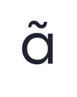</picture></td><td align="center"><picture><source media="(prefers-color-scheme: dark)" srcset="images/character-alternatives/ordfeminine-ss01.dark.svg"></picture></td><td align="center"><picture><source media="(prefers-color-scheme: dark)" srcset="images/character-alternatives/uni01E3-ss01.dark.svg"></picture></td><td align="center"><picture><source media="(prefers-color-scheme: dark)" srcset="images/character-alternatives/uni0203-ss01.dark.svg"></picture></td><td align="center"><picture><source media="(prefers-color-scheme: dark)" srcset="images/character-alternatives/uni1EA1-ss01.dark.svg"></picture></td><td align="center"><picture><source media="(prefers-color-scheme: dark)" srcset="images/character-alternatives/uni1EA3-ss01.dark.svg"></picture></td><td align="center"><picture><source media="(prefers-color-scheme: dark)" srcset="images/character-alternatives/uni1EA5-ss01.dark.svg"></picture></td><td align="center"><picture><source media="(prefers-color-scheme: dark)" srcset="images/character-alternatives/uni1EA7-ss01.dark.svg"></picture></td><td align="center"><picture><source media="(prefers-color-scheme: dark)" srcset="images/character-alternatives/uni1EA9-ss01.dark.svg"></picture></td><td align="center"><picture><source media="(prefers-color-scheme: dark)" srcset="images/character-alternatives/uni1EAB-ss01.dark.svg">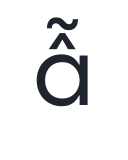</picture></td><td align="center"><picture><source media="(prefers-color-scheme: dark)" srcset="images/character-alternatives/uni1EAD-ss01.dark.svg"></picture></td><td align="center"><picture><source media="(prefers-color-scheme: dark)" srcset="images/character-alternatives/uni1EAF-ss01.dark.svg"></picture></td><td align="center"><picture><source media="(prefers-color-scheme: dark)" srcset="images/character-alternatives/uni1EB1-ss01.dark.svg"></picture></td><td align="center"><picture><source media="(prefers-color-scheme: dark)" srcset="images/character-alternatives/uni1EB3-ss01.dark.svg"></picture></td><td align="center"><picture><source media="(prefers-color-scheme: dark)" srcset="images/character-alternatives/uni1EB5-ss01.dark.svg"></picture></td><td align="center"><picture><source media="(prefers-color-scheme: dark)" srcset="images/character-alternatives/uni1EB7-ss01.dark.svg"></picture></td></tr>
<tr><td align="center"><code>a.ss01</code></td><td align="center"><code>aacute.ss01</code></td><td align="center"><code>abreve.ss01</code></td><td align="center"><code>acircumflex.ss01</code></td><td align="center"><code>adieresis.ss01</code></td><td align="center"><code>ae.ss01</code></td><td align="center"><code>agrave.ss01</code></td><td align="center"><code>amacron.ss01</code></td><td align="center"><code>aogonek.ss01</code></td><td align="center"><code>aring.ss01</code></td><td align="center"><code>atilde.ss01</code></td><td align="center"><code>ordfeminine.ss01</code></td><td align="center"><code>uni01E3.ss01</code></td><td align="center"><code>uni0203.ss01</code></td><td align="center"><code>uni1EA1.ss01</code></td><td align="center"><code>uni1EA3.ss01</code></td><td align="center"><code>uni1EA5.ss01</code></td><td align="center"><code>uni1EA7.ss01</code></td><td align="center"><code>uni1EA9.ss01</code></td><td align="center"><code>uni1EAB.ss01</code></td><td align="center"><code>uni1EAD.ss01</code></td><td align="center"><code>uni1EAF.ss01</code></td><td align="center"><code>uni1EB1.ss01</code></td><td align="center"><code>uni1EB3.ss01</code></td><td align="center"><code>uni1EB5.ss01</code></td><td align="center"><code>uni1EB7.ss01</code></td></tr>
</table>

## `ss02` — Humanist a

75 substitutions produce **26 distinct forms**.

<table>
<tr><td rowspan="2" align="left"><code><b>ss02</b></code> Humanist a 26 forms</td><td align="center"><picture><source media="(prefers-color-scheme: dark)" srcset="images/character-alternatives/a-ss02.dark.svg"></picture></td><td align="center"><picture><source media="(prefers-color-scheme: dark)" srcset="images/character-alternatives/aacute-ss02.dark.svg"></picture></td><td align="center"><picture><source media="(prefers-color-scheme: dark)" srcset="images/character-alternatives/abreve-ss02.dark.svg"></picture></td><td align="center"><picture><source media="(prefers-color-scheme: dark)" srcset="images/character-alternatives/acircumflex-ss02.dark.svg"></picture></td><td align="center"><picture><source media="(prefers-color-scheme: dark)" srcset="images/character-alternatives/adieresis-ss02.dark.svg"></picture></td><td align="center"><picture><source media="(prefers-color-scheme: dark)" srcset="images/character-alternatives/ae-ss02.dark.svg"></picture></td><td align="center"><picture><source media="(prefers-color-scheme: dark)" srcset="images/character-alternatives/agrave-ss02.dark.svg"></picture></td><td align="center"><picture><source media="(prefers-color-scheme: dark)" srcset="images/character-alternatives/amacron-ss02.dark.svg"></picture></td><td align="center"><picture><source media="(prefers-color-scheme: dark)" srcset="images/character-alternatives/aogonek-ss02.dark.svg"></picture></td><td align="center"><picture><source media="(prefers-color-scheme: dark)" srcset="images/character-alternatives/aring-ss02.dark.svg"></picture></td><td align="center"><picture><source media="(prefers-color-scheme: dark)" srcset="images/character-alternatives/atilde-ss02.dark.svg">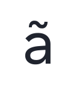</picture></td><td align="center"><picture><source media="(prefers-color-scheme: dark)" srcset="images/character-alternatives/ordfeminine-ss02.dark.svg"></picture></td><td align="center"><picture><source media="(prefers-color-scheme: dark)" srcset="images/character-alternatives/uni01E3-ss02.dark.svg"></picture></td><td align="center"><picture><source media="(prefers-color-scheme: dark)" srcset="images/character-alternatives/uni0203-ss02.dark.svg"></picture></td><td align="center"><picture><source media="(prefers-color-scheme: dark)" srcset="images/character-alternatives/uni1EA1-ss02.dark.svg"></picture></td><td align="center"><picture><source media="(prefers-color-scheme: dark)" srcset="images/character-alternatives/uni1EA3-ss02.dark.svg"></picture></td><td align="center"><picture><source media="(prefers-color-scheme: dark)" srcset="images/character-alternatives/uni1EA5-ss02.dark.svg"></picture></td><td align="center"><picture><source media="(prefers-color-scheme: dark)" srcset="images/character-alternatives/uni1EA7-ss02.dark.svg"></picture></td><td align="center"><picture><source media="(prefers-color-scheme: dark)" srcset="images/character-alternatives/uni1EA9-ss02.dark.svg"></picture></td><td align="center"><picture><source media="(prefers-color-scheme: dark)" srcset="images/character-alternatives/uni1EAB-ss02.dark.svg"></picture></td><td align="center"><picture><source media="(prefers-color-scheme: dark)" srcset="images/character-alternatives/uni1EAD-ss02.dark.svg"></picture></td><td align="center"><picture><source media="(prefers-color-scheme: dark)" srcset="images/character-alternatives/uni1EAF-ss02.dark.svg"></picture></td><td align="center"><picture><source media="(prefers-color-scheme: dark)" srcset="images/character-alternatives/uni1EB1-ss02.dark.svg"></picture></td><td align="center"><picture><source media="(prefers-color-scheme: dark)" srcset="images/character-alternatives/uni1EB3-ss02.dark.svg"></picture></td><td align="center"><picture><source media="(prefers-color-scheme: dark)" srcset="images/character-alternatives/uni1EB5-ss02.dark.svg"></picture></td><td align="center"><picture><source media="(prefers-color-scheme: dark)" srcset="images/character-alternatives/uni1EB7-ss02.dark.svg"></picture></td></tr>
<tr><td align="center"><code>a.ss02</code></td><td align="center"><code>aacute.ss02</code></td><td align="center"><code>abreve.ss02</code></td><td align="center"><code>acircumflex.ss02</code></td><td align="center"><code>adieresis.ss02</code></td><td align="center"><code>ae.ss02</code></td><td align="center"><code>agrave.ss02</code></td><td align="center"><code>amacron.ss02</code></td><td align="center"><code>aogonek.ss02</code></td><td align="center"><code>aring.ss02</code></td><td align="center"><code>atilde.ss02</code></td><td align="center"><code>ordfeminine.ss02</code></td><td align="center"><code>uni01E3.ss02</code></td><td align="center"><code>uni0203.ss02</code></td><td align="center"><code>uni1EA1.ss02</code></td><td align="center"><code>uni1EA3.ss02</code></td><td align="center"><code>uni1EA5.ss02</code></td><td align="center"><code>uni1EA7.ss02</code></td><td align="center"><code>uni1EA9.ss02</code></td><td align="center"><code>uni1EAB.ss02</code></td><td align="center"><code>uni1EAD.ss02</code></td><td align="center"><code>uni1EAF.ss02</code></td><td align="center"><code>uni1EB1.ss02</code></td><td align="center"><code>uni1EB3.ss02</code></td><td align="center"><code>uni1EB5.ss02</code></td><td align="center"><code>uni1EB7.ss02</code></td></tr>
</table>

## `ss03` — Tailed a

52 substitutions produce **26 distinct forms**.

<table>
<tr><td rowspan="2" align="left"><code><b>ss03</b></code> Tailed a 26 forms</td><td align="center"><picture><source media="(prefers-color-scheme: dark)" srcset="images/character-alternatives/a-ss03.dark.svg"></picture></td><td align="center"><picture><source media="(prefers-color-scheme: dark)" srcset="images/character-alternatives/aacute-ss03.dark.svg">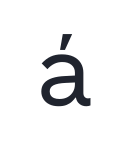</picture></td><td align="center"><picture><source media="(prefers-color-scheme: dark)" srcset="images/character-alternatives/abreve-ss03.dark.svg">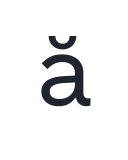</picture></td><td align="center"><picture><source media="(prefers-color-scheme: dark)" srcset="images/character-alternatives/acircumflex-ss03.dark.svg"></picture></td><td align="center"><picture><source media="(prefers-color-scheme: dark)" srcset="images/character-alternatives/adieresis-ss03.dark.svg">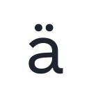</picture></td><td align="center"><picture><source media="(prefers-color-scheme: dark)" srcset="images/character-alternatives/ae-ss03.dark.svg"></picture></td><td align="center"><picture><source media="(prefers-color-scheme: dark)" srcset="images/character-alternatives/agrave-ss03.dark.svg"></picture></td><td align="center"><picture><source media="(prefers-color-scheme: dark)" srcset="images/character-alternatives/amacron-ss03.dark.svg"></picture></td><td align="center"><picture><source media="(prefers-color-scheme: dark)" srcset="images/character-alternatives/aogonek-ss03.dark.svg"></picture></td><td align="center"><picture><source media="(prefers-color-scheme: dark)" srcset="images/character-alternatives/aring-ss03.dark.svg"></picture></td><td align="center"><picture><source media="(prefers-color-scheme: dark)" srcset="images/character-alternatives/atilde-ss03.dark.svg"></picture></td><td align="center"><picture><source media="(prefers-color-scheme: dark)" srcset="images/character-alternatives/ordfeminine-ss03.dark.svg"></picture></td><td align="center"><picture><source media="(prefers-color-scheme: dark)" srcset="images/character-alternatives/uni01E3-ss03.dark.svg"></picture></td><td align="center"><picture><source media="(prefers-color-scheme: dark)" srcset="images/character-alternatives/uni0203-ss03.dark.svg"></picture></td><td align="center"><picture><source media="(prefers-color-scheme: dark)" srcset="images/character-alternatives/uni1EA1-ss03.dark.svg"></picture></td><td align="center"><picture><source media="(prefers-color-scheme: dark)" srcset="images/character-alternatives/uni1EA3-ss03.dark.svg"></picture></td><td align="center"><picture><source media="(prefers-color-scheme: dark)" srcset="images/character-alternatives/uni1EA5-ss03.dark.svg"></picture></td><td align="center"><picture><source media="(prefers-color-scheme: dark)" srcset="images/character-alternatives/uni1EA7-ss03.dark.svg">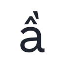</picture></td><td align="center"><picture><source media="(prefers-color-scheme: dark)" srcset="images/character-alternatives/uni1EA9-ss03.dark.svg">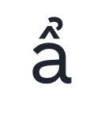</picture></td><td align="center"><picture><source media="(prefers-color-scheme: dark)" srcset="images/character-alternatives/uni1EAB-ss03.dark.svg"></picture></td><td align="center"><picture><source media="(prefers-color-scheme: dark)" srcset="images/character-alternatives/uni1EAD-ss03.dark.svg">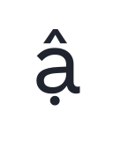</picture></td><td align="center"><picture><source media="(prefers-color-scheme: dark)" srcset="images/character-alternatives/uni1EAF-ss03.dark.svg"></picture></td><td align="center"><picture><source media="(prefers-color-scheme: dark)" srcset="images/character-alternatives/uni1EB1-ss03.dark.svg"></picture></td><td align="center"><picture><source media="(prefers-color-scheme: dark)" srcset="images/character-alternatives/uni1EB3-ss03.dark.svg"></picture></td><td align="center"><picture><source media="(prefers-color-scheme: dark)" srcset="images/character-alternatives/uni1EB5-ss03.dark.svg"></picture></td><td align="center"><picture><source media="(prefers-color-scheme: dark)" srcset="images/character-alternatives/uni1EB7-ss03.dark.svg">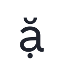</picture></td></tr>
<tr><td align="center"><code>a.ss03</code></td><td align="center"><code>aacute.ss03</code></td><td align="center"><code>abreve.ss03</code></td><td align="center"><code>acircumflex.ss03</code></td><td align="center"><code>adieresis.ss03</code></td><td align="center"><code>ae.ss03</code></td><td align="center"><code>agrave.ss03</code></td><td align="center"><code>amacron.ss03</code></td><td align="center"><code>aogonek.ss03</code></td><td align="center"><code>aring.ss03</code></td><td align="center"><code>atilde.ss03</code></td><td align="center"><code>ordfeminine.ss03</code></td><td align="center"><code>uni01E3.ss03</code></td><td align="center"><code>uni0203.ss03</code></td><td align="center"><code>uni1EA1.ss03</code></td><td align="center"><code>uni1EA3.ss03</code></td><td align="center"><code>uni1EA5.ss03</code></td><td align="center"><code>uni1EA7.ss03</code></td><td align="center"><code>uni1EA9.ss03</code></td><td align="center"><code>uni1EAB.ss03</code></td><td align="center"><code>uni1EAD.ss03</code></td><td align="center"><code>uni1EAF.ss03</code></td><td align="center"><code>uni1EB1.ss03</code></td><td align="center"><code>uni1EB3.ss03</code></td><td align="center"><code>uni1EB5.ss03</code></td><td align="center"><code>uni1EB7.ss03</code></td></tr>
</table>

## `ss04` — Geometric g

12 substitutions produce **6 distinct forms**.

<table>
<tr><td rowspan="2" align="left"><code><b>ss04</b></code> Geometric g 6 forms</td><td align="center"><picture><source media="(prefers-color-scheme: dark)" srcset="images/character-alternatives/g-ss04.dark.svg"></picture></td><td align="center"><picture><source media="(prefers-color-scheme: dark)" srcset="images/character-alternatives/gbreve-ss04.dark.svg"></picture></td><td align="center"><picture><source media="(prefers-color-scheme: dark)" srcset="images/character-alternatives/gcircumflex-ss04.dark.svg"></picture></td><td align="center"><picture><source media="(prefers-color-scheme: dark)" srcset="images/character-alternatives/gdotaccent-ss04.dark.svg"></picture></td><td align="center"><picture><source media="(prefers-color-scheme: dark)" srcset="images/character-alternatives/uni0123-ss04.dark.svg"></picture></td><td align="center"><picture><source media="(prefers-color-scheme: dark)" srcset="images/character-alternatives/uni1E21-ss04.dark.svg"></picture></td></tr>
<tr><td align="center"><code>g.ss04</code></td><td align="center"><code>gbreve.ss04</code></td><td align="center"><code>gcircumflex.ss04</code></td><td align="center"><code>gdotaccent.ss04</code></td><td align="center"><code>uni0123.ss04</code></td><td align="center"><code>uni1E21.ss04</code></td></tr>
</table>

## `ss05` — Gothic g

12 substitutions produce **6 distinct forms**.

<table>
<tr><td rowspan="2" align="left"><code><b>ss05</b></code> Gothic g 6 forms</td><td align="center"><picture><source media="(prefers-color-scheme: dark)" srcset="images/character-alternatives/g-ss05.dark.svg"></picture></td><td align="center"><picture><source media="(prefers-color-scheme: dark)" srcset="images/character-alternatives/gbreve-ss05.dark.svg"></picture></td><td align="center"><picture><source media="(prefers-color-scheme: dark)" srcset="images/character-alternatives/gcircumflex-ss05.dark.svg"></picture></td><td align="center"><picture><source media="(prefers-color-scheme: dark)" srcset="images/character-alternatives/gdotaccent-ss05.dark.svg"></picture></td><td align="center"><picture><source media="(prefers-color-scheme: dark)" srcset="images/character-alternatives/uni0123-ss05.dark.svg"></picture></td><td align="center"><picture><source media="(prefers-color-scheme: dark)" srcset="images/character-alternatives/uni1E21-ss05.dark.svg"></picture></td></tr>
<tr><td align="center"><code>g.ss05</code></td><td align="center"><code>gbreve.ss05</code></td><td align="center"><code>gcircumflex.ss05</code></td><td align="center"><code>gdotaccent.ss05</code></td><td align="center"><code>uni0123.ss05</code></td><td align="center"><code>uni1E21.ss05</code></td></tr>
</table>

## `ss06` — Geometric G

16 substitutions produce **8 distinct forms**.

<table>
<tr><td rowspan="2" align="left"><code><b>ss06</b></code> Geometric G 8 forms</td><td align="center"><picture><source media="(prefers-color-scheme: dark)" srcset="images/character-alternatives/G-ss06.dark.svg"></picture></td><td align="center"><picture><source media="(prefers-color-scheme: dark)" srcset="images/character-alternatives/Gbreve-ss06.dark.svg"></picture></td><td align="center"><picture><source media="(prefers-color-scheme: dark)" srcset="images/character-alternatives/Gcircumflex-ss06.dark.svg"></picture></td><td align="center"><picture><source media="(prefers-color-scheme: dark)" srcset="images/character-alternatives/Gdotaccent-ss06.dark.svg"></picture></td><td align="center"><picture><source media="(prefers-color-scheme: dark)" srcset="images/character-alternatives/uni0122-ss06.dark.svg"></picture></td><td align="center"><picture><source media="(prefers-color-scheme: dark)" srcset="images/character-alternatives/uni1E20-ss06.dark.svg"></picture></td><td align="center"><picture><source media="(prefers-color-scheme: dark)" srcset="images/character-alternatives/uni20B2-ss06.dark.svg"></picture></td><td align="center"><picture><source media="(prefers-color-scheme: dark)" srcset="images/character-alternatives/uni20B2-tf-ss06.dark.svg"></picture></td></tr>
<tr><td align="center"><code>G.ss06</code></td><td align="center"><code>Gbreve.ss06</code></td><td align="center"><code>Gcircumflex.ss06</code></td><td align="center"><code>Gdotaccent.ss06</code></td><td align="center"><code>uni0122.ss06</code></td><td align="center"><code>uni1E20.ss06</code></td><td align="center"><code>uni20B2.ss06</code></td><td align="center"><code>uni20B2.tf.ss06</code></td></tr>
</table>

## `ss07` — Humanist G

16 substitutions produce **8 distinct forms**.

<table>
<tr><td rowspan="2" align="left"><code><b>ss07</b></code> Humanist G 8 forms</td><td align="center"><picture><source media="(prefers-color-scheme: dark)" srcset="images/character-alternatives/G-ss07.dark.svg"></picture></td><td align="center"><picture><source media="(prefers-color-scheme: dark)" srcset="images/character-alternatives/Gbreve-ss07.dark.svg"></picture></td><td align="center"><picture><source media="(prefers-color-scheme: dark)" srcset="images/character-alternatives/Gcircumflex-ss07.dark.svg"></picture></td><td align="center"><picture><source media="(prefers-color-scheme: dark)" srcset="images/character-alternatives/Gdotaccent-ss07.dark.svg"></picture></td><td align="center"><picture><source media="(prefers-color-scheme: dark)" srcset="images/character-alternatives/uni0122-ss07.dark.svg"></picture></td><td align="center"><picture><source media="(prefers-color-scheme: dark)" srcset="images/character-alternatives/uni1E20-ss07.dark.svg"></picture></td><td align="center"><picture><source media="(prefers-color-scheme: dark)" srcset="images/character-alternatives/uni20B2-ss07.dark.svg"></picture></td><td align="center"><picture><source media="(prefers-color-scheme: dark)" srcset="images/character-alternatives/uni20B2-tf-ss07.dark.svg"></picture></td></tr>
<tr><td align="center"><code>G.ss07</code></td><td align="center"><code>Gbreve.ss07</code></td><td align="center"><code>Gcircumflex.ss07</code></td><td align="center"><code>Gdotaccent.ss07</code></td><td align="center"><code>uni0122.ss07</code></td><td align="center"><code>uni1E20.ss07</code></td><td align="center"><code>uni20B2.ss07</code></td><td align="center"><code>uni20B2.tf.ss07</code></td></tr>
</table>

## `ss08` — Constructed j and y

30 substitutions produce **15 distinct forms**.

<table>
<tr><td rowspan="2" align="left"><code><b>ss08</b></code> Constructed j and y 15 forms</td><td align="center"><picture><source media="(prefers-color-scheme: dark)" srcset="images/character-alternatives/ij-ss08.dark.svg"></picture></td><td align="center"><picture><source media="(prefers-color-scheme: dark)" srcset="images/character-alternatives/ijacute-ss08.dark.svg"></picture></td><td align="center"><picture><source media="(prefers-color-scheme: dark)" srcset="images/character-alternatives/j-ss08.dark.svg"></picture></td><td align="center"><picture><source media="(prefers-color-scheme: dark)" srcset="images/character-alternatives/jcircumflex-ss08.dark.svg">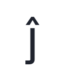</picture></td><td align="center"><picture><source media="(prefers-color-scheme: dark)" srcset="images/character-alternatives/uni006A0301-ss08.dark.svg"></picture></td><td align="center"><picture><source media="(prefers-color-scheme: dark)" srcset="images/character-alternatives/uni0237-ss08.dark.svg"></picture></td><td align="center"><picture><source media="(prefers-color-scheme: dark)" srcset="images/character-alternatives/uni1E8F-ss08.dark.svg"></picture></td><td align="center"><picture><source media="(prefers-color-scheme: dark)" srcset="images/character-alternatives/uni1EF5-ss08.dark.svg"></picture></td><td align="center"><picture><source media="(prefers-color-scheme: dark)" srcset="images/character-alternatives/uni1EF7-ss08.dark.svg"></picture></td><td align="center"><picture><source media="(prefers-color-scheme: dark)" srcset="images/character-alternatives/uni1EF9-ss08.dark.svg"></picture></td><td align="center"><picture><source media="(prefers-color-scheme: dark)" srcset="images/character-alternatives/y-ss08.dark.svg"></picture></td><td align="center"><picture><source media="(prefers-color-scheme: dark)" srcset="images/character-alternatives/yacute-ss08.dark.svg">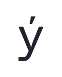</picture></td><td align="center"><picture><source media="(prefers-color-scheme: dark)" srcset="images/character-alternatives/ycircumflex-ss08.dark.svg">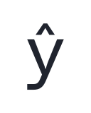</picture></td><td align="center"><picture><source media="(prefers-color-scheme: dark)" srcset="images/character-alternatives/ydieresis-ss08.dark.svg"></picture></td><td align="center"><picture><source media="(prefers-color-scheme: dark)" srcset="images/character-alternatives/ygrave-ss08.dark.svg">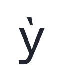</picture></td></tr>
<tr><td align="center"><code>ij.ss08</code></td><td align="center"><code>ijacute.ss08</code></td><td align="center"><code>j.ss08</code></td><td align="center"><code>jcircumflex.ss08</code></td><td align="center"><code>uni006A0301.ss08</code></td><td align="center"><code>uni0237.ss08</code></td><td align="center"><code>uni1E8F.ss08</code></td><td align="center"><code>uni1EF5.ss08</code></td><td align="center"><code>uni1EF7.ss08</code></td><td align="center"><code>uni1EF9.ss08</code></td><td align="center"><code>y.ss08</code></td><td align="center"><code>yacute.ss08</code></td><td align="center"><code>ycircumflex.ss08</code></td><td align="center"><code>ydieresis.ss08</code></td><td align="center"><code>ygrave.ss08</code></td></tr>
</table>

## `ss09` — Humanist j and y

30 substitutions produce **15 distinct forms**.

<table>
<tr><td rowspan="2" align="left"><code><b>ss09</b></code> Humanist j and y 15 forms</td><td align="center"><picture><source media="(prefers-color-scheme: dark)" srcset="images/character-alternatives/ij-ss09.dark.svg"></picture></td><td align="center"><picture><source media="(prefers-color-scheme: dark)" srcset="images/character-alternatives/ijacute-ss09.dark.svg"></picture></td><td align="center"><picture><source media="(prefers-color-scheme: dark)" srcset="images/character-alternatives/j-ss09.dark.svg"></picture></td><td align="center"><picture><source media="(prefers-color-scheme: dark)" srcset="images/character-alternatives/jcircumflex-ss09.dark.svg">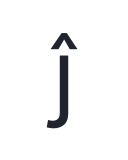</picture></td><td align="center"><picture><source media="(prefers-color-scheme: dark)" srcset="images/character-alternatives/uni006A0301-ss09.dark.svg"></picture></td><td align="center"><picture><source media="(prefers-color-scheme: dark)" srcset="images/character-alternatives/uni0237-ss09.dark.svg"></picture></td><td align="center"><picture><source media="(prefers-color-scheme: dark)" srcset="images/character-alternatives/uni1E8F-ss09.dark.svg"></picture></td><td align="center"><picture><source media="(prefers-color-scheme: dark)" srcset="images/character-alternatives/uni1EF5-ss09.dark.svg"></picture></td><td align="center"><picture><source media="(prefers-color-scheme: dark)" srcset="images/character-alternatives/uni1EF7-ss09.dark.svg">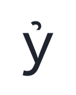</picture></td><td align="center"><picture><source media="(prefers-color-scheme: dark)" srcset="images/character-alternatives/uni1EF9-ss09.dark.svg"></picture></td><td align="center"><picture><source media="(prefers-color-scheme: dark)" srcset="images/character-alternatives/y-ss09.dark.svg"></picture></td><td align="center"><picture><source media="(prefers-color-scheme: dark)" srcset="images/character-alternatives/yacute-ss09.dark.svg"></picture></td><td align="center"><picture><source media="(prefers-color-scheme: dark)" srcset="images/character-alternatives/ycircumflex-ss09.dark.svg">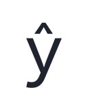</picture></td><td align="center"><picture><source media="(prefers-color-scheme: dark)" srcset="images/character-alternatives/ydieresis-ss09.dark.svg"></picture></td><td align="center"><picture><source media="(prefers-color-scheme: dark)" srcset="images/character-alternatives/ygrave-ss09.dark.svg"></picture></td></tr>
<tr><td align="center"><code>ij.ss09</code></td><td align="center"><code>ijacute.ss09</code></td><td align="center"><code>j.ss09</code></td><td align="center"><code>jcircumflex.ss09</code></td><td align="center"><code>uni006A0301.ss09</code></td><td align="center"><code>uni0237.ss09</code></td><td align="center"><code>uni1E8F.ss09</code></td><td align="center"><code>uni1EF5.ss09</code></td><td align="center"><code>uni1EF7.ss09</code></td><td align="center"><code>uni1EF9.ss09</code></td><td align="center"><code>y.ss09</code></td><td align="center"><code>yacute.ss09</code></td><td align="center"><code>ycircumflex.ss09</code></td><td align="center"><code>ydieresis.ss09</code></td><td align="center"><code>ygrave.ss09</code></td></tr>
</table>

## `ss10` — Futura alternatives

280 substitutions produce **118 distinct forms**.

<table>
<tr><td rowspan="2" align="left"><code><b>ss10</b></code> Futura alternatives 118 forms</td><td align="center"><picture><source media="(prefers-color-scheme: dark)" srcset="images/character-alternatives/C-ss10.dark.svg"></picture></td><td align="center"><picture><source media="(prefers-color-scheme: dark)" srcset="images/character-alternatives/Cacute-ss10.dark.svg"></picture></td><td align="center"><picture><source media="(prefers-color-scheme: dark)" srcset="images/character-alternatives/Ccaron-ss10.dark.svg"></picture></td><td align="center"><picture><source media="(prefers-color-scheme: dark)" srcset="images/character-alternatives/Ccedilla-ss10.dark.svg"></picture></td><td align="center"><picture><source media="(prefers-color-scheme: dark)" srcset="images/character-alternatives/Ccircumflex-ss10.dark.svg"></picture></td><td align="center"><picture><source media="(prefers-color-scheme: dark)" srcset="images/character-alternatives/Cdotaccent-ss10.dark.svg"></picture></td><td align="center"><picture><source media="(prefers-color-scheme: dark)" srcset="images/character-alternatives/Eng-ss10.dark.svg"></picture></td><td align="center"><picture><source media="(prefers-color-scheme: dark)" srcset="images/character-alternatives/Euro-ss10.dark.svg"></picture></td><td align="center"><picture><source media="(prefers-color-scheme: dark)" srcset="images/character-alternatives/Euro-tf-ss10.dark.svg"></picture></td><td align="center"><picture><source media="(prefers-color-scheme: dark)" srcset="images/character-alternatives/a-ss01.dark.svg"></picture></td><td align="center"><picture><source media="(prefers-color-scheme: dark)" srcset="images/character-alternatives/aacute-ss01.dark.svg"></picture></td><td align="center"><picture><source media="(prefers-color-scheme: dark)" srcset="images/character-alternatives/abreve-ss01.dark.svg"></picture></td><td align="center"><picture><source media="(prefers-color-scheme: dark)" srcset="images/character-alternatives/acircumflex-ss01.dark.svg"></picture></td><td align="center"><picture><source media="(prefers-color-scheme: dark)" srcset="images/character-alternatives/adieresis-ss01.dark.svg"></picture></td><td align="center"><picture><source media="(prefers-color-scheme: dark)" srcset="images/character-alternatives/ae-ss01.dark.svg"></picture></td><td align="center"><picture><source media="(prefers-color-scheme: dark)" srcset="images/character-alternatives/agrave-ss01.dark.svg"></picture></td><td align="center"><picture><source media="(prefers-color-scheme: dark)" srcset="images/character-alternatives/amacron-ss01.dark.svg"></picture></td><td align="center"><picture><source media="(prefers-color-scheme: dark)" srcset="images/character-alternatives/aogonek-ss01.dark.svg"></picture></td><td align="center"><picture><source media="(prefers-color-scheme: dark)" srcset="images/character-alternatives/aring-ss01.dark.svg"></picture></td><td align="center"><picture><source media="(prefers-color-scheme: dark)" srcset="images/character-alternatives/atilde-ss01.dark.svg"></picture></td><td align="center"><picture><source media="(prefers-color-scheme: dark)" srcset="images/character-alternatives/c-ss10.dark.svg"></picture></td><td align="center"><picture><source media="(prefers-color-scheme: dark)" srcset="images/character-alternatives/cacute-ss10.dark.svg"></picture></td><td align="center"><picture><source media="(prefers-color-scheme: dark)" srcset="images/character-alternatives/ccaron-ss10.dark.svg"></picture></td><td align="center"><picture><source media="(prefers-color-scheme: dark)" srcset="images/character-alternatives/ccedilla-ss10.dark.svg"></picture></td><td align="center"><picture><source media="(prefers-color-scheme: dark)" srcset="images/character-alternatives/ccircumflex-ss10.dark.svg"></picture></td><td align="center"><picture><source media="(prefers-color-scheme: dark)" srcset="images/character-alternatives/cdotaccent-ss10.dark.svg"></picture></td><td align="center"><picture><source media="(prefers-color-scheme: dark)" srcset="images/character-alternatives/cent-ss10.dark.svg"></picture></td><td align="center"><picture><source media="(prefers-color-scheme: dark)" srcset="images/character-alternatives/eng-ss10.dark.svg"></picture></td><td align="center"><picture><source media="(prefers-color-scheme: dark)" srcset="images/character-alternatives/f-alt.dark.svg"></picture></td><td align="center"><picture><source media="(prefers-color-scheme: dark)" srcset="images/character-alternatives/f_t-ss10.dark.svg"></picture></td><td align="center"><picture><source media="(prefers-color-scheme: dark)" srcset="images/character-alternatives/five-dnom-ss10.dark.svg"></picture></td><td align="center"><picture><source media="(prefers-color-scheme: dark)" srcset="images/character-alternatives/five-numr-ss10.dark.svg"></picture></td><td align="center"><picture><source media="(prefers-color-scheme: dark)" srcset="images/character-alternatives/five-ss10.dark.svg"></picture></td><td align="center"><picture><source media="(prefers-color-scheme: dark)" srcset="images/character-alternatives/fiveeighths-ss10.dark.svg"></picture></td><td align="center"><picture><source media="(prefers-color-scheme: dark)" srcset="images/character-alternatives/ij-ss10.dark.svg"></picture></td><td align="center"><picture><source media="(prefers-color-scheme: dark)" srcset="images/character-alternatives/ijacute-ss10.dark.svg"></picture></td><td align="center"><picture><source media="(prefers-color-scheme: dark)" srcset="images/character-alternatives/j-ss10.dark.svg"></picture></td><td align="center"><picture><source media="(prefers-color-scheme: dark)" srcset="images/character-alternatives/jcircumflex-ss10.dark.svg">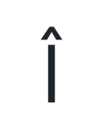</picture></td><td align="center"><picture><source media="(prefers-color-scheme: dark)" srcset="images/character-alternatives/one-dnom-ss10.dark.svg"></picture></td><td align="center"><picture><source media="(prefers-color-scheme: dark)" srcset="images/character-alternatives/one-lf-ss10.dark.svg"></picture></td><td align="center"><picture><source media="(prefers-color-scheme: dark)" srcset="images/character-alternatives/one-numr-ss10.dark.svg"></picture></td><td align="center"><picture><source media="(prefers-color-scheme: dark)" srcset="images/character-alternatives/one-ss10.dark.svg"></picture></td><td align="center"><picture><source media="(prefers-color-scheme: dark)" srcset="images/character-alternatives/one-tf-ss10.dark.svg"></picture></td><td align="center"><picture><source media="(prefers-color-scheme: dark)" srcset="images/character-alternatives/oneeighth-ss10.dark.svg"></picture></td><td align="center"><picture><source media="(prefers-color-scheme: dark)" srcset="images/character-alternatives/onehalf-ss10.dark.svg"></picture></td><td align="center"><picture><source media="(prefers-color-scheme: dark)" srcset="images/character-alternatives/onequarter-ss10.dark.svg">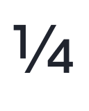</picture></td><td align="center"><picture><source media="(prefers-color-scheme: dark)" srcset="images/character-alternatives/ordfeminine-ss01.dark.svg"></picture></td><td align="center"><picture><source media="(prefers-color-scheme: dark)" srcset="images/character-alternatives/pi-ss10.dark.svg"></picture></td><td align="center"><picture><source media="(prefers-color-scheme: dark)" srcset="images/character-alternatives/t-ss10.dark.svg"></picture></td><td align="center"><picture><source media="(prefers-color-scheme: dark)" srcset="images/character-alternatives/tbar-ss10.dark.svg"></picture></td><td align="center"><picture><source media="(prefers-color-scheme: dark)" srcset="images/character-alternatives/tcaron-ss10.dark.svg"></picture></td><td align="center"><picture><source media="(prefers-color-scheme: dark)" srcset="images/character-alternatives/u-ss10.dark.svg"></picture></td><td align="center"><picture><source media="(prefers-color-scheme: dark)" srcset="images/character-alternatives/uacute-ss10.dark.svg"></picture></td><td align="center"><picture><source media="(prefers-color-scheme: dark)" srcset="images/character-alternatives/ubreve-ss10.dark.svg"></picture></td><td align="center"><picture><source media="(prefers-color-scheme: dark)" srcset="images/character-alternatives/ucircumflex-ss10.dark.svg"></picture></td><td align="center"><picture><source media="(prefers-color-scheme: dark)" srcset="images/character-alternatives/udieresis-ss10.dark.svg"></picture></td><td align="center"><picture><source media="(prefers-color-scheme: dark)" srcset="images/character-alternatives/ugrave-ss10.dark.svg"></picture></td><td align="center"><picture><source media="(prefers-color-scheme: dark)" srcset="images/character-alternatives/uhorn-ss10.dark.svg"></picture></td><td align="center"><picture><source media="(prefers-color-scheme: dark)" srcset="images/character-alternatives/uhungarumlaut-ss10.dark.svg"></picture></td><td align="center"><picture><source media="(prefers-color-scheme: dark)" srcset="images/character-alternatives/umacron-ss10.dark.svg"></picture></td><td align="center"><picture><source media="(prefers-color-scheme: dark)" srcset="images/character-alternatives/uni006A0301-ss10.dark.svg">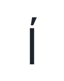</picture></td><td align="center"><picture><source media="(prefers-color-scheme: dark)" srcset="images/character-alternatives/uni00B5-ss10.dark.svg"></picture></td><td align="center"><picture><source media="(prefers-color-scheme: dark)" srcset="images/character-alternatives/uni00B9-ss10.dark.svg"></picture></td><td align="center"><picture><source media="(prefers-color-scheme: dark)" srcset="images/character-alternatives/uni0163-ss10.dark.svg"></picture></td><td align="center"><picture><source media="(prefers-color-scheme: dark)" srcset="images/character-alternatives/uni01D6-ss10.dark.svg"></picture></td><td align="center"><picture><source media="(prefers-color-scheme: dark)" srcset="images/character-alternatives/uni01D8-ss10.dark.svg"></picture></td><td align="center"><picture><source media="(prefers-color-scheme: dark)" srcset="images/character-alternatives/uni01DA-ss10.dark.svg"></picture></td><td align="center"><picture><source media="(prefers-color-scheme: dark)" srcset="images/character-alternatives/uni01DC-ss10.dark.svg"></picture></td><td align="center"><picture><source media="(prefers-color-scheme: dark)" srcset="images/character-alternatives/uni01E3-ss01.dark.svg"></picture></td><td align="center"><picture><source media="(prefers-color-scheme: dark)" srcset="images/character-alternatives/uni0203-ss01.dark.svg"></picture></td><td align="center"><picture><source media="(prefers-color-scheme: dark)" srcset="images/character-alternatives/uni0217-ss10.dark.svg"></picture></td><td align="center"><picture><source media="(prefers-color-scheme: dark)" srcset="images/character-alternatives/uni021B-ss10.dark.svg">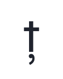</picture></td><td align="center"><picture><source media="(prefers-color-scheme: dark)" srcset="images/character-alternatives/uni0237-ss10.dark.svg"></picture></td><td align="center"><picture><source media="(prefers-color-scheme: dark)" srcset="images/character-alternatives/uni1E6D-ss10.dark.svg"></picture></td><td align="center"><picture><source media="(prefers-color-scheme: dark)" srcset="images/character-alternatives/uni1E6F-ss10.dark.svg"></picture></td><td align="center"><picture><source media="(prefers-color-scheme: dark)" srcset="images/character-alternatives/uni1E8F-ss10.dark.svg"></picture></td><td align="center"><picture><source media="(prefers-color-scheme: dark)" srcset="images/character-alternatives/uni1EA1-ss01.dark.svg"></picture></td><td align="center"><picture><source media="(prefers-color-scheme: dark)" srcset="images/character-alternatives/uni1EA3-ss01.dark.svg"></picture></td><td align="center"><picture><source media="(prefers-color-scheme: dark)" srcset="images/character-alternatives/uni1EA5-ss01.dark.svg"></picture></td><td align="center"><picture><source media="(prefers-color-scheme: dark)" srcset="images/character-alternatives/uni1EA7-ss01.dark.svg"></picture></td><td align="center"><picture><source media="(prefers-color-scheme: dark)" srcset="images/character-alternatives/uni1EA9-ss01.dark.svg"></picture></td><td align="center"><picture><source media="(prefers-color-scheme: dark)" srcset="images/character-alternatives/uni1EAB-ss01.dark.svg"></picture></td><td align="center"><picture><source media="(prefers-color-scheme: dark)" srcset="images/character-alternatives/uni1EAD-ss01.dark.svg"></picture></td><td align="center"><picture><source media="(prefers-color-scheme: dark)" srcset="images/character-alternatives/uni1EAF-ss01.dark.svg"></picture></td><td align="center"><picture><source media="(prefers-color-scheme: dark)" srcset="images/character-alternatives/uni1EB1-ss01.dark.svg"></picture></td><td align="center"><picture><source media="(prefers-color-scheme: dark)" srcset="images/character-alternatives/uni1EB3-ss01.dark.svg"></picture></td><td align="center"><picture><source media="(prefers-color-scheme: dark)" srcset="images/character-alternatives/uni1EB5-ss01.dark.svg"></picture></td><td align="center"><picture><source media="(prefers-color-scheme: dark)" srcset="images/character-alternatives/uni1EB7-ss01.dark.svg"></picture></td><td align="center"><picture><source media="(prefers-color-scheme: dark)" srcset="images/character-alternatives/uni1EE5-ss10.dark.svg"></picture></td><td align="center"><picture><source media="(prefers-color-scheme: dark)" srcset="images/character-alternatives/uni1EE7-ss10.dark.svg"></picture></td><td align="center"><picture><source media="(prefers-color-scheme: dark)" srcset="images/character-alternatives/uni1EE9-ss10.dark.svg"></picture></td><td align="center"><picture><source media="(prefers-color-scheme: dark)" srcset="images/character-alternatives/uni1EEB-ss10.dark.svg"></picture></td><td align="center"><picture><source media="(prefers-color-scheme: dark)" srcset="images/character-alternatives/uni1EED-ss10.dark.svg"></picture></td><td align="center"><picture><source media="(prefers-color-scheme: dark)" srcset="images/character-alternatives/uni1EEF-ss10.dark.svg"></picture></td><td align="center"><picture><source media="(prefers-color-scheme: dark)" srcset="images/character-alternatives/uni1EF1-ss10.dark.svg"></picture></td><td align="center"><picture><source media="(prefers-color-scheme: dark)" srcset="images/character-alternatives/uni1EF5-ss10.dark.svg"></picture></td><td align="center"><picture><source media="(prefers-color-scheme: dark)" srcset="images/character-alternatives/uni1EF7-ss10.dark.svg"></picture></td><td align="center"><picture><source media="(prefers-color-scheme: dark)" srcset="images/character-alternatives/uni1EF9-ss10.dark.svg"></picture></td><td align="center"><picture><source media="(prefers-color-scheme: dark)" srcset="images/character-alternatives/uni2070-ss10.dark.svg"></picture></td><td align="center"><picture><source media="(prefers-color-scheme: dark)" srcset="images/character-alternatives/uni2075-ss10.dark.svg"></picture></td><td align="center"><picture><source media="(prefers-color-scheme: dark)" srcset="images/character-alternatives/uni2080-ss10.dark.svg"></picture></td><td align="center"><picture><source media="(prefers-color-scheme: dark)" srcset="images/character-alternatives/uni2081-ss10.dark.svg"></picture></td><td align="center"><picture><source media="(prefers-color-scheme: dark)" srcset="images/character-alternatives/uni2085-ss10.dark.svg"></picture></td><td align="center"><picture><source media="(prefers-color-scheme: dark)" srcset="images/character-alternatives/uni2153-ss10.dark.svg">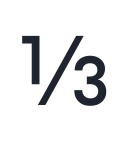</picture></td><td align="center"><picture><source media="(prefers-color-scheme: dark)" srcset="images/character-alternatives/uni2154-ss10.dark.svg">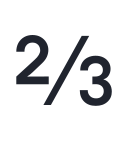</picture></td><td align="center"><picture><source media="(prefers-color-scheme: dark)" srcset="images/character-alternatives/uogonek-ss10.dark.svg"></picture></td><td align="center"><picture><source media="(prefers-color-scheme: dark)" srcset="images/character-alternatives/uring-ss10.dark.svg"></picture></td><td align="center"><picture><source media="(prefers-color-scheme: dark)" srcset="images/character-alternatives/utilde-ss10.dark.svg"></picture></td><td align="center"><picture><source media="(prefers-color-scheme: dark)" srcset="images/character-alternatives/y-ss10.dark.svg"></picture></td><td align="center"><picture><source media="(prefers-color-scheme: dark)" srcset="images/character-alternatives/yacute-ss10.dark.svg"></picture></td><td align="center"><picture><source media="(prefers-color-scheme: dark)" srcset="images/character-alternatives/ycircumflex-ss10.dark.svg"></picture></td><td align="center"><picture><source media="(prefers-color-scheme: dark)" srcset="images/character-alternatives/ydieresis-ss10.dark.svg"></picture></td><td align="center"><picture><source media="(prefers-color-scheme: dark)" srcset="images/character-alternatives/ygrave-ss10.dark.svg"></picture></td><td align="center"><picture><source media="(prefers-color-scheme: dark)" srcset="images/character-alternatives/zero-dnom-ss10.dark.svg"></picture></td><td align="center"><picture><source media="(prefers-color-scheme: dark)" srcset="images/character-alternatives/zero-lf-ss10.dark.svg"></picture></td><td align="center"><picture><source media="(prefers-color-scheme: dark)" srcset="images/character-alternatives/zero-numr-ss10.dark.svg"></picture></td><td align="center"><picture><source media="(prefers-color-scheme: dark)" srcset="images/character-alternatives/zero-ss10.dark.svg"></picture></td><td align="center"><picture><source media="(prefers-color-scheme: dark)" srcset="images/character-alternatives/zero-tf-ss10.dark.svg"></picture></td></tr>
<tr><td align="center"><code>C.ss10</code></td><td align="center"><code>Cacute.ss10</code></td><td align="center"><code>Ccaron.ss10</code></td><td align="center"><code>Ccedilla.ss10</code></td><td align="center"><code>Ccircumflex.ss10</code></td><td align="center"><code>Cdotaccent.ss10</code></td><td align="center"><code>Eng.ss10</code></td><td align="center"><code>Euro.ss10</code></td><td align="center"><code>Euro.tf.ss10</code></td><td align="center"><code>a.ss01</code></td><td align="center"><code>aacute.ss01</code></td><td align="center"><code>abreve.ss01</code></td><td align="center"><code>acircumflex.ss01</code></td><td align="center"><code>adieresis.ss01</code></td><td align="center"><code>ae.ss01</code></td><td align="center"><code>agrave.ss01</code></td><td align="center"><code>amacron.ss01</code></td><td align="center"><code>aogonek.ss01</code></td><td align="center"><code>aring.ss01</code></td><td align="center"><code>atilde.ss01</code></td><td align="center"><code>c.ss10</code></td><td align="center"><code>cacute.ss10</code></td><td align="center"><code>ccaron.ss10</code></td><td align="center"><code>ccedilla.ss10</code></td><td align="center"><code>ccircumflex.ss10</code></td><td align="center"><code>cdotaccent.ss10</code></td><td align="center"><code>cent.ss10</code></td><td align="center"><code>eng.ss10</code></td><td align="center"><code>f.alt</code></td><td align="center"><code>f_t.ss10</code></td><td align="center"><code>five.dnom.ss10</code></td><td align="center"><code>five.numr.ss10</code></td><td align="center"><code>five.ss10</code></td><td align="center"><code>fiveeighths.ss10</code></td><td align="center"><code>ij.ss10</code></td><td align="center"><code>ijacute.ss10</code></td><td align="center"><code>j.ss10</code></td><td align="center"><code>jcircumflex.ss10</code></td><td align="center"><code>one.dnom.ss10</code></td><td align="center"><code>one.lf.ss10</code></td><td align="center"><code>one.numr.ss10</code></td><td align="center"><code>one.ss10</code></td><td align="center"><code>one.tf.ss10</code></td><td align="center"><code>oneeighth.ss10</code></td><td align="center"><code>onehalf.ss10</code></td><td align="center"><code>onequarter.ss10</code></td><td align="center"><code>ordfeminine.ss01</code></td><td align="center"><code>pi.ss10</code></td><td align="center"><code>t.ss10</code></td><td align="center"><code>tbar.ss10</code></td><td align="center"><code>tcaron.ss10</code></td><td align="center"><code>u.ss10</code></td><td align="center"><code>uacute.ss10</code></td><td align="center"><code>ubreve.ss10</code></td><td align="center"><code>ucircumflex.ss10</code></td><td align="center"><code>udieresis.ss10</code></td><td align="center"><code>ugrave.ss10</code></td><td align="center"><code>uhorn.ss10</code></td><td align="center"><code>uhungarumlaut.ss10</code></td><td align="center"><code>umacron.ss10</code></td><td align="center"><code>uni006A0301.ss10</code></td><td align="center"><code>uni00B5.ss10</code></td><td align="center"><code>uni00B9.ss10</code></td><td align="center"><code>uni0163.ss10</code></td><td align="center"><code>uni01D6.ss10</code></td><td align="center"><code>uni01D8.ss10</code></td><td align="center"><code>uni01DA.ss10</code></td><td align="center"><code>uni01DC.ss10</code></td><td align="center"><code>uni01E3.ss01</code></td><td align="center"><code>uni0203.ss01</code></td><td align="center"><code>uni0217.ss10</code></td><td align="center"><code>uni021B.ss10</code></td><td align="center"><code>uni0237.ss10</code></td><td align="center"><code>uni1E6D.ss10</code></td><td align="center"><code>uni1E6F.ss10</code></td><td align="center"><code>uni1E8F.ss10</code></td><td align="center"><code>uni1EA1.ss01</code></td><td align="center"><code>uni1EA3.ss01</code></td><td align="center"><code>uni1EA5.ss01</code></td><td align="center"><code>uni1EA7.ss01</code></td><td align="center"><code>uni1EA9.ss01</code></td><td align="center"><code>uni1EAB.ss01</code></td><td align="center"><code>uni1EAD.ss01</code></td><td align="center"><code>uni1EAF.ss01</code></td><td align="center"><code>uni1EB1.ss01</code></td><td align="center"><code>uni1EB3.ss01</code></td><td align="center"><code>uni1EB5.ss01</code></td><td align="center"><code>uni1EB7.ss01</code></td><td align="center"><code>uni1EE5.ss10</code></td><td align="center"><code>uni1EE7.ss10</code></td><td align="center"><code>uni1EE9.ss10</code></td><td align="center"><code>uni1EEB.ss10</code></td><td align="center"><code>uni1EED.ss10</code></td><td align="center"><code>uni1EEF.ss10</code></td><td align="center"><code>uni1EF1.ss10</code></td><td align="center"><code>uni1EF5.ss10</code></td><td align="center"><code>uni1EF7.ss10</code></td><td align="center"><code>uni1EF9.ss10</code></td><td align="center"><code>uni2070.ss10</code></td><td align="center"><code>uni2075.ss10</code></td><td align="center"><code>uni2080.ss10</code></td><td align="center"><code>uni2081.ss10</code></td><td align="center"><code>uni2085.ss10</code></td><td align="center"><code>uni2153.ss10</code></td><td align="center"><code>uni2154.ss10</code></td><td align="center"><code>uogonek.ss10</code></td><td align="center"><code>uring.ss10</code></td><td align="center"><code>utilde.ss10</code></td><td align="center"><code>y.ss10</code></td><td align="center"><code>yacute.ss10</code></td><td align="center"><code>ycircumflex.ss10</code></td><td align="center"><code>ydieresis.ss10</code></td><td align="center"><code>ygrave.ss10</code></td><td align="center"><code>zero.dnom.ss10</code></td><td align="center"><code>zero.lf.ss10</code></td><td align="center"><code>zero.numr.ss10</code></td><td align="center"><code>zero.ss10</code></td><td align="center"><code>zero.tf.ss10</code></td></tr>
</table>

## `ss11` — Futura alternatives and ligations

289 substitutions produce **123 distinct forms**.

<table>
<tr><td rowspan="2" align="left"><code><b>ss11</b></code> Futura alternatives and ligations 123 forms</td><td align="center"><picture><source media="(prefers-color-scheme: dark)" srcset="images/character-alternatives/C-ss10.dark.svg"></picture></td><td align="center"><picture><source media="(prefers-color-scheme: dark)" srcset="images/character-alternatives/Cacute-ss10.dark.svg"></picture></td><td align="center"><picture><source media="(prefers-color-scheme: dark)" srcset="images/character-alternatives/Ccaron-ss10.dark.svg"></picture></td><td align="center"><picture><source media="(prefers-color-scheme: dark)" srcset="images/character-alternatives/Ccedilla-ss10.dark.svg"></picture></td><td align="center"><picture><source media="(prefers-color-scheme: dark)" srcset="images/character-alternatives/Ccircumflex-ss10.dark.svg"></picture></td><td align="center"><picture><source media="(prefers-color-scheme: dark)" srcset="images/character-alternatives/Cdotaccent-ss10.dark.svg"></picture></td><td align="center"><picture><source media="(prefers-color-scheme: dark)" srcset="images/character-alternatives/Eng-ss10.dark.svg"></picture></td><td align="center"><picture><source media="(prefers-color-scheme: dark)" srcset="images/character-alternatives/Euro-ss10.dark.svg"></picture></td><td align="center"><picture><source media="(prefers-color-scheme: dark)" srcset="images/character-alternatives/Euro-tf-ss10.dark.svg"></picture></td><td align="center"><picture><source media="(prefers-color-scheme: dark)" srcset="images/character-alternatives/a-ss01.dark.svg"></picture></td><td align="center"><picture><source media="(prefers-color-scheme: dark)" srcset="images/character-alternatives/aacute-ss01.dark.svg"></picture></td><td align="center"><picture><source media="(prefers-color-scheme: dark)" srcset="images/character-alternatives/abreve-ss01.dark.svg"></picture></td><td align="center"><picture><source media="(prefers-color-scheme: dark)" srcset="images/character-alternatives/acircumflex-ss01.dark.svg"></picture></td><td align="center"><picture><source media="(prefers-color-scheme: dark)" srcset="images/character-alternatives/adieresis-ss01.dark.svg"></picture></td><td align="center"><picture><source media="(prefers-color-scheme: dark)" srcset="images/character-alternatives/ae-ss01.dark.svg"></picture></td><td align="center"><picture><source media="(prefers-color-scheme: dark)" srcset="images/character-alternatives/agrave-ss01.dark.svg"></picture></td><td align="center"><picture><source media="(prefers-color-scheme: dark)" srcset="images/character-alternatives/amacron-ss01.dark.svg"></picture></td><td align="center"><picture><source media="(prefers-color-scheme: dark)" srcset="images/character-alternatives/aogonek-ss01.dark.svg"></picture></td><td align="center"><picture><source media="(prefers-color-scheme: dark)" srcset="images/character-alternatives/aring-ss01.dark.svg"></picture></td><td align="center"><picture><source media="(prefers-color-scheme: dark)" srcset="images/character-alternatives/atilde-ss01.dark.svg"></picture></td><td align="center"><picture><source media="(prefers-color-scheme: dark)" srcset="images/character-alternatives/c-ss10.dark.svg"></picture></td><td align="center"><picture><source media="(prefers-color-scheme: dark)" srcset="images/character-alternatives/cacute-ss10.dark.svg"></picture></td><td align="center"><picture><source media="(prefers-color-scheme: dark)" srcset="images/character-alternatives/ccaron-ss10.dark.svg"></picture></td><td align="center"><picture><source media="(prefers-color-scheme: dark)" srcset="images/character-alternatives/ccedilla-ss10.dark.svg"></picture></td><td align="center"><picture><source media="(prefers-color-scheme: dark)" srcset="images/character-alternatives/ccircumflex-ss10.dark.svg"></picture></td><td align="center"><picture><source media="(prefers-color-scheme: dark)" srcset="images/character-alternatives/cdotaccent-ss10.dark.svg"></picture></td><td align="center"><picture><source media="(prefers-color-scheme: dark)" srcset="images/character-alternatives/cent-ss10.dark.svg"></picture></td><td align="center"><picture><source media="(prefers-color-scheme: dark)" srcset="images/character-alternatives/cent-tf-ss10.dark.svg"></picture></td><td align="center"><picture><source media="(prefers-color-scheme: dark)" srcset="images/character-alternatives/eng-ss10.dark.svg"></picture></td><td align="center"><picture><source media="(prefers-color-scheme: dark)" srcset="images/character-alternatives/f-alt.dark.svg"></picture></td><td align="center"><picture><source media="(prefers-color-scheme: dark)" srcset="images/character-alternatives/f_f_i-ss11.dark.svg"></picture></td><td align="center"><picture><source media="(prefers-color-scheme: dark)" srcset="images/character-alternatives/f_f_l-ss11.dark.svg"></picture></td><td align="center"><picture><source media="(prefers-color-scheme: dark)" srcset="images/character-alternatives/f_t-ss11.dark.svg"></picture></td><td align="center"><picture><source media="(prefers-color-scheme: dark)" srcset="images/character-alternatives/fi-ss11.dark.svg"></picture></td><td align="center"><picture><source media="(prefers-color-scheme: dark)" srcset="images/character-alternatives/five-dnom-ss10.dark.svg"></picture></td><td align="center"><picture><source media="(prefers-color-scheme: dark)" srcset="images/character-alternatives/five-numr-ss10.dark.svg"></picture></td><td align="center"><picture><source media="(prefers-color-scheme: dark)" srcset="images/character-alternatives/five-ss10.dark.svg"></picture></td><td align="center"><picture><source media="(prefers-color-scheme: dark)" srcset="images/character-alternatives/fiveeighths-ss10.dark.svg"></picture></td><td align="center"><picture><source media="(prefers-color-scheme: dark)" srcset="images/character-alternatives/fl-ss11.dark.svg"></picture></td><td align="center"><picture><source media="(prefers-color-scheme: dark)" srcset="images/character-alternatives/ij-ss10.dark.svg"></picture></td><td align="center"><picture><source media="(prefers-color-scheme: dark)" srcset="images/character-alternatives/ijacute-ss10.dark.svg"></picture></td><td align="center"><picture><source media="(prefers-color-scheme: dark)" srcset="images/character-alternatives/j-ss10.dark.svg"></picture></td><td align="center"><picture><source media="(prefers-color-scheme: dark)" srcset="images/character-alternatives/jcircumflex-ss10.dark.svg"></picture></td><td align="center"><picture><source media="(prefers-color-scheme: dark)" srcset="images/character-alternatives/one-dnom-ss10.dark.svg"></picture></td><td align="center"><picture><source media="(prefers-color-scheme: dark)" srcset="images/character-alternatives/one-lf-ss10.dark.svg"></picture></td><td align="center"><picture><source media="(prefers-color-scheme: dark)" srcset="images/character-alternatives/one-numr-ss10.dark.svg"></picture></td><td align="center"><picture><source media="(prefers-color-scheme: dark)" srcset="images/character-alternatives/one-ss10.dark.svg"></picture></td><td align="center"><picture><source media="(prefers-color-scheme: dark)" srcset="images/character-alternatives/one-tf-ss10.dark.svg"></picture></td><td align="center"><picture><source media="(prefers-color-scheme: dark)" srcset="images/character-alternatives/oneeighth-ss10.dark.svg"></picture></td><td align="center"><picture><source media="(prefers-color-scheme: dark)" srcset="images/character-alternatives/onehalf-ss10.dark.svg"></picture></td><td align="center"><picture><source media="(prefers-color-scheme: dark)" srcset="images/character-alternatives/onequarter-ss10.dark.svg"></picture></td><td align="center"><picture><source media="(prefers-color-scheme: dark)" srcset="images/character-alternatives/ordfeminine-ss01.dark.svg"></picture></td><td align="center"><picture><source media="(prefers-color-scheme: dark)" srcset="images/character-alternatives/pi-ss10.dark.svg"></picture></td><td align="center"><picture><source media="(prefers-color-scheme: dark)" srcset="images/character-alternatives/t-ss10.dark.svg"></picture></td><td align="center"><picture><source media="(prefers-color-scheme: dark)" srcset="images/character-alternatives/tbar-ss10.dark.svg"></picture></td><td align="center"><picture><source media="(prefers-color-scheme: dark)" srcset="images/character-alternatives/tcaron-ss10.dark.svg"></picture></td><td align="center"><picture><source media="(prefers-color-scheme: dark)" srcset="images/character-alternatives/u-ss10.dark.svg"></picture></td><td align="center"><picture><source media="(prefers-color-scheme: dark)" srcset="images/character-alternatives/uacute-ss10.dark.svg"></picture></td><td align="center"><picture><source media="(prefers-color-scheme: dark)" srcset="images/character-alternatives/ubreve-ss10.dark.svg"></picture></td><td align="center"><picture><source media="(prefers-color-scheme: dark)" srcset="images/character-alternatives/ucircumflex-ss10.dark.svg"></picture></td><td align="center"><picture><source media="(prefers-color-scheme: dark)" srcset="images/character-alternatives/udieresis-ss10.dark.svg"></picture></td><td align="center"><picture><source media="(prefers-color-scheme: dark)" srcset="images/character-alternatives/ugrave-ss10.dark.svg"></picture></td><td align="center"><picture><source media="(prefers-color-scheme: dark)" srcset="images/character-alternatives/uhorn-ss10.dark.svg"></picture></td><td align="center"><picture><source media="(prefers-color-scheme: dark)" srcset="images/character-alternatives/uhungarumlaut-ss10.dark.svg"></picture></td><td align="center"><picture><source media="(prefers-color-scheme: dark)" srcset="images/character-alternatives/umacron-ss10.dark.svg"></picture></td><td align="center"><picture><source media="(prefers-color-scheme: dark)" srcset="images/character-alternatives/uni006A0301-ss10.dark.svg"></picture></td><td align="center"><picture><source media="(prefers-color-scheme: dark)" srcset="images/character-alternatives/uni00B5-ss10.dark.svg"></picture></td><td align="center"><picture><source media="(prefers-color-scheme: dark)" srcset="images/character-alternatives/uni00B9-ss10.dark.svg"></picture></td><td align="center"><picture><source media="(prefers-color-scheme: dark)" srcset="images/character-alternatives/uni0163-ss10.dark.svg"></picture></td><td align="center"><picture><source media="(prefers-color-scheme: dark)" srcset="images/character-alternatives/uni01D6-ss10.dark.svg"></picture></td><td align="center"><picture><source media="(prefers-color-scheme: dark)" srcset="images/character-alternatives/uni01D8-ss10.dark.svg"></picture></td><td align="center"><picture><source media="(prefers-color-scheme: dark)" srcset="images/character-alternatives/uni01DA-ss10.dark.svg"></picture></td><td align="center"><picture><source media="(prefers-color-scheme: dark)" srcset="images/character-alternatives/uni01DC-ss10.dark.svg"></picture></td><td align="center"><picture><source media="(prefers-color-scheme: dark)" srcset="images/character-alternatives/uni01E3-ss01.dark.svg"></picture></td><td align="center"><picture><source media="(prefers-color-scheme: dark)" srcset="images/character-alternatives/uni0203-ss01.dark.svg"></picture></td><td align="center"><picture><source media="(prefers-color-scheme: dark)" srcset="images/character-alternatives/uni0217-ss10.dark.svg"></picture></td><td align="center"><picture><source media="(prefers-color-scheme: dark)" srcset="images/character-alternatives/uni021B-ss10.dark.svg"></picture></td><td align="center"><picture><source media="(prefers-color-scheme: dark)" srcset="images/character-alternatives/uni0237-ss10.dark.svg"></picture></td><td align="center"><picture><source media="(prefers-color-scheme: dark)" srcset="images/character-alternatives/uni1E6D-ss10.dark.svg"></picture></td><td align="center"><picture><source media="(prefers-color-scheme: dark)" srcset="images/character-alternatives/uni1E6F-ss10.dark.svg"></picture></td><td align="center"><picture><source media="(prefers-color-scheme: dark)" srcset="images/character-alternatives/uni1E8F-ss10.dark.svg"></picture></td><td align="center"><picture><source media="(prefers-color-scheme: dark)" srcset="images/character-alternatives/uni1EA1-ss01.dark.svg"></picture></td><td align="center"><picture><source media="(prefers-color-scheme: dark)" srcset="images/character-alternatives/uni1EA3-ss01.dark.svg"></picture></td><td align="center"><picture><source media="(prefers-color-scheme: dark)" srcset="images/character-alternatives/uni1EA5-ss01.dark.svg"></picture></td><td align="center"><picture><source media="(prefers-color-scheme: dark)" srcset="images/character-alternatives/uni1EA7-ss01.dark.svg"></picture></td><td align="center"><picture><source media="(prefers-color-scheme: dark)" srcset="images/character-alternatives/uni1EA9-ss01.dark.svg"></picture></td><td align="center"><picture><source media="(prefers-color-scheme: dark)" srcset="images/character-alternatives/uni1EAB-ss01.dark.svg"></picture></td><td align="center"><picture><source media="(prefers-color-scheme: dark)" srcset="images/character-alternatives/uni1EAD-ss01.dark.svg"></picture></td><td align="center"><picture><source media="(prefers-color-scheme: dark)" srcset="images/character-alternatives/uni1EAF-ss01.dark.svg"></picture></td><td align="center"><picture><source media="(prefers-color-scheme: dark)" srcset="images/character-alternatives/uni1EB1-ss01.dark.svg"></picture></td><td align="center"><picture><source media="(prefers-color-scheme: dark)" srcset="images/character-alternatives/uni1EB3-ss01.dark.svg"></picture></td><td align="center"><picture><source media="(prefers-color-scheme: dark)" srcset="images/character-alternatives/uni1EB5-ss01.dark.svg"></picture></td><td align="center"><picture><source media="(prefers-color-scheme: dark)" srcset="images/character-alternatives/uni1EB7-ss01.dark.svg"></picture></td><td align="center"><picture><source media="(prefers-color-scheme: dark)" srcset="images/character-alternatives/uni1EE5-ss10.dark.svg"></picture></td><td align="center"><picture><source media="(prefers-color-scheme: dark)" srcset="images/character-alternatives/uni1EE7-ss10.dark.svg"></picture></td><td align="center"><picture><source media="(prefers-color-scheme: dark)" srcset="images/character-alternatives/uni1EE9-ss10.dark.svg"></picture></td><td align="center"><picture><source media="(prefers-color-scheme: dark)" srcset="images/character-alternatives/uni1EEB-ss10.dark.svg"></picture></td><td align="center"><picture><source media="(prefers-color-scheme: dark)" srcset="images/character-alternatives/uni1EED-ss10.dark.svg"></picture></td><td align="center"><picture><source media="(prefers-color-scheme: dark)" srcset="images/character-alternatives/uni1EEF-ss10.dark.svg"></picture></td><td align="center"><picture><source media="(prefers-color-scheme: dark)" srcset="images/character-alternatives/uni1EF1-ss10.dark.svg"></picture></td><td align="center"><picture><source media="(prefers-color-scheme: dark)" srcset="images/character-alternatives/uni1EF5-ss10.dark.svg"></picture></td><td align="center"><picture><source media="(prefers-color-scheme: dark)" srcset="images/character-alternatives/uni1EF7-ss10.dark.svg"></picture></td><td align="center"><picture><source media="(prefers-color-scheme: dark)" srcset="images/character-alternatives/uni1EF9-ss10.dark.svg"></picture></td><td align="center"><picture><source media="(prefers-color-scheme: dark)" srcset="images/character-alternatives/uni2070-ss10.dark.svg"></picture></td><td align="center"><picture><source media="(prefers-color-scheme: dark)" srcset="images/character-alternatives/uni2075-ss10.dark.svg"></picture></td><td align="center"><picture><source media="(prefers-color-scheme: dark)" srcset="images/character-alternatives/uni2080-ss10.dark.svg"></picture></td><td align="center"><picture><source media="(prefers-color-scheme: dark)" srcset="images/character-alternatives/uni2081-ss10.dark.svg"></picture></td><td align="center"><picture><source media="(prefers-color-scheme: dark)" srcset="images/character-alternatives/uni2085-ss10.dark.svg"></picture></td><td align="center"><picture><source media="(prefers-color-scheme: dark)" srcset="images/character-alternatives/uni2153-ss10.dark.svg"></picture></td><td align="center"><picture><source media="(prefers-color-scheme: dark)" srcset="images/character-alternatives/uni2154-ss10.dark.svg"></picture></td><td align="center"><picture><source media="(prefers-color-scheme: dark)" srcset="images/character-alternatives/uogonek-ss10.dark.svg"></picture></td><td align="center"><picture><source media="(prefers-color-scheme: dark)" srcset="images/character-alternatives/uring-ss10.dark.svg"></picture></td><td align="center"><picture><source media="(prefers-color-scheme: dark)" srcset="images/character-alternatives/utilde-ss10.dark.svg"></picture></td><td align="center"><picture><source media="(prefers-color-scheme: dark)" srcset="images/character-alternatives/y-ss10.dark.svg"></picture></td><td align="center"><picture><source media="(prefers-color-scheme: dark)" srcset="images/character-alternatives/yacute-ss10.dark.svg"></picture></td><td align="center"><picture><source media="(prefers-color-scheme: dark)" srcset="images/character-alternatives/ycircumflex-ss10.dark.svg"></picture></td><td align="center"><picture><source media="(prefers-color-scheme: dark)" srcset="images/character-alternatives/ydieresis-ss10.dark.svg"></picture></td><td align="center"><picture><source media="(prefers-color-scheme: dark)" srcset="images/character-alternatives/ygrave-ss10.dark.svg"></picture></td><td align="center"><picture><source media="(prefers-color-scheme: dark)" srcset="images/character-alternatives/zero-dnom-ss10.dark.svg"></picture></td><td align="center"><picture><source media="(prefers-color-scheme: dark)" srcset="images/character-alternatives/zero-lf-ss10.dark.svg"></picture></td><td align="center"><picture><source media="(prefers-color-scheme: dark)" srcset="images/character-alternatives/zero-numr-ss10.dark.svg"></picture></td><td align="center"><picture><source media="(prefers-color-scheme: dark)" srcset="images/character-alternatives/zero-ss10.dark.svg"></picture></td><td align="center"><picture><source media="(prefers-color-scheme: dark)" srcset="images/character-alternatives/zero-tf-ss10.dark.svg"></picture></td></tr>
<tr><td align="center"><code>C.ss10</code></td><td align="center"><code>Cacute.ss10</code></td><td align="center"><code>Ccaron.ss10</code></td><td align="center"><code>Ccedilla.ss10</code></td><td align="center"><code>Ccircumflex.ss10</code></td><td align="center"><code>Cdotaccent.ss10</code></td><td align="center"><code>Eng.ss10</code></td><td align="center"><code>Euro.ss10</code></td><td align="center"><code>Euro.tf.ss10</code></td><td align="center"><code>a.ss01</code></td><td align="center"><code>aacute.ss01</code></td><td align="center"><code>abreve.ss01</code></td><td align="center"><code>acircumflex.ss01</code></td><td align="center"><code>adieresis.ss01</code></td><td align="center"><code>ae.ss01</code></td><td align="center"><code>agrave.ss01</code></td><td align="center"><code>amacron.ss01</code></td><td align="center"><code>aogonek.ss01</code></td><td align="center"><code>aring.ss01</code></td><td align="center"><code>atilde.ss01</code></td><td align="center"><code>c.ss10</code></td><td align="center"><code>cacute.ss10</code></td><td align="center"><code>ccaron.ss10</code></td><td align="center"><code>ccedilla.ss10</code></td><td align="center"><code>ccircumflex.ss10</code></td><td align="center"><code>cdotaccent.ss10</code></td><td align="center"><code>cent.ss10</code></td><td align="center"><code>cent.tf.ss10</code></td><td align="center"><code>eng.ss10</code></td><td align="center"><code>f.alt</code></td><td align="center"><code>f_f_i.ss11</code></td><td align="center"><code>f_f_l.ss11</code></td><td align="center"><code>f_t.ss11</code></td><td align="center"><code>fi.ss11</code></td><td align="center"><code>five.dnom.ss10</code></td><td align="center"><code>five.numr.ss10</code></td><td align="center"><code>five.ss10</code></td><td align="center"><code>fiveeighths.ss10</code></td><td align="center"><code>fl.ss11</code></td><td align="center"><code>ij.ss10</code></td><td align="center"><code>ijacute.ss10</code></td><td align="center"><code>j.ss10</code></td><td align="center"><code>jcircumflex.ss10</code></td><td align="center"><code>one.dnom.ss10</code></td><td align="center"><code>one.lf.ss10</code></td><td align="center"><code>one.numr.ss10</code></td><td align="center"><code>one.ss10</code></td><td align="center"><code>one.tf.ss10</code></td><td align="center"><code>oneeighth.ss10</code></td><td align="center"><code>onehalf.ss10</code></td><td align="center"><code>onequarter.ss10</code></td><td align="center"><code>ordfeminine.ss01</code></td><td align="center"><code>pi.ss10</code></td><td align="center"><code>t.ss10</code></td><td align="center"><code>tbar.ss10</code></td><td align="center"><code>tcaron.ss10</code></td><td align="center"><code>u.ss10</code></td><td align="center"><code>uacute.ss10</code></td><td align="center"><code>ubreve.ss10</code></td><td align="center"><code>ucircumflex.ss10</code></td><td align="center"><code>udieresis.ss10</code></td><td align="center"><code>ugrave.ss10</code></td><td align="center"><code>uhorn.ss10</code></td><td align="center"><code>uhungarumlaut.ss10</code></td><td align="center"><code>umacron.ss10</code></td><td align="center"><code>uni006A0301.ss10</code></td><td align="center"><code>uni00B5.ss10</code></td><td align="center"><code>uni00B9.ss10</code></td><td align="center"><code>uni0163.ss10</code></td><td align="center"><code>uni01D6.ss10</code></td><td align="center"><code>uni01D8.ss10</code></td><td align="center"><code>uni01DA.ss10</code></td><td align="center"><code>uni01DC.ss10</code></td><td align="center"><code>uni01E3.ss01</code></td><td align="center"><code>uni0203.ss01</code></td><td align="center"><code>uni0217.ss10</code></td><td align="center"><code>uni021B.ss10</code></td><td align="center"><code>uni0237.ss10</code></td><td align="center"><code>uni1E6D.ss10</code></td><td align="center"><code>uni1E6F.ss10</code></td><td align="center"><code>uni1E8F.ss10</code></td><td align="center"><code>uni1EA1.ss01</code></td><td align="center"><code>uni1EA3.ss01</code></td><td align="center"><code>uni1EA5.ss01</code></td><td align="center"><code>uni1EA7.ss01</code></td><td align="center"><code>uni1EA9.ss01</code></td><td align="center"><code>uni1EAB.ss01</code></td><td align="center"><code>uni1EAD.ss01</code></td><td align="center"><code>uni1EAF.ss01</code></td><td align="center"><code>uni1EB1.ss01</code></td><td align="center"><code>uni1EB3.ss01</code></td><td align="center"><code>uni1EB5.ss01</code></td><td align="center"><code>uni1EB7.ss01</code></td><td align="center"><code>uni1EE5.ss10</code></td><td align="center"><code>uni1EE7.ss10</code></td><td align="center"><code>uni1EE9.ss10</code></td><td align="center"><code>uni1EEB.ss10</code></td><td align="center"><code>uni1EED.ss10</code></td><td align="center"><code>uni1EEF.ss10</code></td><td align="center"><code>uni1EF1.ss10</code></td><td align="center"><code>uni1EF5.ss10</code></td><td align="center"><code>uni1EF7.ss10</code></td><td align="center"><code>uni1EF9.ss10</code></td><td align="center"><code>uni2070.ss10</code></td><td align="center"><code>uni2075.ss10</code></td><td align="center"><code>uni2080.ss10</code></td><td align="center"><code>uni2081.ss10</code></td><td align="center"><code>uni2085.ss10</code></td><td align="center"><code>uni2153.ss10</code></td><td align="center"><code>uni2154.ss10</code></td><td align="center"><code>uogonek.ss10</code></td><td align="center"><code>uring.ss10</code></td><td align="center"><code>utilde.ss10</code></td><td align="center"><code>y.ss10</code></td><td align="center"><code>yacute.ss10</code></td><td align="center"><code>ycircumflex.ss10</code></td><td align="center"><code>ydieresis.ss10</code></td><td align="center"><code>ygrave.ss10</code></td><td align="center"><code>zero.dnom.ss10</code></td><td align="center"><code>zero.lf.ss10</code></td><td align="center"><code>zero.numr.ss10</code></td><td align="center"><code>zero.ss10</code></td><td align="center"><code>zero.tf.ss10</code></td></tr>
</table>

## `ss12` — Angular M

10 substitutions produce **5 distinct forms**.

<table>
<tr><td rowspan="2" align="left"><code><b>ss12</b></code> Angular M 5 forms</td><td align="center"><picture><source media="(prefers-color-scheme: dark)" srcset="images/character-alternatives/M-ss12.dark.svg"></picture></td><td align="center"><picture><source media="(prefers-color-scheme: dark)" srcset="images/character-alternatives/Mcommaaccent-loclMAH-ss12.dark.svg"></picture></td><td align="center"><picture><source media="(prefers-color-scheme: dark)" srcset="images/character-alternatives/Mcommaaccent-ss12.dark.svg">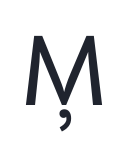</picture></td><td align="center"><picture><source media="(prefers-color-scheme: dark)" srcset="images/character-alternatives/uni1E40-ss12.dark.svg"></picture></td><td align="center"><picture><source media="(prefers-color-scheme: dark)" srcset="images/character-alternatives/uni1E42-ss12.dark.svg"></picture></td></tr>
<tr><td align="center"><code>M.ss12</code></td><td align="center"><code>Mcommaaccent.loclMAH.ss12</code></td><td align="center"><code>Mcommaaccent.ss12</code></td><td align="center"><code>uni1E40.ss12</code></td><td align="center"><code>uni1E42.ss12</code></td></tr>
</table>

## `ss13` — Square M

10 substitutions produce **5 distinct forms**.

<table>
<tr><td rowspan="2" align="left"><code><b>ss13</b></code> Square M 5 forms</td><td align="center"><picture><source media="(prefers-color-scheme: dark)" srcset="images/character-alternatives/M-ss13.dark.svg"></picture></td><td align="center"><picture><source media="(prefers-color-scheme: dark)" srcset="images/character-alternatives/Mcommaaccent-loclMAH-ss13.dark.svg"></picture></td><td align="center"><picture><source media="(prefers-color-scheme: dark)" srcset="images/character-alternatives/Mcommaaccent-ss13.dark.svg">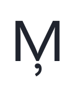</picture></td><td align="center"><picture><source media="(prefers-color-scheme: dark)" srcset="images/character-alternatives/uni1E40-ss13.dark.svg"></picture></td><td align="center"><picture><source media="(prefers-color-scheme: dark)" srcset="images/character-alternatives/uni1E42-ss13.dark.svg"></picture></td></tr>
<tr><td align="center"><code>M.ss13</code></td><td align="center"><code>Mcommaaccent.loclMAH.ss13</code></td><td align="center"><code>Mcommaaccent.ss13</code></td><td align="center"><code>uni1E40.ss13</code></td><td align="center"><code>uni1E42.ss13</code></td></tr>
</table>

## `ss14` — Constructed f and t

21 substitutions produce **13 distinct forms**.

<table>
<tr><td rowspan="2" align="left"><code><b>ss14</b></code> Constructed f and t 13 forms</td><td align="center"><picture><source media="(prefers-color-scheme: dark)" srcset="images/character-alternatives/f-ss14.dark.svg"></picture></td><td align="center"><picture><source media="(prefers-color-scheme: dark)" srcset="images/character-alternatives/f_f_i-ss14.dark.svg"></picture></td><td align="center"><picture><source media="(prefers-color-scheme: dark)" srcset="images/character-alternatives/f_f_l-ss14.dark.svg"></picture></td><td align="center"><picture><source media="(prefers-color-scheme: dark)" srcset="images/character-alternatives/f_t-ss14.dark.svg"></picture></td><td align="center"><picture><source media="(prefers-color-scheme: dark)" srcset="images/character-alternatives/fi-ss14.dark.svg"></picture></td><td align="center"><picture><source media="(prefers-color-scheme: dark)" srcset="images/character-alternatives/fl-ss14.dark.svg"></picture></td><td align="center"><picture><source media="(prefers-color-scheme: dark)" srcset="images/character-alternatives/t-ss14.dark.svg"></picture></td><td align="center"><picture><source media="(prefers-color-scheme: dark)" srcset="images/character-alternatives/tbar-ss14.dark.svg"></picture></td><td align="center"><picture><source media="(prefers-color-scheme: dark)" srcset="images/character-alternatives/tcaron-ss14.dark.svg"></picture></td><td align="center"><picture><source media="(prefers-color-scheme: dark)" srcset="images/character-alternatives/uni0163-ss14.dark.svg"></picture></td><td align="center"><picture><source media="(prefers-color-scheme: dark)" srcset="images/character-alternatives/uni021B-ss14.dark.svg"></picture></td><td align="center"><picture><source media="(prefers-color-scheme: dark)" srcset="images/character-alternatives/uni1E6D-ss14.dark.svg"></picture></td><td align="center"><picture><source media="(prefers-color-scheme: dark)" srcset="images/character-alternatives/uni1E6F-ss14.dark.svg"></picture></td></tr>
<tr><td align="center"><code>f.ss14</code></td><td align="center"><code>f_f_i.ss14</code></td><td align="center"><code>f_f_l.ss14</code></td><td align="center"><code>f_t.ss14</code></td><td align="center"><code>fi.ss14</code></td><td align="center"><code>fl.ss14</code></td><td align="center"><code>t.ss14</code></td><td align="center"><code>tbar.ss14</code></td><td align="center"><code>tcaron.ss14</code></td><td align="center"><code>uni0163.ss14</code></td><td align="center"><code>uni021B.ss14</code></td><td align="center"><code>uni1E6D.ss14</code></td><td align="center"><code>uni1E6F.ss14</code></td></tr>
</table>

## `ss15` — Humanist f and t

21 substitutions produce **13 distinct forms**.

<table>
<tr><td rowspan="2" align="left"><code><b>ss15</b></code> Humanist f and t 13 forms</td><td align="center"><picture><source media="(prefers-color-scheme: dark)" srcset="images/character-alternatives/f-ss15.dark.svg"></picture></td><td align="center"><picture><source media="(prefers-color-scheme: dark)" srcset="images/character-alternatives/f_f_i-ss15.dark.svg"></picture></td><td align="center"><picture><source media="(prefers-color-scheme: dark)" srcset="images/character-alternatives/f_f_l-ss15.dark.svg"></picture></td><td align="center"><picture><source media="(prefers-color-scheme: dark)" srcset="images/character-alternatives/f_t-ss15.dark.svg"></picture></td><td align="center"><picture><source media="(prefers-color-scheme: dark)" srcset="images/character-alternatives/fi-ss15.dark.svg"></picture></td><td align="center"><picture><source media="(prefers-color-scheme: dark)" srcset="images/character-alternatives/fl-ss15.dark.svg"></picture></td><td align="center"><picture><source media="(prefers-color-scheme: dark)" srcset="images/character-alternatives/t-ss15.dark.svg"></picture></td><td align="center"><picture><source media="(prefers-color-scheme: dark)" srcset="images/character-alternatives/tbar-ss15.dark.svg"></picture></td><td align="center"><picture><source media="(prefers-color-scheme: dark)" srcset="images/character-alternatives/tcaron-ss15.dark.svg"></picture></td><td align="center"><picture><source media="(prefers-color-scheme: dark)" srcset="images/character-alternatives/uni0163-ss15.dark.svg"></picture></td><td align="center"><picture><source media="(prefers-color-scheme: dark)" srcset="images/character-alternatives/uni021B-ss15.dark.svg"></picture></td><td align="center"><picture><source media="(prefers-color-scheme: dark)" srcset="images/character-alternatives/uni1E6D-ss15.dark.svg"></picture></td><td align="center"><picture><source media="(prefers-color-scheme: dark)" srcset="images/character-alternatives/uni1E6F-ss15.dark.svg"></picture></td></tr>
<tr><td align="center"><code>f.ss15</code></td><td align="center"><code>f_f_i.ss15</code></td><td align="center"><code>f_f_l.ss15</code></td><td align="center"><code>f_t.ss15</code></td><td align="center"><code>fi.ss15</code></td><td align="center"><code>fl.ss15</code></td><td align="center"><code>t.ss15</code></td><td align="center"><code>tbar.ss15</code></td><td align="center"><code>tcaron.ss15</code></td><td align="center"><code>uni0163.ss15</code></td><td align="center"><code>uni021B.ss15</code></td><td align="center"><code>uni1E6D.ss15</code></td><td align="center"><code>uni1E6F.ss15</code></td></tr>
</table>

## `ss16` — Humanist/Grotesk 6 and 9

48 substitutions produce **14 distinct forms**.

<table>
<tr><td rowspan="2" align="left"><code><b>ss16</b></code> Humanist/Grotesk 6 and 9 14 forms</td><td align="center"><picture><source media="(prefers-color-scheme: dark)" srcset="images/character-alternatives/nine-dnom-ss16.dark.svg"></picture></td><td align="center"><picture><source media="(prefers-color-scheme: dark)" srcset="images/character-alternatives/nine-lf-ss16.dark.svg"></picture></td><td align="center"><picture><source media="(prefers-color-scheme: dark)" srcset="images/character-alternatives/nine-numr-ss16.dark.svg"></picture></td><td align="center"><picture><source media="(prefers-color-scheme: dark)" srcset="images/character-alternatives/nine-ss16.dark.svg"></picture></td><td align="center"><picture><source media="(prefers-color-scheme: dark)" srcset="images/character-alternatives/nine-tf-ss16.dark.svg"></picture></td><td align="center"><picture><source media="(prefers-color-scheme: dark)" srcset="images/character-alternatives/six-dnom-ss16.dark.svg"></picture></td><td align="center"><picture><source media="(prefers-color-scheme: dark)" srcset="images/character-alternatives/six-lf-ss16.dark.svg"></picture></td><td align="center"><picture><source media="(prefers-color-scheme: dark)" srcset="images/character-alternatives/six-numr-ss16.dark.svg"></picture></td><td align="center"><picture><source media="(prefers-color-scheme: dark)" srcset="images/character-alternatives/six-ss16.dark.svg"></picture></td><td align="center"><picture><source media="(prefers-color-scheme: dark)" srcset="images/character-alternatives/six-tf-ss16.dark.svg"></picture></td><td align="center"><picture><source media="(prefers-color-scheme: dark)" srcset="images/character-alternatives/uni2076-ss16.dark.svg"></picture></td><td align="center"><picture><source media="(prefers-color-scheme: dark)" srcset="images/character-alternatives/uni2079-ss16.dark.svg"></picture></td><td align="center"><picture><source media="(prefers-color-scheme: dark)" srcset="images/character-alternatives/uni2086-ss16.dark.svg"></picture></td><td align="center"><picture><source media="(prefers-color-scheme: dark)" srcset="images/character-alternatives/uni2089-ss16.dark.svg"></picture></td></tr>
<tr><td align="center"><code>nine.dnom.ss16</code></td><td align="center"><code>nine.lf.ss16</code></td><td align="center"><code>nine.numr.ss16</code></td><td align="center"><code>nine.ss16</code></td><td align="center"><code>nine.tf.ss16</code></td><td align="center"><code>six.dnom.ss16</code></td><td align="center"><code>six.lf.ss16</code></td><td align="center"><code>six.numr.ss16</code></td><td align="center"><code>six.ss16</code></td><td align="center"><code>six.tf.ss16</code></td><td align="center"><code>uni2076.ss16</code></td><td align="center"><code>uni2079.ss16</code></td><td align="center"><code>uni2086.ss16</code></td><td align="center"><code>uni2089.ss16</code></td></tr>
</table>

## `ss17` — Geometric/legible 6 and 9

24 substitutions produce **14 distinct forms**.

<table>
<tr><td rowspan="2" align="left"><code><b>ss17</b></code> Geometric/legible 6 and 9 14 forms</td><td align="center"><picture><source media="(prefers-color-scheme: dark)" srcset="images/character-alternatives/nine-dnom-ss17.dark.svg"></picture></td><td align="center"><picture><source media="(prefers-color-scheme: dark)" srcset="images/character-alternatives/nine-lf-ss17.dark.svg"></picture></td><td align="center"><picture><source media="(prefers-color-scheme: dark)" srcset="images/character-alternatives/nine-numr-ss17.dark.svg"></picture></td><td align="center"><picture><source media="(prefers-color-scheme: dark)" srcset="images/character-alternatives/nine-ss17.dark.svg"></picture></td><td align="center"><picture><source media="(prefers-color-scheme: dark)" srcset="images/character-alternatives/nine-tf-ss17.dark.svg"></picture></td><td align="center"><picture><source media="(prefers-color-scheme: dark)" srcset="images/character-alternatives/six-dnom-ss17.dark.svg"></picture></td><td align="center"><picture><source media="(prefers-color-scheme: dark)" srcset="images/character-alternatives/six-lf-ss17.dark.svg"></picture></td><td align="center"><picture><source media="(prefers-color-scheme: dark)" srcset="images/character-alternatives/six-numr-ss17.dark.svg"></picture></td><td align="center"><picture><source media="(prefers-color-scheme: dark)" srcset="images/character-alternatives/six-ss17.dark.svg"></picture></td><td align="center"><picture><source media="(prefers-color-scheme: dark)" srcset="images/character-alternatives/six-tf-ss17.dark.svg"></picture></td><td align="center"><picture><source media="(prefers-color-scheme: dark)" srcset="images/character-alternatives/uni2076-ss17.dark.svg"></picture></td><td align="center"><picture><source media="(prefers-color-scheme: dark)" srcset="images/character-alternatives/uni2079-ss17.dark.svg"></picture></td><td align="center"><picture><source media="(prefers-color-scheme: dark)" srcset="images/character-alternatives/uni2086-ss17.dark.svg"></picture></td><td align="center"><picture><source media="(prefers-color-scheme: dark)" srcset="images/character-alternatives/uni2089-ss17.dark.svg"></picture></td></tr>
<tr><td align="center"><code>nine.dnom.ss17</code></td><td align="center"><code>nine.lf.ss17</code></td><td align="center"><code>nine.numr.ss17</code></td><td align="center"><code>nine.ss17</code></td><td align="center"><code>nine.tf.ss17</code></td><td align="center"><code>six.dnom.ss17</code></td><td align="center"><code>six.lf.ss17</code></td><td align="center"><code>six.numr.ss17</code></td><td align="center"><code>six.ss17</code></td><td align="center"><code>six.tf.ss17</code></td><td align="center"><code>uni2076.ss17</code></td><td align="center"><code>uni2079.ss17</code></td><td align="center"><code>uni2086.ss17</code></td><td align="center"><code>uni2089.ss17</code></td></tr>
</table>

## `ss18` — A11Y I l a

126 substitutions produce **56 distinct forms**.

<table>
<tr><td rowspan="2" align="left"><code><b>ss18</b></code> A11Y I l a 56 forms</td><td align="center"><picture><source media="(prefers-color-scheme: dark)" srcset="images/character-alternatives/I-ss18.dark.svg"></picture></td><td align="center"><picture><source media="(prefers-color-scheme: dark)" srcset="images/character-alternatives/IJ-ss18.dark.svg"></picture></td><td align="center"><picture><source media="(prefers-color-scheme: dark)" srcset="images/character-alternatives/IJacute-ss18.dark.svg"></picture></td><td align="center"><picture><source media="(prefers-color-scheme: dark)" srcset="images/character-alternatives/Iacute-ss18.dark.svg"></picture></td><td align="center"><picture><source media="(prefers-color-scheme: dark)" srcset="images/character-alternatives/Icircumflex-ss18.dark.svg"></picture></td><td align="center"><picture><source media="(prefers-color-scheme: dark)" srcset="images/character-alternatives/Idieresis-ss18.dark.svg"></picture></td><td align="center"><picture><source media="(prefers-color-scheme: dark)" srcset="images/character-alternatives/Idotaccent-ss18.dark.svg"></picture></td><td align="center"><picture><source media="(prefers-color-scheme: dark)" srcset="images/character-alternatives/Igrave-ss18.dark.svg"></picture></td><td align="center"><picture><source media="(prefers-color-scheme: dark)" srcset="images/character-alternatives/Imacron-ss18.dark.svg"></picture></td><td align="center"><picture><source media="(prefers-color-scheme: dark)" srcset="images/character-alternatives/Iogonek-ss18.dark.svg"></picture></td><td align="center"><picture><source media="(prefers-color-scheme: dark)" srcset="images/character-alternatives/Itilde-ss18.dark.svg"></picture></td><td align="center"><picture><source media="(prefers-color-scheme: dark)" srcset="images/character-alternatives/a-ss18.dark.svg"></picture></td><td align="center"><picture><source media="(prefers-color-scheme: dark)" srcset="images/character-alternatives/aacute-ss18.dark.svg"></picture></td><td align="center"><picture><source media="(prefers-color-scheme: dark)" srcset="images/character-alternatives/abreve-ss18.dark.svg"></picture></td><td align="center"><picture><source media="(prefers-color-scheme: dark)" srcset="images/character-alternatives/acircumflex-ss18.dark.svg"></picture></td><td align="center"><picture><source media="(prefers-color-scheme: dark)" srcset="images/character-alternatives/adieresis-ss18.dark.svg">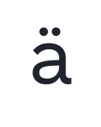</picture></td><td align="center"><picture><source media="(prefers-color-scheme: dark)" srcset="images/character-alternatives/ae-ss03.dark.svg"></picture></td><td align="center"><picture><source media="(prefers-color-scheme: dark)" srcset="images/character-alternatives/agrave-ss18.dark.svg"></picture></td><td align="center"><picture><source media="(prefers-color-scheme: dark)" srcset="images/character-alternatives/amacron-ss18.dark.svg"></picture></td><td align="center"><picture><source media="(prefers-color-scheme: dark)" srcset="images/character-alternatives/aogonek-ss18.dark.svg"></picture></td><td align="center"><picture><source media="(prefers-color-scheme: dark)" srcset="images/character-alternatives/aring-ss18.dark.svg"></picture></td><td align="center"><picture><source media="(prefers-color-scheme: dark)" srcset="images/character-alternatives/atilde-ss18.dark.svg">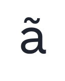</picture></td><td align="center"><picture><source media="(prefers-color-scheme: dark)" srcset="images/character-alternatives/g-rcltA11y.dark.svg"></picture></td><td align="center"><picture><source media="(prefers-color-scheme: dark)" srcset="images/character-alternatives/gbreve-rcltA11y.dark.svg"></picture></td><td align="center"><picture><source media="(prefers-color-scheme: dark)" srcset="images/character-alternatives/gcircumflex-rcltA11y.dark.svg"></picture></td><td align="center"><picture><source media="(prefers-color-scheme: dark)" srcset="images/character-alternatives/gdotaccent-rcltA11y.dark.svg"></picture></td><td align="center"><picture><source media="(prefers-color-scheme: dark)" srcset="images/character-alternatives/l-ss18.dark.svg"></picture></td><td align="center"><picture><source media="(prefers-color-scheme: dark)" srcset="images/character-alternatives/lacute-ss18.dark.svg"></picture></td><td align="center"><picture><source media="(prefers-color-scheme: dark)" srcset="images/character-alternatives/lcaron-ss18.dark.svg"></picture></td><td align="center"><picture><source media="(prefers-color-scheme: dark)" srcset="images/character-alternatives/ldot-ss18.dark.svg"></picture></td><td align="center"><picture><source media="(prefers-color-scheme: dark)" srcset="images/character-alternatives/lslash-ss18.dark.svg"></picture></td><td align="center"><picture><source media="(prefers-color-scheme: dark)" srcset="images/character-alternatives/ordfeminine-ss03.dark.svg"></picture></td><td align="center"><picture><source media="(prefers-color-scheme: dark)" srcset="images/character-alternatives/uni0123-rcltA11y.dark.svg"></picture></td><td align="center"><picture><source media="(prefers-color-scheme: dark)" srcset="images/character-alternatives/uni013C-loclMAH-ss18.dark.svg"></picture></td><td align="center"><picture><source media="(prefers-color-scheme: dark)" srcset="images/character-alternatives/uni013C-ss18.dark.svg"></picture></td><td align="center"><picture><source media="(prefers-color-scheme: dark)" srcset="images/character-alternatives/uni01E3-ss03.dark.svg"></picture></td><td align="center"><picture><source media="(prefers-color-scheme: dark)" srcset="images/character-alternatives/uni0203-ss18.dark.svg"></picture></td><td align="center"><picture><source media="(prefers-color-scheme: dark)" srcset="images/character-alternatives/uni020A-ss18.dark.svg"></picture></td><td align="center"><picture><source media="(prefers-color-scheme: dark)" srcset="images/character-alternatives/uni1E21-rcltA11y.dark.svg"></picture></td><td align="center"><picture><source media="(prefers-color-scheme: dark)" srcset="images/character-alternatives/uni1E37-ss18.dark.svg"></picture></td><td align="center"><picture><source media="(prefers-color-scheme: dark)" srcset="images/character-alternatives/uni1E39-ss18.dark.svg"></picture></td><td align="center"><picture><source media="(prefers-color-scheme: dark)" srcset="images/character-alternatives/uni1E3B-ss18.dark.svg"></picture></td><td align="center"><picture><source media="(prefers-color-scheme: dark)" srcset="images/character-alternatives/uni1EA1-ss18.dark.svg"></picture></td><td align="center"><picture><source media="(prefers-color-scheme: dark)" srcset="images/character-alternatives/uni1EA3-ss18.dark.svg"></picture></td><td align="center"><picture><source media="(prefers-color-scheme: dark)" srcset="images/character-alternatives/uni1EA5-ss18.dark.svg">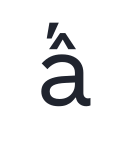</picture></td><td align="center"><picture><source media="(prefers-color-scheme: dark)" srcset="images/character-alternatives/uni1EA7-ss18.dark.svg"></picture></td><td align="center"><picture><source media="(prefers-color-scheme: dark)" srcset="images/character-alternatives/uni1EA9-ss18.dark.svg"></picture></td><td align="center"><picture><source media="(prefers-color-scheme: dark)" srcset="images/character-alternatives/uni1EAB-ss18.dark.svg">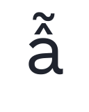</picture></td><td align="center"><picture><source media="(prefers-color-scheme: dark)" srcset="images/character-alternatives/uni1EAD-ss18.dark.svg"></picture></td><td align="center"><picture><source media="(prefers-color-scheme: dark)" srcset="images/character-alternatives/uni1EAF-ss18.dark.svg"></picture></td><td align="center"><picture><source media="(prefers-color-scheme: dark)" srcset="images/character-alternatives/uni1EB1-ss18.dark.svg"></picture></td><td align="center"><picture><source media="(prefers-color-scheme: dark)" srcset="images/character-alternatives/uni1EB3-ss18.dark.svg"></picture></td><td align="center"><picture><source media="(prefers-color-scheme: dark)" srcset="images/character-alternatives/uni1EB5-ss18.dark.svg"></picture></td><td align="center"><picture><source media="(prefers-color-scheme: dark)" srcset="images/character-alternatives/uni1EB7-ss18.dark.svg">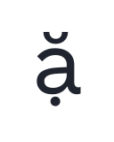</picture></td><td align="center"><picture><source media="(prefers-color-scheme: dark)" srcset="images/character-alternatives/uni1EC8-ss18.dark.svg"></picture></td><td align="center"><picture><source media="(prefers-color-scheme: dark)" srcset="images/character-alternatives/uni1ECA-ss18.dark.svg"></picture></td></tr>
<tr><td align="center"><code>I.ss18</code></td><td align="center"><code>IJ.ss18</code></td><td align="center"><code>IJacute.ss18</code></td><td align="center"><code>Iacute.ss18</code></td><td align="center"><code>Icircumflex.ss18</code></td><td align="center"><code>Idieresis.ss18</code></td><td align="center"><code>Idotaccent.ss18</code></td><td align="center"><code>Igrave.ss18</code></td><td align="center"><code>Imacron.ss18</code></td><td align="center"><code>Iogonek.ss18</code></td><td align="center"><code>Itilde.ss18</code></td><td align="center"><code>a.ss18</code></td><td align="center"><code>aacute.ss18</code></td><td align="center"><code>abreve.ss18</code></td><td align="center"><code>acircumflex.ss18</code></td><td align="center"><code>adieresis.ss18</code></td><td align="center"><code>ae.ss03</code></td><td align="center"><code>agrave.ss18</code></td><td align="center"><code>amacron.ss18</code></td><td align="center"><code>aogonek.ss18</code></td><td align="center"><code>aring.ss18</code></td><td align="center"><code>atilde.ss18</code></td><td align="center"><code>g.rcltA11y</code></td><td align="center"><code>gbreve.rcltA11y</code></td><td align="center"><code>gcircumflex.rcltA11y</code></td><td align="center"><code>gdotaccent.rcltA11y</code></td><td align="center"><code>l.ss18</code></td><td align="center"><code>lacute.ss18</code></td><td align="center"><code>lcaron.ss18</code></td><td align="center"><code>ldot.ss18</code></td><td align="center"><code>lslash.ss18</code></td><td align="center"><code>ordfeminine.ss03</code></td><td align="center"><code>uni0123.rcltA11y</code></td><td align="center"><code>uni013C.loclMAH.ss18</code></td><td align="center"><code>uni013C.ss18</code></td><td align="center"><code>uni01E3.ss03</code></td><td align="center"><code>uni0203.ss18</code></td><td align="center"><code>uni020A.ss18</code></td><td align="center"><code>uni1E21.rcltA11y</code></td><td align="center"><code>uni1E37.ss18</code></td><td align="center"><code>uni1E39.ss18</code></td><td align="center"><code>uni1E3B.ss18</code></td><td align="center"><code>uni1EA1.ss18</code></td><td align="center"><code>uni1EA3.ss18</code></td><td align="center"><code>uni1EA5.ss18</code></td><td align="center"><code>uni1EA7.ss18</code></td><td align="center"><code>uni1EA9.ss18</code></td><td align="center"><code>uni1EAB.ss18</code></td><td align="center"><code>uni1EAD.ss18</code></td><td align="center"><code>uni1EAF.ss18</code></td><td align="center"><code>uni1EB1.ss18</code></td><td align="center"><code>uni1EB3.ss18</code></td><td align="center"><code>uni1EB5.ss18</code></td><td align="center"><code>uni1EB7.ss18</code></td><td align="center"><code>uni1EC8.ss18</code></td><td align="center"><code>uni1ECA.ss18</code></td></tr>
</table>

## `ss19` — Constructed l

20 substitutions produce **10 distinct forms**.

<table>
<tr><td rowspan="2" align="left"><code><b>ss19</b></code> Constructed l 10 forms</td><td align="center"><picture><source media="(prefers-color-scheme: dark)" srcset="images/character-alternatives/l-ss19.dark.svg"></picture></td><td align="center"><picture><source media="(prefers-color-scheme: dark)" srcset="images/character-alternatives/lacute-ss19.dark.svg"></picture></td><td align="center"><picture><source media="(prefers-color-scheme: dark)" srcset="images/character-alternatives/lcaron-ss19.dark.svg"></picture></td><td align="center"><picture><source media="(prefers-color-scheme: dark)" srcset="images/character-alternatives/ldot-ss19.dark.svg"></picture></td><td align="center"><picture><source media="(prefers-color-scheme: dark)" srcset="images/character-alternatives/lslash-ss19.dark.svg"></picture></td><td align="center"><picture><source media="(prefers-color-scheme: dark)" srcset="images/character-alternatives/uni013C-loclMAH-ss19.dark.svg"></picture></td><td align="center"><picture><source media="(prefers-color-scheme: dark)" srcset="images/character-alternatives/uni013C-ss19.dark.svg"></picture></td><td align="center"><picture><source media="(prefers-color-scheme: dark)" srcset="images/character-alternatives/uni1E37-ss19.dark.svg"></picture></td><td align="center"><picture><source media="(prefers-color-scheme: dark)" srcset="images/character-alternatives/uni1E39-ss19.dark.svg"></picture></td><td align="center"><picture><source media="(prefers-color-scheme: dark)" srcset="images/character-alternatives/uni1E3B-ss19.dark.svg"></picture></td></tr>
<tr><td align="center"><code>l.ss19</code></td><td align="center"><code>lacute.ss19</code></td><td align="center"><code>lcaron.ss19</code></td><td align="center"><code>ldot.ss19</code></td><td align="center"><code>lslash.ss19</code></td><td align="center"><code>uni013C.loclMAH.ss19</code></td><td align="center"><code>uni013C.ss19</code></td><td align="center"><code>uni1E37.ss19</code></td><td align="center"><code>uni1E39.ss19</code></td><td align="center"><code>uni1E3B.ss19</code></td></tr>
</table>

## `ss20` — Horizontal Sharps

76 substitutions produce **68 distinct forms**.

<table>
<tr><td rowspan="2" align="left"><code><b>ss20</b></code> Horizontal Sharps 68 forms</td><td align="center"><picture><source media="(prefers-color-scheme: dark)" srcset="images/character-alternatives/Z-ss20.dark.svg"></picture></td><td align="center"><picture><source media="(prefers-color-scheme: dark)" srcset="images/character-alternatives/Zacute-ss20.dark.svg"></picture></td><td align="center"><picture><source media="(prefers-color-scheme: dark)" srcset="images/character-alternatives/Zcaron-ss20.dark.svg"></picture></td><td align="center"><picture><source media="(prefers-color-scheme: dark)" srcset="images/character-alternatives/Zdotaccent-ss20.dark.svg"></picture></td><td align="center"><picture><source media="(prefers-color-scheme: dark)" srcset="images/character-alternatives/five-dnom-rcltGeo-ss20.dark.svg"></picture></td><td align="center"><picture><source media="(prefers-color-scheme: dark)" srcset="images/character-alternatives/five-dnom-ss10-ss20.dark.svg"></picture></td><td align="center"><picture><source media="(prefers-color-scheme: dark)" srcset="images/character-alternatives/five-lf-rcltGeo-ss20.dark.svg"></picture></td><td align="center"><picture><source media="(prefers-color-scheme: dark)" srcset="images/character-alternatives/five-lf-ss10-ss20.dark.svg"></picture></td><td align="center"><picture><source media="(prefers-color-scheme: dark)" srcset="images/character-alternatives/five-lf-ss20.dark.svg"></picture></td><td align="center"><picture><source media="(prefers-color-scheme: dark)" srcset="images/character-alternatives/five-numr-rcltGeo-ss20.dark.svg"></picture></td><td align="center"><picture><source media="(prefers-color-scheme: dark)" srcset="images/character-alternatives/five-numr-ss10-ss20.dark.svg"></picture></td><td align="center"><picture><source media="(prefers-color-scheme: dark)" srcset="images/character-alternatives/five-rcltGeo-ss20.dark.svg"></picture></td><td align="center"><picture><source media="(prefers-color-scheme: dark)" srcset="images/character-alternatives/five-ss10-ss20.dark.svg"></picture></td><td align="center"><picture><source media="(prefers-color-scheme: dark)" srcset="images/character-alternatives/five-ss20.dark.svg"></picture></td><td align="center"><picture><source media="(prefers-color-scheme: dark)" srcset="images/character-alternatives/five-tf-rcltGeo-ss20.dark.svg"></picture></td><td align="center"><picture><source media="(prefers-color-scheme: dark)" srcset="images/character-alternatives/five-tf-ss10-ss20.dark.svg"></picture></td><td align="center"><picture><source media="(prefers-color-scheme: dark)" srcset="images/character-alternatives/fiveeighths-rcltGeo-ss20.dark.svg"></picture></td><td align="center"><picture><source media="(prefers-color-scheme: dark)" srcset="images/character-alternatives/fiveeighths-ss10-ss20.dark.svg"></picture></td><td align="center"><picture><source media="(prefers-color-scheme: dark)" srcset="images/character-alternatives/four-dnom-ss20.dark.svg"></picture></td><td align="center"><picture><source media="(prefers-color-scheme: dark)" srcset="images/character-alternatives/four-lf-ss20.dark.svg"></picture></td><td align="center"><picture><source media="(prefers-color-scheme: dark)" srcset="images/character-alternatives/four-numr-ss20.dark.svg"></picture></td><td align="center"><picture><source media="(prefers-color-scheme: dark)" srcset="images/character-alternatives/four-ss20.dark.svg"></picture></td><td align="center"><picture><source media="(prefers-color-scheme: dark)" srcset="images/character-alternatives/four-tf-ss20.dark.svg"></picture></td><td align="center"><picture><source media="(prefers-color-scheme: dark)" srcset="images/character-alternatives/one-dnom-ss20.dark.svg"></picture></td><td align="center"><picture><source media="(prefers-color-scheme: dark)" srcset="images/character-alternatives/one-lf-ss20.dark.svg"></picture></td><td align="center"><picture><source media="(prefers-color-scheme: dark)" srcset="images/character-alternatives/one-numr-ss20.dark.svg"></picture></td><td align="center"><picture><source media="(prefers-color-scheme: dark)" srcset="images/character-alternatives/one-ss20.dark.svg"></picture></td><td align="center"><picture><source media="(prefers-color-scheme: dark)" srcset="images/character-alternatives/one-tf-ss20.dark.svg"></picture></td><td align="center"><picture><source media="(prefers-color-scheme: dark)" srcset="images/character-alternatives/oneeighth-ss10-ss20.dark.svg"></picture></td><td align="center"><picture><source media="(prefers-color-scheme: dark)" srcset="images/character-alternatives/oneeighth-ss20.dark.svg"></picture></td><td align="center"><picture><source media="(prefers-color-scheme: dark)" srcset="images/character-alternatives/onehalf-ss10-ss20.dark.svg"></picture></td><td align="center"><picture><source media="(prefers-color-scheme: dark)" srcset="images/character-alternatives/onehalf-ss20.dark.svg"></picture></td><td align="center"><picture><source media="(prefers-color-scheme: dark)" srcset="images/character-alternatives/onequarter-ss10-ss20.dark.svg">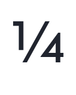</picture></td><td align="center"><picture><source media="(prefers-color-scheme: dark)" srcset="images/character-alternatives/onequarter-ss20.dark.svg">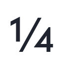</picture></td><td align="center"><picture><source media="(prefers-color-scheme: dark)" srcset="images/character-alternatives/seven-disp-ss20.dark.svg"></picture></td><td align="center"><picture><source media="(prefers-color-scheme: dark)" srcset="images/character-alternatives/seven-dnom-ss20.dark.svg"></picture></td><td align="center"><picture><source media="(prefers-color-scheme: dark)" srcset="images/character-alternatives/seven-lf-ss20.dark.svg"></picture></td><td align="center"><picture><source media="(prefers-color-scheme: dark)" srcset="images/character-alternatives/seven-numr-ss20.dark.svg"></picture></td><td align="center"><picture><source media="(prefers-color-scheme: dark)" srcset="images/character-alternatives/seven-ss20.dark.svg"></picture></td><td align="center"><picture><source media="(prefers-color-scheme: dark)" srcset="images/character-alternatives/seven-tf-ss20.dark.svg"></picture></td><td align="center"><picture><source media="(prefers-color-scheme: dark)" srcset="images/character-alternatives/two-dnom-ss20.dark.svg"></picture></td><td align="center"><picture><source media="(prefers-color-scheme: dark)" srcset="images/character-alternatives/two-lf-ss20.dark.svg"></picture></td><td align="center"><picture><source media="(prefers-color-scheme: dark)" srcset="images/character-alternatives/two-numr-ss20.dark.svg"></picture></td><td align="center"><picture><source media="(prefers-color-scheme: dark)" srcset="images/character-alternatives/two-ss20.dark.svg"></picture></td><td align="center"><picture><source media="(prefers-color-scheme: dark)" srcset="images/character-alternatives/two-tf-ss20.dark.svg"></picture></td><td align="center"><picture><source media="(prefers-color-scheme: dark)" srcset="images/character-alternatives/uni00B2-ss20.dark.svg"></picture></td><td align="center"><picture><source media="(prefers-color-scheme: dark)" srcset="images/character-alternatives/uni00B9-ss20.dark.svg"></picture></td><td align="center"><picture><source media="(prefers-color-scheme: dark)" srcset="images/character-alternatives/uni1E92-ss20.dark.svg"></picture></td><td align="center"><picture><source media="(prefers-color-scheme: dark)" srcset="images/character-alternatives/uni1E93-ss20.dark.svg"></picture></td><td align="center"><picture><source media="(prefers-color-scheme: dark)" srcset="images/character-alternatives/uni1E94-ss20.dark.svg"></picture></td><td align="center"><picture><source media="(prefers-color-scheme: dark)" srcset="images/character-alternatives/uni1E95-ss20.dark.svg"></picture></td><td align="center"><picture><source media="(prefers-color-scheme: dark)" srcset="images/character-alternatives/uni2074-ss20.dark.svg"></picture></td><td align="center"><picture><source media="(prefers-color-scheme: dark)" srcset="images/character-alternatives/uni2075-rcltGeo-ss20.dark.svg"></picture></td><td align="center"><picture><source media="(prefers-color-scheme: dark)" srcset="images/character-alternatives/uni2075-ss10-ss20.dark.svg"></picture></td><td align="center"><picture><source media="(prefers-color-scheme: dark)" srcset="images/character-alternatives/uni2077-ss20.dark.svg"></picture></td><td align="center"><picture><source media="(prefers-color-scheme: dark)" srcset="images/character-alternatives/uni2081-ss20.dark.svg"></picture></td><td align="center"><picture><source media="(prefers-color-scheme: dark)" srcset="images/character-alternatives/uni2082-ss20.dark.svg"></picture></td><td align="center"><picture><source media="(prefers-color-scheme: dark)" srcset="images/character-alternatives/uni2084-ss20.dark.svg"></picture></td><td align="center"><picture><source media="(prefers-color-scheme: dark)" srcset="images/character-alternatives/uni2085-ss10-ss20.dark.svg"></picture></td><td align="center"><picture><source media="(prefers-color-scheme: dark)" srcset="images/character-alternatives/uni2087-ss20.dark.svg"></picture></td><td align="center"><picture><source media="(prefers-color-scheme: dark)" srcset="images/character-alternatives/uni2153-ss10-ss20.dark.svg">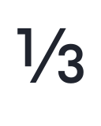</picture></td><td align="center"><picture><source media="(prefers-color-scheme: dark)" srcset="images/character-alternatives/uni2153-ss20.dark.svg">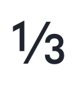</picture></td><td align="center"><picture><source media="(prefers-color-scheme: dark)" srcset="images/character-alternatives/uni2154-ss10-ss20.dark.svg">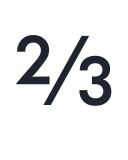</picture></td><td align="center"><picture><source media="(prefers-color-scheme: dark)" srcset="images/character-alternatives/uni2154-ss20.dark.svg">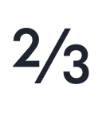</picture></td><td align="center"><picture><source media="(prefers-color-scheme: dark)" srcset="images/character-alternatives/z-ss20.dark.svg"></picture></td><td align="center"><picture><source media="(prefers-color-scheme: dark)" srcset="images/character-alternatives/zacute-ss20.dark.svg"></picture></td><td align="center"><picture><source media="(prefers-color-scheme: dark)" srcset="images/character-alternatives/zcaron-ss20.dark.svg"></picture></td><td align="center"><picture><source media="(prefers-color-scheme: dark)" srcset="images/character-alternatives/zdotaccent-ss20.dark.svg"></picture></td></tr>
<tr><td align="center"><code>Z.ss20</code></td><td align="center"><code>Zacute.ss20</code></td><td align="center"><code>Zcaron.ss20</code></td><td align="center"><code>Zdotaccent.ss20</code></td><td align="center"><code>five.dnom.rcltGeo.ss20</code></td><td align="center"><code>five.dnom.ss10.ss20</code></td><td align="center"><code>five.lf.rcltGeo.ss20</code></td><td align="center"><code>five.lf.ss10.ss20</code></td><td align="center"><code>five.lf.ss20</code></td><td align="center"><code>five.numr.rcltGeo.ss20</code></td><td align="center"><code>five.numr.ss10.ss20</code></td><td align="center"><code>five.rcltGeo.ss20</code></td><td align="center"><code>five.ss10.ss20</code></td><td align="center"><code>five.ss20</code></td><td align="center"><code>five.tf.rcltGeo.ss20</code></td><td align="center"><code>five.tf.ss10.ss20</code></td><td align="center"><code>fiveeighths.rcltGeo.ss20</code></td><td align="center"><code>fiveeighths.ss10.ss20</code></td><td align="center"><code>four.dnom.ss20</code></td><td align="center"><code>four.lf.ss20</code></td><td align="center"><code>four.numr.ss20</code></td><td align="center"><code>four.ss20</code></td><td align="center"><code>four.tf.ss20</code></td><td align="center"><code>one.dnom.ss20</code></td><td align="center"><code>one.lf.ss20</code></td><td align="center"><code>one.numr.ss20</code></td><td align="center"><code>one.ss20</code></td><td align="center"><code>one.tf.ss20</code></td><td align="center"><code>oneeighth.ss10.ss20</code></td><td align="center"><code>oneeighth.ss20</code></td><td align="center"><code>onehalf.ss10.ss20</code></td><td align="center"><code>onehalf.ss20</code></td><td align="center"><code>onequarter.ss10.ss20</code></td><td align="center"><code>onequarter.ss20</code></td><td align="center"><code>seven.disp.ss20</code></td><td align="center"><code>seven.dnom.ss20</code></td><td align="center"><code>seven.lf.ss20</code></td><td align="center"><code>seven.numr.ss20</code></td><td align="center"><code>seven.ss20</code></td><td align="center"><code>seven.tf.ss20</code></td><td align="center"><code>two.dnom.ss20</code></td><td align="center"><code>two.lf.ss20</code></td><td align="center"><code>two.numr.ss20</code></td><td align="center"><code>two.ss20</code></td><td align="center"><code>two.tf.ss20</code></td><td align="center"><code>uni00B2.ss20</code></td><td align="center"><code>uni00B9.ss20</code></td><td align="center"><code>uni1E92.ss20</code></td><td align="center"><code>uni1E93.ss20</code></td><td align="center"><code>uni1E94.ss20</code></td><td align="center"><code>uni1E95.ss20</code></td><td align="center"><code>uni2074.ss20</code></td><td align="center"><code>uni2075.rcltGeo.ss20</code></td><td align="center"><code>uni2075.ss10.ss20</code></td><td align="center"><code>uni2077.ss20</code></td><td align="center"><code>uni2081.ss20</code></td><td align="center"><code>uni2082.ss20</code></td><td align="center"><code>uni2084.ss20</code></td><td align="center"><code>uni2085.ss10.ss20</code></td><td align="center"><code>uni2087.ss20</code></td><td align="center"><code>uni2153.ss10.ss20</code></td><td align="center"><code>uni2153.ss20</code></td><td align="center"><code>uni2154.ss10.ss20</code></td><td align="center"><code>uni2154.ss20</code></td><td align="center"><code>z.ss20</code></td><td align="center"><code>zacute.ss20</code></td><td align="center"><code>zcaron.ss20</code></td><td align="center"><code>zdotaccent.ss20</code></td></tr>
</table>

## `cv01` — Geometric a

71 substitutions produce **24 distinct forms**.

<table>
<tr><td rowspan="2" align="left"><code><b>cv01</b></code> Geometric a 24 forms</td><td align="center"><picture><source media="(prefers-color-scheme: dark)" srcset="images/character-alternatives/a-ss01.dark.svg"></picture></td><td align="center"><picture><source media="(prefers-color-scheme: dark)" srcset="images/character-alternatives/aacute-ss01.dark.svg"></picture></td><td align="center"><picture><source media="(prefers-color-scheme: dark)" srcset="images/character-alternatives/abreve-ss01.dark.svg"></picture></td><td align="center"><picture><source media="(prefers-color-scheme: dark)" srcset="images/character-alternatives/acircumflex-ss01.dark.svg"></picture></td><td align="center"><picture><source media="(prefers-color-scheme: dark)" srcset="images/character-alternatives/adieresis-ss01.dark.svg"></picture></td><td align="center"><picture><source media="(prefers-color-scheme: dark)" srcset="images/character-alternatives/agrave-ss01.dark.svg"></picture></td><td align="center"><picture><source media="(prefers-color-scheme: dark)" srcset="images/character-alternatives/amacron-ss01.dark.svg"></picture></td><td align="center"><picture><source media="(prefers-color-scheme: dark)" srcset="images/character-alternatives/aogonek-ss01.dark.svg"></picture></td><td align="center"><picture><source media="(prefers-color-scheme: dark)" srcset="images/character-alternatives/aring-ss01.dark.svg"></picture></td><td align="center"><picture><source media="(prefers-color-scheme: dark)" srcset="images/character-alternatives/atilde-ss01.dark.svg"></picture></td><td align="center"><picture><source media="(prefers-color-scheme: dark)" srcset="images/character-alternatives/ordfeminine-ss01.dark.svg"></picture></td><td align="center"><picture><source media="(prefers-color-scheme: dark)" srcset="images/character-alternatives/uni0203-ss01.dark.svg"></picture></td><td align="center"><picture><source media="(prefers-color-scheme: dark)" srcset="images/character-alternatives/uni1EA1-ss01.dark.svg"></picture></td><td align="center"><picture><source media="(prefers-color-scheme: dark)" srcset="images/character-alternatives/uni1EA3-ss01.dark.svg"></picture></td><td align="center"><picture><source media="(prefers-color-scheme: dark)" srcset="images/character-alternatives/uni1EA5-ss01.dark.svg"></picture></td><td align="center"><picture><source media="(prefers-color-scheme: dark)" srcset="images/character-alternatives/uni1EA7-ss01.dark.svg"></picture></td><td align="center"><picture><source media="(prefers-color-scheme: dark)" srcset="images/character-alternatives/uni1EA9-ss01.dark.svg"></picture></td><td align="center"><picture><source media="(prefers-color-scheme: dark)" srcset="images/character-alternatives/uni1EAB-ss01.dark.svg"></picture></td><td align="center"><picture><source media="(prefers-color-scheme: dark)" srcset="images/character-alternatives/uni1EAD-ss01.dark.svg"></picture></td><td align="center"><picture><source media="(prefers-color-scheme: dark)" srcset="images/character-alternatives/uni1EAF-ss01.dark.svg"></picture></td><td align="center"><picture><source media="(prefers-color-scheme: dark)" srcset="images/character-alternatives/uni1EB1-ss01.dark.svg"></picture></td><td align="center"><picture><source media="(prefers-color-scheme: dark)" srcset="images/character-alternatives/uni1EB3-ss01.dark.svg"></picture></td><td align="center"><picture><source media="(prefers-color-scheme: dark)" srcset="images/character-alternatives/uni1EB5-ss01.dark.svg"></picture></td><td align="center"><picture><source media="(prefers-color-scheme: dark)" srcset="images/character-alternatives/uni1EB7-ss01.dark.svg"></picture></td></tr>
<tr><td align="center"><code>a.ss01</code></td><td align="center"><code>aacute.ss01</code></td><td align="center"><code>abreve.ss01</code></td><td align="center"><code>acircumflex.ss01</code></td><td align="center"><code>adieresis.ss01</code></td><td align="center"><code>agrave.ss01</code></td><td align="center"><code>amacron.ss01</code></td><td align="center"><code>aogonek.ss01</code></td><td align="center"><code>aring.ss01</code></td><td align="center"><code>atilde.ss01</code></td><td align="center"><code>ordfeminine.ss01</code></td><td align="center"><code>uni0203.ss01</code></td><td align="center"><code>uni1EA1.ss01</code></td><td align="center"><code>uni1EA3.ss01</code></td><td align="center"><code>uni1EA5.ss01</code></td><td align="center"><code>uni1EA7.ss01</code></td><td align="center"><code>uni1EA9.ss01</code></td><td align="center"><code>uni1EAB.ss01</code></td><td align="center"><code>uni1EAD.ss01</code></td><td align="center"><code>uni1EAF.ss01</code></td><td align="center"><code>uni1EB1.ss01</code></td><td align="center"><code>uni1EB3.ss01</code></td><td align="center"><code>uni1EB5.ss01</code></td><td align="center"><code>uni1EB7.ss01</code></td></tr>
</table>

## `cv02` — Humanist a

71 substitutions produce **24 distinct forms**.

<table>
<tr><td rowspan="2" align="left"><code><b>cv02</b></code> Humanist a 24 forms</td><td align="center"><picture><source media="(prefers-color-scheme: dark)" srcset="images/character-alternatives/a-ss02.dark.svg"></picture></td><td align="center"><picture><source media="(prefers-color-scheme: dark)" srcset="images/character-alternatives/aacute-ss02.dark.svg"></picture></td><td align="center"><picture><source media="(prefers-color-scheme: dark)" srcset="images/character-alternatives/abreve-ss02.dark.svg"></picture></td><td align="center"><picture><source media="(prefers-color-scheme: dark)" srcset="images/character-alternatives/acircumflex-ss02.dark.svg"></picture></td><td align="center"><picture><source media="(prefers-color-scheme: dark)" srcset="images/character-alternatives/adieresis-ss02.dark.svg"></picture></td><td align="center"><picture><source media="(prefers-color-scheme: dark)" srcset="images/character-alternatives/agrave-ss02.dark.svg"></picture></td><td align="center"><picture><source media="(prefers-color-scheme: dark)" srcset="images/character-alternatives/amacron-ss02.dark.svg"></picture></td><td align="center"><picture><source media="(prefers-color-scheme: dark)" srcset="images/character-alternatives/aogonek-ss02.dark.svg"></picture></td><td align="center"><picture><source media="(prefers-color-scheme: dark)" srcset="images/character-alternatives/aring-ss02.dark.svg"></picture></td><td align="center"><picture><source media="(prefers-color-scheme: dark)" srcset="images/character-alternatives/atilde-ss02.dark.svg"></picture></td><td align="center"><picture><source media="(prefers-color-scheme: dark)" srcset="images/character-alternatives/ordfeminine-ss02.dark.svg"></picture></td><td align="center"><picture><source media="(prefers-color-scheme: dark)" srcset="images/character-alternatives/uni0203-ss02.dark.svg"></picture></td><td align="center"><picture><source media="(prefers-color-scheme: dark)" srcset="images/character-alternatives/uni1EA1-ss02.dark.svg"></picture></td><td align="center"><picture><source media="(prefers-color-scheme: dark)" srcset="images/character-alternatives/uni1EA3-ss02.dark.svg"></picture></td><td align="center"><picture><source media="(prefers-color-scheme: dark)" srcset="images/character-alternatives/uni1EA5-ss02.dark.svg"></picture></td><td align="center"><picture><source media="(prefers-color-scheme: dark)" srcset="images/character-alternatives/uni1EA7-ss02.dark.svg"></picture></td><td align="center"><picture><source media="(prefers-color-scheme: dark)" srcset="images/character-alternatives/uni1EA9-ss02.dark.svg"></picture></td><td align="center"><picture><source media="(prefers-color-scheme: dark)" srcset="images/character-alternatives/uni1EAB-ss02.dark.svg"></picture></td><td align="center"><picture><source media="(prefers-color-scheme: dark)" srcset="images/character-alternatives/uni1EAD-ss02.dark.svg"></picture></td><td align="center"><picture><source media="(prefers-color-scheme: dark)" srcset="images/character-alternatives/uni1EAF-ss02.dark.svg"></picture></td><td align="center"><picture><source media="(prefers-color-scheme: dark)" srcset="images/character-alternatives/uni1EB1-ss02.dark.svg"></picture></td><td align="center"><picture><source media="(prefers-color-scheme: dark)" srcset="images/character-alternatives/uni1EB3-ss02.dark.svg"></picture></td><td align="center"><picture><source media="(prefers-color-scheme: dark)" srcset="images/character-alternatives/uni1EB5-ss02.dark.svg"></picture></td><td align="center"><picture><source media="(prefers-color-scheme: dark)" srcset="images/character-alternatives/uni1EB7-ss02.dark.svg"></picture></td></tr>
<tr><td align="center"><code>a.ss02</code></td><td align="center"><code>aacute.ss02</code></td><td align="center"><code>abreve.ss02</code></td><td align="center"><code>acircumflex.ss02</code></td><td align="center"><code>adieresis.ss02</code></td><td align="center"><code>agrave.ss02</code></td><td align="center"><code>amacron.ss02</code></td><td align="center"><code>aogonek.ss02</code></td><td align="center"><code>aring.ss02</code></td><td align="center"><code>atilde.ss02</code></td><td align="center"><code>ordfeminine.ss02</code></td><td align="center"><code>uni0203.ss02</code></td><td align="center"><code>uni1EA1.ss02</code></td><td align="center"><code>uni1EA3.ss02</code></td><td align="center"><code>uni1EA5.ss02</code></td><td align="center"><code>uni1EA7.ss02</code></td><td align="center"><code>uni1EA9.ss02</code></td><td align="center"><code>uni1EAB.ss02</code></td><td align="center"><code>uni1EAD.ss02</code></td><td align="center"><code>uni1EAF.ss02</code></td><td align="center"><code>uni1EB1.ss02</code></td><td align="center"><code>uni1EB3.ss02</code></td><td align="center"><code>uni1EB5.ss02</code></td><td align="center"><code>uni1EB7.ss02</code></td></tr>
</table>

## `cv03` — Accessible/tailed a

69 substitutions produce **23 distinct forms**.

<table>
<tr><td rowspan="2" align="left"><code><b>cv03</b></code> Accessible/tailed a 23 forms</td><td align="center"><picture><source media="(prefers-color-scheme: dark)" srcset="images/character-alternatives/a-ss18.dark.svg"></picture></td><td align="center"><picture><source media="(prefers-color-scheme: dark)" srcset="images/character-alternatives/aacute-ss18.dark.svg"></picture></td><td align="center"><picture><source media="(prefers-color-scheme: dark)" srcset="images/character-alternatives/abreve-ss18.dark.svg"></picture></td><td align="center"><picture><source media="(prefers-color-scheme: dark)" srcset="images/character-alternatives/acircumflex-ss18.dark.svg"></picture></td><td align="center"><picture><source media="(prefers-color-scheme: dark)" srcset="images/character-alternatives/adieresis-ss18.dark.svg"></picture></td><td align="center"><picture><source media="(prefers-color-scheme: dark)" srcset="images/character-alternatives/agrave-ss18.dark.svg"></picture></td><td align="center"><picture><source media="(prefers-color-scheme: dark)" srcset="images/character-alternatives/amacron-ss18.dark.svg"></picture></td><td align="center"><picture><source media="(prefers-color-scheme: dark)" srcset="images/character-alternatives/aogonek-ss18.dark.svg"></picture></td><td align="center"><picture><source media="(prefers-color-scheme: dark)" srcset="images/character-alternatives/aring-ss18.dark.svg"></picture></td><td align="center"><picture><source media="(prefers-color-scheme: dark)" srcset="images/character-alternatives/atilde-ss18.dark.svg"></picture></td><td align="center"><picture><source media="(prefers-color-scheme: dark)" srcset="images/character-alternatives/uni0203-ss18.dark.svg"></picture></td><td align="center"><picture><source media="(prefers-color-scheme: dark)" srcset="images/character-alternatives/uni1EA1-ss18.dark.svg"></picture></td><td align="center"><picture><source media="(prefers-color-scheme: dark)" srcset="images/character-alternatives/uni1EA3-ss18.dark.svg"></picture></td><td align="center"><picture><source media="(prefers-color-scheme: dark)" srcset="images/character-alternatives/uni1EA5-ss18.dark.svg"></picture></td><td align="center"><picture><source media="(prefers-color-scheme: dark)" srcset="images/character-alternatives/uni1EA7-ss18.dark.svg"></picture></td><td align="center"><picture><source media="(prefers-color-scheme: dark)" srcset="images/character-alternatives/uni1EA9-ss18.dark.svg"></picture></td><td align="center"><picture><source media="(prefers-color-scheme: dark)" srcset="images/character-alternatives/uni1EAB-ss18.dark.svg"></picture></td><td align="center"><picture><source media="(prefers-color-scheme: dark)" srcset="images/character-alternatives/uni1EAD-ss18.dark.svg"></picture></td><td align="center"><picture><source media="(prefers-color-scheme: dark)" srcset="images/character-alternatives/uni1EAF-ss18.dark.svg"></picture></td><td align="center"><picture><source media="(prefers-color-scheme: dark)" srcset="images/character-alternatives/uni1EB1-ss18.dark.svg"></picture></td><td align="center"><picture><source media="(prefers-color-scheme: dark)" srcset="images/character-alternatives/uni1EB3-ss18.dark.svg"></picture></td><td align="center"><picture><source media="(prefers-color-scheme: dark)" srcset="images/character-alternatives/uni1EB5-ss18.dark.svg"></picture></td><td align="center"><picture><source media="(prefers-color-scheme: dark)" srcset="images/character-alternatives/uni1EB7-ss18.dark.svg"></picture></td></tr>
<tr><td align="center"><code>a.ss18</code></td><td align="center"><code>aacute.ss18</code></td><td align="center"><code>abreve.ss18</code></td><td align="center"><code>acircumflex.ss18</code></td><td align="center"><code>adieresis.ss18</code></td><td align="center"><code>agrave.ss18</code></td><td align="center"><code>amacron.ss18</code></td><td align="center"><code>aogonek.ss18</code></td><td align="center"><code>aring.ss18</code></td><td align="center"><code>atilde.ss18</code></td><td align="center"><code>uni0203.ss18</code></td><td align="center"><code>uni1EA1.ss18</code></td><td align="center"><code>uni1EA3.ss18</code></td><td align="center"><code>uni1EA5.ss18</code></td><td align="center"><code>uni1EA7.ss18</code></td><td align="center"><code>uni1EA9.ss18</code></td><td align="center"><code>uni1EAB.ss18</code></td><td align="center"><code>uni1EAD.ss18</code></td><td align="center"><code>uni1EAF.ss18</code></td><td align="center"><code>uni1EB1.ss18</code></td><td align="center"><code>uni1EB3.ss18</code></td><td align="center"><code>uni1EB5.ss18</code></td><td align="center"><code>uni1EB7.ss18</code></td></tr>
</table>

## `cv04` — Geometric ae

4 substitutions produce **2 distinct forms**.

<table>
<tr><td rowspan="2" align="left"><code><b>cv04</b></code> Geometric ae 2 forms</td><td align="center"><picture><source media="(prefers-color-scheme: dark)" srcset="images/character-alternatives/ae-ss01.dark.svg"></picture></td><td align="center"><picture><source media="(prefers-color-scheme: dark)" srcset="images/character-alternatives/uni01E3-ss01.dark.svg"></picture></td></tr>
<tr><td align="center"><code>ae.ss01</code></td><td align="center"><code>uni01E3.ss01</code></td></tr>
</table>

## `cv05` — Humanist ae

4 substitutions produce **2 distinct forms**.

<table>
<tr><td rowspan="2" align="left"><code><b>cv05</b></code> Humanist ae 2 forms</td><td align="center"><picture><source media="(prefers-color-scheme: dark)" srcset="images/character-alternatives/ae-ss02.dark.svg"></picture></td><td align="center"><picture><source media="(prefers-color-scheme: dark)" srcset="images/character-alternatives/uni01E3-ss02.dark.svg"></picture></td></tr>
<tr><td align="center"><code>ae.ss02</code></td><td align="center"><code>uni01E3.ss02</code></td></tr>
</table>

## `cv06` — Futura-style C

28 substitutions produce **16 distinct forms**.

<table>
<tr><td rowspan="2" align="left"><code><b>cv06</b></code> Futura-style C 16 forms</td><td align="center"><picture><source media="(prefers-color-scheme: dark)" srcset="images/character-alternatives/C-ss10.dark.svg"></picture></td><td align="center"><picture><source media="(prefers-color-scheme: dark)" srcset="images/character-alternatives/Cacute-ss10.dark.svg"></picture></td><td align="center"><picture><source media="(prefers-color-scheme: dark)" srcset="images/character-alternatives/Ccaron-ss10.dark.svg"></picture></td><td align="center"><picture><source media="(prefers-color-scheme: dark)" srcset="images/character-alternatives/Ccedilla-ss10.dark.svg"></picture></td><td align="center"><picture><source media="(prefers-color-scheme: dark)" srcset="images/character-alternatives/Ccircumflex-ss10.dark.svg"></picture></td><td align="center"><picture><source media="(prefers-color-scheme: dark)" srcset="images/character-alternatives/Cdotaccent-ss10.dark.svg"></picture></td><td align="center"><picture><source media="(prefers-color-scheme: dark)" srcset="images/character-alternatives/Euro-ss10.dark.svg"></picture></td><td align="center"><picture><source media="(prefers-color-scheme: dark)" srcset="images/character-alternatives/Euro-tf-ss10.dark.svg"></picture></td><td align="center"><picture><source media="(prefers-color-scheme: dark)" srcset="images/character-alternatives/c-ss10.dark.svg"></picture></td><td align="center"><picture><source media="(prefers-color-scheme: dark)" srcset="images/character-alternatives/cacute-ss10.dark.svg"></picture></td><td align="center"><picture><source media="(prefers-color-scheme: dark)" srcset="images/character-alternatives/ccaron-ss10.dark.svg"></picture></td><td align="center"><picture><source media="(prefers-color-scheme: dark)" srcset="images/character-alternatives/ccedilla-ss10.dark.svg"></picture></td><td align="center"><picture><source media="(prefers-color-scheme: dark)" srcset="images/character-alternatives/ccircumflex-ss10.dark.svg"></picture></td><td align="center"><picture><source media="(prefers-color-scheme: dark)" srcset="images/character-alternatives/cdotaccent-ss10.dark.svg"></picture></td><td align="center"><picture><source media="(prefers-color-scheme: dark)" srcset="images/character-alternatives/cent-ss10.dark.svg"></picture></td><td align="center"><picture><source media="(prefers-color-scheme: dark)" srcset="images/character-alternatives/cent-tf-ss10.dark.svg"></picture></td></tr>
<tr><td align="center"><code>C.ss10</code></td><td align="center"><code>Cacute.ss10</code></td><td align="center"><code>Ccaron.ss10</code></td><td align="center"><code>Ccedilla.ss10</code></td><td align="center"><code>Ccircumflex.ss10</code></td><td align="center"><code>Cdotaccent.ss10</code></td><td align="center"><code>Euro.ss10</code></td><td align="center"><code>Euro.tf.ss10</code></td><td align="center"><code>c.ss10</code></td><td align="center"><code>cacute.ss10</code></td><td align="center"><code>ccaron.ss10</code></td><td align="center"><code>ccedilla.ss10</code></td><td align="center"><code>ccircumflex.ss10</code></td><td align="center"><code>cdotaccent.ss10</code></td><td align="center"><code>cent.ss10</code></td><td align="center"><code>cent.tf.ss10</code></td></tr>
</table>

## `cv07` — Constructed f

2 substitutions produce **1 distinct form**.

<table>
<tr><td rowspan="2" align="left"><code><b>cv07</b></code> Constructed f 1 forms</td><td align="center"><picture><source media="(prefers-color-scheme: dark)" srcset="images/character-alternatives/f-ss14.dark.svg"></picture></td></tr>
<tr><td align="center"><code>f.ss14</code></td></tr>
</table>

## `cv08` — Geometric g

12 substitutions produce **6 distinct forms**.

<table>
<tr><td rowspan="2" align="left"><code><b>cv08</b></code> Geometric g 6 forms</td><td align="center"><picture><source media="(prefers-color-scheme: dark)" srcset="images/character-alternatives/g-ss04.dark.svg"></picture></td><td align="center"><picture><source media="(prefers-color-scheme: dark)" srcset="images/character-alternatives/gbreve-ss04.dark.svg"></picture></td><td align="center"><picture><source media="(prefers-color-scheme: dark)" srcset="images/character-alternatives/gcircumflex-ss04.dark.svg"></picture></td><td align="center"><picture><source media="(prefers-color-scheme: dark)" srcset="images/character-alternatives/gdotaccent-ss04.dark.svg"></picture></td><td align="center"><picture><source media="(prefers-color-scheme: dark)" srcset="images/character-alternatives/uni0123-ss04.dark.svg"></picture></td><td align="center"><picture><source media="(prefers-color-scheme: dark)" srcset="images/character-alternatives/uni1E21-ss04.dark.svg"></picture></td></tr>
<tr><td align="center"><code>g.ss04</code></td><td align="center"><code>gbreve.ss04</code></td><td align="center"><code>gcircumflex.ss04</code></td><td align="center"><code>gdotaccent.ss04</code></td><td align="center"><code>uni0123.ss04</code></td><td align="center"><code>uni1E21.ss04</code></td></tr>
</table>

## `cv09` — Gothic g

12 substitutions produce **6 distinct forms**.

<table>
<tr><td rowspan="2" align="left"><code><b>cv09</b></code> Gothic g 6 forms</td><td align="center"><picture><source media="(prefers-color-scheme: dark)" srcset="images/character-alternatives/g-ss05.dark.svg"></picture></td><td align="center"><picture><source media="(prefers-color-scheme: dark)" srcset="images/character-alternatives/gbreve-ss05.dark.svg"></picture></td><td align="center"><picture><source media="(prefers-color-scheme: dark)" srcset="images/character-alternatives/gcircumflex-ss05.dark.svg"></picture></td><td align="center"><picture><source media="(prefers-color-scheme: dark)" srcset="images/character-alternatives/gdotaccent-ss05.dark.svg"></picture></td><td align="center"><picture><source media="(prefers-color-scheme: dark)" srcset="images/character-alternatives/uni0123-ss05.dark.svg"></picture></td><td align="center"><picture><source media="(prefers-color-scheme: dark)" srcset="images/character-alternatives/uni1E21-ss05.dark.svg"></picture></td></tr>
<tr><td align="center"><code>g.ss05</code></td><td align="center"><code>gbreve.ss05</code></td><td align="center"><code>gcircumflex.ss05</code></td><td align="center"><code>gdotaccent.ss05</code></td><td align="center"><code>uni0123.ss05</code></td><td align="center"><code>uni1E21.ss05</code></td></tr>
</table>

## `cv10` — Geometric G

8 substitutions produce **8 distinct forms**.

<table>
<tr><td rowspan="2" align="left"><code><b>cv10</b></code> Geometric G 8 forms</td><td align="center"><picture><source media="(prefers-color-scheme: dark)" srcset="images/character-alternatives/G-ss06.dark.svg"></picture></td><td align="center"><picture><source media="(prefers-color-scheme: dark)" srcset="images/character-alternatives/Gbreve-ss06.dark.svg"></picture></td><td align="center"><picture><source media="(prefers-color-scheme: dark)" srcset="images/character-alternatives/Gcircumflex-ss06.dark.svg"></picture></td><td align="center"><picture><source media="(prefers-color-scheme: dark)" srcset="images/character-alternatives/Gdotaccent-ss06.dark.svg"></picture></td><td align="center"><picture><source media="(prefers-color-scheme: dark)" srcset="images/character-alternatives/uni0122-ss06.dark.svg"></picture></td><td align="center"><picture><source media="(prefers-color-scheme: dark)" srcset="images/character-alternatives/uni1E20-ss06.dark.svg"></picture></td><td align="center"><picture><source media="(prefers-color-scheme: dark)" srcset="images/character-alternatives/uni20B2-ss06.dark.svg"></picture></td><td align="center"><picture><source media="(prefers-color-scheme: dark)" srcset="images/character-alternatives/uni20B2-tf-ss06.dark.svg"></picture></td></tr>
<tr><td align="center"><code>G.ss06</code></td><td align="center"><code>Gbreve.ss06</code></td><td align="center"><code>Gcircumflex.ss06</code></td><td align="center"><code>Gdotaccent.ss06</code></td><td align="center"><code>uni0122.ss06</code></td><td align="center"><code>uni1E20.ss06</code></td><td align="center"><code>uni20B2.ss06</code></td><td align="center"><code>uni20B2.tf.ss06</code></td></tr>
</table>

## `cv11` — Humanist G

16 substitutions produce **8 distinct forms**.

<table>
<tr><td rowspan="2" align="left"><code><b>cv11</b></code> Humanist G 8 forms</td><td align="center"><picture><source media="(prefers-color-scheme: dark)" srcset="images/character-alternatives/G-ss07.dark.svg"></picture></td><td align="center"><picture><source media="(prefers-color-scheme: dark)" srcset="images/character-alternatives/Gbreve-ss07.dark.svg"></picture></td><td align="center"><picture><source media="(prefers-color-scheme: dark)" srcset="images/character-alternatives/Gcircumflex-ss07.dark.svg"></picture></td><td align="center"><picture><source media="(prefers-color-scheme: dark)" srcset="images/character-alternatives/Gdotaccent-ss07.dark.svg"></picture></td><td align="center"><picture><source media="(prefers-color-scheme: dark)" srcset="images/character-alternatives/uni0122-ss07.dark.svg"></picture></td><td align="center"><picture><source media="(prefers-color-scheme: dark)" srcset="images/character-alternatives/uni1E20-ss07.dark.svg"></picture></td><td align="center"><picture><source media="(prefers-color-scheme: dark)" srcset="images/character-alternatives/uni20B2-ss07.dark.svg"></picture></td><td align="center"><picture><source media="(prefers-color-scheme: dark)" srcset="images/character-alternatives/uni20B2-tf-ss07.dark.svg"></picture></td></tr>
<tr><td align="center"><code>G.ss07</code></td><td align="center"><code>Gbreve.ss07</code></td><td align="center"><code>Gcircumflex.ss07</code></td><td align="center"><code>Gdotaccent.ss07</code></td><td align="center"><code>uni0122.ss07</code></td><td align="center"><code>uni1E20.ss07</code></td><td align="center"><code>uni20B2.ss07</code></td><td align="center"><code>uni20B2.tf.ss07</code></td></tr>
</table>

## `cv12` — Accessible/seriffed I

28 substitutions produce **14 distinct forms**.

<table>
<tr><td rowspan="2" align="left"><code><b>cv12</b></code> Accessible/seriffed I 14 forms</td><td align="center"><picture><source media="(prefers-color-scheme: dark)" srcset="images/character-alternatives/I-ss18.dark.svg"></picture></td><td align="center"><picture><source media="(prefers-color-scheme: dark)" srcset="images/character-alternatives/IJ-ss18.dark.svg"></picture></td><td align="center"><picture><source media="(prefers-color-scheme: dark)" srcset="images/character-alternatives/IJacute-ss18.dark.svg"></picture></td><td align="center"><picture><source media="(prefers-color-scheme: dark)" srcset="images/character-alternatives/Iacute-ss18.dark.svg"></picture></td><td align="center"><picture><source media="(prefers-color-scheme: dark)" srcset="images/character-alternatives/Icircumflex-ss18.dark.svg"></picture></td><td align="center"><picture><source media="(prefers-color-scheme: dark)" srcset="images/character-alternatives/Idieresis-ss18.dark.svg"></picture></td><td align="center"><picture><source media="(prefers-color-scheme: dark)" srcset="images/character-alternatives/Idotaccent-ss18.dark.svg"></picture></td><td align="center"><picture><source media="(prefers-color-scheme: dark)" srcset="images/character-alternatives/Igrave-ss18.dark.svg"></picture></td><td align="center"><picture><source media="(prefers-color-scheme: dark)" srcset="images/character-alternatives/Imacron-ss18.dark.svg"></picture></td><td align="center"><picture><source media="(prefers-color-scheme: dark)" srcset="images/character-alternatives/Iogonek-ss18.dark.svg"></picture></td><td align="center"><picture><source media="(prefers-color-scheme: dark)" srcset="images/character-alternatives/Itilde-ss18.dark.svg"></picture></td><td align="center"><picture><source media="(prefers-color-scheme: dark)" srcset="images/character-alternatives/uni020A-ss18.dark.svg"></picture></td><td align="center"><picture><source media="(prefers-color-scheme: dark)" srcset="images/character-alternatives/uni1EC8-ss18.dark.svg"></picture></td><td align="center"><picture><source media="(prefers-color-scheme: dark)" srcset="images/character-alternatives/uni1ECA-ss18.dark.svg"></picture></td></tr>
<tr><td align="center"><code>I.ss18</code></td><td align="center"><code>IJ.ss18</code></td><td align="center"><code>IJacute.ss18</code></td><td align="center"><code>Iacute.ss18</code></td><td align="center"><code>Icircumflex.ss18</code></td><td align="center"><code>Idieresis.ss18</code></td><td align="center"><code>Idotaccent.ss18</code></td><td align="center"><code>Igrave.ss18</code></td><td align="center"><code>Imacron.ss18</code></td><td align="center"><code>Iogonek.ss18</code></td><td align="center"><code>Itilde.ss18</code></td><td align="center"><code>uni020A.ss18</code></td><td align="center"><code>uni1EC8.ss18</code></td><td align="center"><code>uni1ECA.ss18</code></td></tr>
</table>

## `cv13` — Constructed j

18 substitutions produce **6 distinct forms**.

<table>
<tr><td rowspan="2" align="left"><code><b>cv13</b></code> Constructed j 6 forms</td><td align="center"><picture><source media="(prefers-color-scheme: dark)" srcset="images/character-alternatives/ij-ss08.dark.svg"></picture></td><td align="center"><picture><source media="(prefers-color-scheme: dark)" srcset="images/character-alternatives/ijacute-ss08.dark.svg"></picture></td><td align="center"><picture><source media="(prefers-color-scheme: dark)" srcset="images/character-alternatives/j-ss08.dark.svg"></picture></td><td align="center"><picture><source media="(prefers-color-scheme: dark)" srcset="images/character-alternatives/jcircumflex-ss08.dark.svg"></picture></td><td align="center"><picture><source media="(prefers-color-scheme: dark)" srcset="images/character-alternatives/uni006A0301-ss08.dark.svg"></picture></td><td align="center"><picture><source media="(prefers-color-scheme: dark)" srcset="images/character-alternatives/uni0237-ss08.dark.svg"></picture></td></tr>
<tr><td align="center"><code>ij.ss08</code></td><td align="center"><code>ijacute.ss08</code></td><td align="center"><code>j.ss08</code></td><td align="center"><code>jcircumflex.ss08</code></td><td align="center"><code>uni006A0301.ss08</code></td><td align="center"><code>uni0237.ss08</code></td></tr>
</table>

## `cv14` — Geometric j

22 substitutions produce **8 distinct forms**.

<table>
<tr><td rowspan="2" align="left"><code><b>cv14</b></code> Geometric j 8 forms</td><td align="center"><picture><source media="(prefers-color-scheme: dark)" srcset="images/character-alternatives/Eng-ss10.dark.svg"></picture></td><td align="center"><picture><source media="(prefers-color-scheme: dark)" srcset="images/character-alternatives/eng-ss10.dark.svg"></picture></td><td align="center"><picture><source media="(prefers-color-scheme: dark)" srcset="images/character-alternatives/ij-ss10.dark.svg"></picture></td><td align="center"><picture><source media="(prefers-color-scheme: dark)" srcset="images/character-alternatives/ijacute-ss10.dark.svg"></picture></td><td align="center"><picture><source media="(prefers-color-scheme: dark)" srcset="images/character-alternatives/j-ss10.dark.svg"></picture></td><td align="center"><picture><source media="(prefers-color-scheme: dark)" srcset="images/character-alternatives/jcircumflex-ss10.dark.svg"></picture></td><td align="center"><picture><source media="(prefers-color-scheme: dark)" srcset="images/character-alternatives/uni006A0301-ss10.dark.svg"></picture></td><td align="center"><picture><source media="(prefers-color-scheme: dark)" srcset="images/character-alternatives/uni0237-ss10.dark.svg"></picture></td></tr>
<tr><td align="center"><code>Eng.ss10</code></td><td align="center"><code>eng.ss10</code></td><td align="center"><code>ij.ss10</code></td><td align="center"><code>ijacute.ss10</code></td><td align="center"><code>j.ss10</code></td><td align="center"><code>jcircumflex.ss10</code></td><td align="center"><code>uni006A0301.ss10</code></td><td align="center"><code>uni0237.ss10</code></td></tr>
</table>

## `cv15` — Accessible/seriffed l

20 substitutions produce **10 distinct forms**.

<table>
<tr><td rowspan="2" align="left"><code><b>cv15</b></code> Accessible/seriffed l 10 forms</td><td align="center"><picture><source media="(prefers-color-scheme: dark)" srcset="images/character-alternatives/l-ss18.dark.svg"></picture></td><td align="center"><picture><source media="(prefers-color-scheme: dark)" srcset="images/character-alternatives/lacute-ss18.dark.svg"></picture></td><td align="center"><picture><source media="(prefers-color-scheme: dark)" srcset="images/character-alternatives/lcaron-ss18.dark.svg"></picture></td><td align="center"><picture><source media="(prefers-color-scheme: dark)" srcset="images/character-alternatives/ldot-ss18.dark.svg"></picture></td><td align="center"><picture><source media="(prefers-color-scheme: dark)" srcset="images/character-alternatives/lslash-ss18.dark.svg"></picture></td><td align="center"><picture><source media="(prefers-color-scheme: dark)" srcset="images/character-alternatives/uni013C-loclMAH-ss18.dark.svg"></picture></td><td align="center"><picture><source media="(prefers-color-scheme: dark)" srcset="images/character-alternatives/uni013C-ss18.dark.svg"></picture></td><td align="center"><picture><source media="(prefers-color-scheme: dark)" srcset="images/character-alternatives/uni1E37-ss18.dark.svg"></picture></td><td align="center"><picture><source media="(prefers-color-scheme: dark)" srcset="images/character-alternatives/uni1E39-ss18.dark.svg"></picture></td><td align="center"><picture><source media="(prefers-color-scheme: dark)" srcset="images/character-alternatives/uni1E3B-ss18.dark.svg"></picture></td></tr>
<tr><td align="center"><code>l.ss18</code></td><td align="center"><code>lacute.ss18</code></td><td align="center"><code>lcaron.ss18</code></td><td align="center"><code>ldot.ss18</code></td><td align="center"><code>lslash.ss18</code></td><td align="center"><code>uni013C.loclMAH.ss18</code></td><td align="center"><code>uni013C.ss18</code></td><td align="center"><code>uni1E37.ss18</code></td><td align="center"><code>uni1E39.ss18</code></td><td align="center"><code>uni1E3B.ss18</code></td></tr>
</table>

## `cv16` — Constructed l

20 substitutions produce **10 distinct forms**.

<table>
<tr><td rowspan="2" align="left"><code><b>cv16</b></code> Constructed l 10 forms</td><td align="center"><picture><source media="(prefers-color-scheme: dark)" srcset="images/character-alternatives/l-ss19.dark.svg"></picture></td><td align="center"><picture><source media="(prefers-color-scheme: dark)" srcset="images/character-alternatives/lacute-ss19.dark.svg"></picture></td><td align="center"><picture><source media="(prefers-color-scheme: dark)" srcset="images/character-alternatives/lcaron-ss19.dark.svg"></picture></td><td align="center"><picture><source media="(prefers-color-scheme: dark)" srcset="images/character-alternatives/ldot-ss19.dark.svg"></picture></td><td align="center"><picture><source media="(prefers-color-scheme: dark)" srcset="images/character-alternatives/lslash-ss19.dark.svg"></picture></td><td align="center"><picture><source media="(prefers-color-scheme: dark)" srcset="images/character-alternatives/uni013C-loclMAH-ss19.dark.svg"></picture></td><td align="center"><picture><source media="(prefers-color-scheme: dark)" srcset="images/character-alternatives/uni013C-ss19.dark.svg"></picture></td><td align="center"><picture><source media="(prefers-color-scheme: dark)" srcset="images/character-alternatives/uni1E37-ss19.dark.svg"></picture></td><td align="center"><picture><source media="(prefers-color-scheme: dark)" srcset="images/character-alternatives/uni1E39-ss19.dark.svg"></picture></td><td align="center"><picture><source media="(prefers-color-scheme: dark)" srcset="images/character-alternatives/uni1E3B-ss19.dark.svg"></picture></td></tr>
<tr><td align="center"><code>l.ss19</code></td><td align="center"><code>lacute.ss19</code></td><td align="center"><code>lcaron.ss19</code></td><td align="center"><code>ldot.ss19</code></td><td align="center"><code>lslash.ss19</code></td><td align="center"><code>uni013C.loclMAH.ss19</code></td><td align="center"><code>uni013C.ss19</code></td><td align="center"><code>uni1E37.ss19</code></td><td align="center"><code>uni1E39.ss19</code></td><td align="center"><code>uni1E3B.ss19</code></td></tr>
</table>

## `cv17` — Angled M

10 substitutions produce **5 distinct forms**.

<table>
<tr><td rowspan="2" align="left"><code><b>cv17</b></code> Angled M 5 forms</td><td align="center"><picture><source media="(prefers-color-scheme: dark)" srcset="images/character-alternatives/M-ss12.dark.svg"></picture></td><td align="center"><picture><source media="(prefers-color-scheme: dark)" srcset="images/character-alternatives/Mcommaaccent-loclMAH-ss12.dark.svg"></picture></td><td align="center"><picture><source media="(prefers-color-scheme: dark)" srcset="images/character-alternatives/Mcommaaccent-ss12.dark.svg"></picture></td><td align="center"><picture><source media="(prefers-color-scheme: dark)" srcset="images/character-alternatives/uni1E40-ss12.dark.svg"></picture></td><td align="center"><picture><source media="(prefers-color-scheme: dark)" srcset="images/character-alternatives/uni1E42-ss12.dark.svg"></picture></td></tr>
<tr><td align="center"><code>M.ss12</code></td><td align="center"><code>Mcommaaccent.loclMAH.ss12</code></td><td align="center"><code>Mcommaaccent.ss12</code></td><td align="center"><code>uni1E40.ss12</code></td><td align="center"><code>uni1E42.ss12</code></td></tr>
</table>

## `cv18` — Constructed t

21 substitutions produce **7 distinct forms**.

<table>
<tr><td rowspan="2" align="left"><code><b>cv18</b></code> Constructed t 7 forms</td><td align="center"><picture><source media="(prefers-color-scheme: dark)" srcset="images/character-alternatives/t-ss14.dark.svg"></picture></td><td align="center"><picture><source media="(prefers-color-scheme: dark)" srcset="images/character-alternatives/tbar-ss14.dark.svg"></picture></td><td align="center"><picture><source media="(prefers-color-scheme: dark)" srcset="images/character-alternatives/tcaron-ss14.dark.svg"></picture></td><td align="center"><picture><source media="(prefers-color-scheme: dark)" srcset="images/character-alternatives/uni0163-ss14.dark.svg"></picture></td><td align="center"><picture><source media="(prefers-color-scheme: dark)" srcset="images/character-alternatives/uni021B-ss14.dark.svg"></picture></td><td align="center"><picture><source media="(prefers-color-scheme: dark)" srcset="images/character-alternatives/uni1E6D-ss14.dark.svg"></picture></td><td align="center"><picture><source media="(prefers-color-scheme: dark)" srcset="images/character-alternatives/uni1E6F-ss14.dark.svg"></picture></td></tr>
<tr><td align="center"><code>t.ss14</code></td><td align="center"><code>tbar.ss14</code></td><td align="center"><code>tcaron.ss14</code></td><td align="center"><code>uni0163.ss14</code></td><td align="center"><code>uni021B.ss14</code></td><td align="center"><code>uni1E6D.ss14</code></td><td align="center"><code>uni1E6F.ss14</code></td></tr>
</table>

## `cv19` — Futura-style t

23 substitutions produce **8 distinct forms**.

<table>
<tr><td rowspan="2" align="left"><code><b>cv19</b></code> Futura-style t 8 forms</td><td align="center"><picture><source media="(prefers-color-scheme: dark)" srcset="images/character-alternatives/pi-ss10.dark.svg"></picture></td><td align="center"><picture><source media="(prefers-color-scheme: dark)" srcset="images/character-alternatives/t-ss10.dark.svg"></picture></td><td align="center"><picture><source media="(prefers-color-scheme: dark)" srcset="images/character-alternatives/tbar-ss10.dark.svg"></picture></td><td align="center"><picture><source media="(prefers-color-scheme: dark)" srcset="images/character-alternatives/tcaron-ss10.dark.svg"></picture></td><td align="center"><picture><source media="(prefers-color-scheme: dark)" srcset="images/character-alternatives/uni0163-ss10.dark.svg"></picture></td><td align="center"><picture><source media="(prefers-color-scheme: dark)" srcset="images/character-alternatives/uni021B-ss10.dark.svg"></picture></td><td align="center"><picture><source media="(prefers-color-scheme: dark)" srcset="images/character-alternatives/uni1E6D-ss10.dark.svg"></picture></td><td align="center"><picture><source media="(prefers-color-scheme: dark)" srcset="images/character-alternatives/uni1E6F-ss10.dark.svg"></picture></td></tr>
<tr><td align="center"><code>pi.ss10</code></td><td align="center"><code>t.ss10</code></td><td align="center"><code>tbar.ss10</code></td><td align="center"><code>tcaron.ss10</code></td><td align="center"><code>uni0163.ss10</code></td><td align="center"><code>uni021B.ss10</code></td><td align="center"><code>uni1E6D.ss10</code></td><td align="center"><code>uni1E6F.ss10</code></td></tr>
</table>

## `cv20` — Futura-style u

50 substitutions produce **25 distinct forms**.

<table>
<tr><td rowspan="2" align="left"><code><b>cv20</b></code> Futura-style u 25 forms</td><td align="center"><picture><source media="(prefers-color-scheme: dark)" srcset="images/character-alternatives/u-ss10.dark.svg"></picture></td><td align="center"><picture><source media="(prefers-color-scheme: dark)" srcset="images/character-alternatives/uacute-ss10.dark.svg"></picture></td><td align="center"><picture><source media="(prefers-color-scheme: dark)" srcset="images/character-alternatives/ubreve-ss10.dark.svg"></picture></td><td align="center"><picture><source media="(prefers-color-scheme: dark)" srcset="images/character-alternatives/ucircumflex-ss10.dark.svg"></picture></td><td align="center"><picture><source media="(prefers-color-scheme: dark)" srcset="images/character-alternatives/udieresis-ss10.dark.svg"></picture></td><td align="center"><picture><source media="(prefers-color-scheme: dark)" srcset="images/character-alternatives/ugrave-ss10.dark.svg"></picture></td><td align="center"><picture><source media="(prefers-color-scheme: dark)" srcset="images/character-alternatives/uhorn-ss10.dark.svg"></picture></td><td align="center"><picture><source media="(prefers-color-scheme: dark)" srcset="images/character-alternatives/uhungarumlaut-ss10.dark.svg"></picture></td><td align="center"><picture><source media="(prefers-color-scheme: dark)" srcset="images/character-alternatives/umacron-ss10.dark.svg"></picture></td><td align="center"><picture><source media="(prefers-color-scheme: dark)" srcset="images/character-alternatives/uni00B5-ss10.dark.svg"></picture></td><td align="center"><picture><source media="(prefers-color-scheme: dark)" srcset="images/character-alternatives/uni01D6-ss10.dark.svg"></picture></td><td align="center"><picture><source media="(prefers-color-scheme: dark)" srcset="images/character-alternatives/uni01D8-ss10.dark.svg"></picture></td><td align="center"><picture><source media="(prefers-color-scheme: dark)" srcset="images/character-alternatives/uni01DA-ss10.dark.svg"></picture></td><td align="center"><picture><source media="(prefers-color-scheme: dark)" srcset="images/character-alternatives/uni01DC-ss10.dark.svg"></picture></td><td align="center"><picture><source media="(prefers-color-scheme: dark)" srcset="images/character-alternatives/uni0217-ss10.dark.svg"></picture></td><td align="center"><picture><source media="(prefers-color-scheme: dark)" srcset="images/character-alternatives/uni1EE5-ss10.dark.svg"></picture></td><td align="center"><picture><source media="(prefers-color-scheme: dark)" srcset="images/character-alternatives/uni1EE7-ss10.dark.svg"></picture></td><td align="center"><picture><source media="(prefers-color-scheme: dark)" srcset="images/character-alternatives/uni1EE9-ss10.dark.svg"></picture></td><td align="center"><picture><source media="(prefers-color-scheme: dark)" srcset="images/character-alternatives/uni1EEB-ss10.dark.svg"></picture></td><td align="center"><picture><source media="(prefers-color-scheme: dark)" srcset="images/character-alternatives/uni1EED-ss10.dark.svg"></picture></td><td align="center"><picture><source media="(prefers-color-scheme: dark)" srcset="images/character-alternatives/uni1EEF-ss10.dark.svg"></picture></td><td align="center"><picture><source media="(prefers-color-scheme: dark)" srcset="images/character-alternatives/uni1EF1-ss10.dark.svg"></picture></td><td align="center"><picture><source media="(prefers-color-scheme: dark)" srcset="images/character-alternatives/uogonek-ss10.dark.svg"></picture></td><td align="center"><picture><source media="(prefers-color-scheme: dark)" srcset="images/character-alternatives/uring-ss10.dark.svg"></picture></td><td align="center"><picture><source media="(prefers-color-scheme: dark)" srcset="images/character-alternatives/utilde-ss10.dark.svg"></picture></td></tr>
<tr><td align="center"><code>u.ss10</code></td><td align="center"><code>uacute.ss10</code></td><td align="center"><code>ubreve.ss10</code></td><td align="center"><code>ucircumflex.ss10</code></td><td align="center"><code>udieresis.ss10</code></td><td align="center"><code>ugrave.ss10</code></td><td align="center"><code>uhorn.ss10</code></td><td align="center"><code>uhungarumlaut.ss10</code></td><td align="center"><code>umacron.ss10</code></td><td align="center"><code>uni00B5.ss10</code></td><td align="center"><code>uni01D6.ss10</code></td><td align="center"><code>uni01D8.ss10</code></td><td align="center"><code>uni01DA.ss10</code></td><td align="center"><code>uni01DC.ss10</code></td><td align="center"><code>uni0217.ss10</code></td><td align="center"><code>uni1EE5.ss10</code></td><td align="center"><code>uni1EE7.ss10</code></td><td align="center"><code>uni1EE9.ss10</code></td><td align="center"><code>uni1EEB.ss10</code></td><td align="center"><code>uni1EED.ss10</code></td><td align="center"><code>uni1EEF.ss10</code></td><td align="center"><code>uni1EF1.ss10</code></td><td align="center"><code>uogonek.ss10</code></td><td align="center"><code>uring.ss10</code></td><td align="center"><code>utilde.ss10</code></td></tr>
</table>

## `cv21` — Constructed y

27 substitutions produce **9 distinct forms**.

<table>
<tr><td rowspan="2" align="left"><code><b>cv21</b></code> Constructed y 9 forms</td><td align="center"><picture><source media="(prefers-color-scheme: dark)" srcset="images/character-alternatives/uni1E8F-ss08.dark.svg"></picture></td><td align="center"><picture><source media="(prefers-color-scheme: dark)" srcset="images/character-alternatives/uni1EF5-ss08.dark.svg"></picture></td><td align="center"><picture><source media="(prefers-color-scheme: dark)" srcset="images/character-alternatives/uni1EF7-ss08.dark.svg"></picture></td><td align="center"><picture><source media="(prefers-color-scheme: dark)" srcset="images/character-alternatives/uni1EF9-ss08.dark.svg"></picture></td><td align="center"><picture><source media="(prefers-color-scheme: dark)" srcset="images/character-alternatives/y-ss08.dark.svg"></picture></td><td align="center"><picture><source media="(prefers-color-scheme: dark)" srcset="images/character-alternatives/yacute-ss08.dark.svg"></picture></td><td align="center"><picture><source media="(prefers-color-scheme: dark)" srcset="images/character-alternatives/ycircumflex-ss08.dark.svg"></picture></td><td align="center"><picture><source media="(prefers-color-scheme: dark)" srcset="images/character-alternatives/ydieresis-ss08.dark.svg"></picture></td><td align="center"><picture><source media="(prefers-color-scheme: dark)" srcset="images/character-alternatives/ygrave-ss08.dark.svg"></picture></td></tr>
<tr><td align="center"><code>uni1E8F.ss08</code></td><td align="center"><code>uni1EF5.ss08</code></td><td align="center"><code>uni1EF7.ss08</code></td><td align="center"><code>uni1EF9.ss08</code></td><td align="center"><code>y.ss08</code></td><td align="center"><code>yacute.ss08</code></td><td align="center"><code>ycircumflex.ss08</code></td><td align="center"><code>ydieresis.ss08</code></td><td align="center"><code>ygrave.ss08</code></td></tr>
</table>

## `cv22` — Geometric y

27 substitutions produce **9 distinct forms**.

<table>
<tr><td rowspan="2" align="left"><code><b>cv22</b></code> Geometric y 9 forms</td><td align="center"><picture><source media="(prefers-color-scheme: dark)" srcset="images/character-alternatives/uni1E8F-ss10.dark.svg"></picture></td><td align="center"><picture><source media="(prefers-color-scheme: dark)" srcset="images/character-alternatives/uni1EF5-ss10.dark.svg"></picture></td><td align="center"><picture><source media="(prefers-color-scheme: dark)" srcset="images/character-alternatives/uni1EF7-ss10.dark.svg"></picture></td><td align="center"><picture><source media="(prefers-color-scheme: dark)" srcset="images/character-alternatives/uni1EF9-ss10.dark.svg"></picture></td><td align="center"><picture><source media="(prefers-color-scheme: dark)" srcset="images/character-alternatives/y-ss10.dark.svg"></picture></td><td align="center"><picture><source media="(prefers-color-scheme: dark)" srcset="images/character-alternatives/yacute-ss10.dark.svg"></picture></td><td align="center"><picture><source media="(prefers-color-scheme: dark)" srcset="images/character-alternatives/ycircumflex-ss10.dark.svg"></picture></td><td align="center"><picture><source media="(prefers-color-scheme: dark)" srcset="images/character-alternatives/ydieresis-ss10.dark.svg"></picture></td><td align="center"><picture><source media="(prefers-color-scheme: dark)" srcset="images/character-alternatives/ygrave-ss10.dark.svg"></picture></td></tr>
<tr><td align="center"><code>uni1E8F.ss10</code></td><td align="center"><code>uni1EF5.ss10</code></td><td align="center"><code>uni1EF7.ss10</code></td><td align="center"><code>uni1EF9.ss10</code></td><td align="center"><code>y.ss10</code></td><td align="center"><code>yacute.ss10</code></td><td align="center"><code>ycircumflex.ss10</code></td><td align="center"><code>ydieresis.ss10</code></td><td align="center"><code>ygrave.ss10</code></td></tr>
</table>

## `cv23` — Futura-style zero

14 substitutions produce **7 distinct forms**.

<table>
<tr><td rowspan="2" align="left"><code><b>cv23</b></code> Futura-style zero 7 forms</td><td align="center"><picture><source media="(prefers-color-scheme: dark)" srcset="images/character-alternatives/uni2070-ss10.dark.svg"></picture></td><td align="center"><picture><source media="(prefers-color-scheme: dark)" srcset="images/character-alternatives/uni2080-ss10.dark.svg"></picture></td><td align="center"><picture><source media="(prefers-color-scheme: dark)" srcset="images/character-alternatives/zero-dnom-ss10.dark.svg"></picture></td><td align="center"><picture><source media="(prefers-color-scheme: dark)" srcset="images/character-alternatives/zero-lf-ss10.dark.svg"></picture></td><td align="center"><picture><source media="(prefers-color-scheme: dark)" srcset="images/character-alternatives/zero-numr-ss10.dark.svg"></picture></td><td align="center"><picture><source media="(prefers-color-scheme: dark)" srcset="images/character-alternatives/zero-ss10.dark.svg"></picture></td><td align="center"><picture><source media="(prefers-color-scheme: dark)" srcset="images/character-alternatives/zero-tf-ss10.dark.svg"></picture></td></tr>
<tr><td align="center"><code>uni2070.ss10</code></td><td align="center"><code>uni2080.ss10</code></td><td align="center"><code>zero.dnom.ss10</code></td><td align="center"><code>zero.lf.ss10</code></td><td align="center"><code>zero.numr.ss10</code></td><td align="center"><code>zero.ss10</code></td><td align="center"><code>zero.tf.ss10</code></td></tr>
</table>

## `cv24` — Futura-style one

24 substitutions produce **12 distinct forms**.

<table>
<tr><td rowspan="2" align="left"><code><b>cv24</b></code> Futura-style one 12 forms</td><td align="center"><picture><source media="(prefers-color-scheme: dark)" srcset="images/character-alternatives/one-dnom-ss10.dark.svg"></picture></td><td align="center"><picture><source media="(prefers-color-scheme: dark)" srcset="images/character-alternatives/one-lf-ss10.dark.svg"></picture></td><td align="center"><picture><source media="(prefers-color-scheme: dark)" srcset="images/character-alternatives/one-numr-ss10.dark.svg"></picture></td><td align="center"><picture><source media="(prefers-color-scheme: dark)" srcset="images/character-alternatives/one-ss10.dark.svg"></picture></td><td align="center"><picture><source media="(prefers-color-scheme: dark)" srcset="images/character-alternatives/one-tf-ss10.dark.svg"></picture></td><td align="center"><picture><source media="(prefers-color-scheme: dark)" srcset="images/character-alternatives/oneeighth-ss10.dark.svg"></picture></td><td align="center"><picture><source media="(prefers-color-scheme: dark)" srcset="images/character-alternatives/onehalf-ss10.dark.svg"></picture></td><td align="center"><picture><source media="(prefers-color-scheme: dark)" srcset="images/character-alternatives/onequarter-ss10.dark.svg"></picture></td><td align="center"><picture><source media="(prefers-color-scheme: dark)" srcset="images/character-alternatives/uni00B9-ss10.dark.svg"></picture></td><td align="center"><picture><source media="(prefers-color-scheme: dark)" srcset="images/character-alternatives/uni2081-ss10.dark.svg"></picture></td><td align="center"><picture><source media="(prefers-color-scheme: dark)" srcset="images/character-alternatives/uni2153-ss10.dark.svg"></picture></td><td align="center"><picture><source media="(prefers-color-scheme: dark)" srcset="images/character-alternatives/uni2154-ss10.dark.svg"></picture></td></tr>
<tr><td align="center"><code>one.dnom.ss10</code></td><td align="center"><code>one.lf.ss10</code></td><td align="center"><code>one.numr.ss10</code></td><td align="center"><code>one.ss10</code></td><td align="center"><code>one.tf.ss10</code></td><td align="center"><code>oneeighth.ss10</code></td><td align="center"><code>onehalf.ss10</code></td><td align="center"><code>onequarter.ss10</code></td><td align="center"><code>uni00B9.ss10</code></td><td align="center"><code>uni2081.ss10</code></td><td align="center"><code>uni2153.ss10</code></td><td align="center"><code>uni2154.ss10</code></td></tr>
</table>

## `cv25` — Geometric five

12 substitutions produce **6 distinct forms**.

<table>
<tr><td rowspan="2" align="left"><code><b>cv25</b></code> Geometric five 6 forms</td><td align="center"><picture><source media="(prefers-color-scheme: dark)" srcset="images/character-alternatives/five-dnom-ss10.dark.svg"></picture></td><td align="center"><picture><source media="(prefers-color-scheme: dark)" srcset="images/character-alternatives/five-numr-ss10.dark.svg"></picture></td><td align="center"><picture><source media="(prefers-color-scheme: dark)" srcset="images/character-alternatives/five-ss10.dark.svg"></picture></td><td align="center"><picture><source media="(prefers-color-scheme: dark)" srcset="images/character-alternatives/fiveeighths-ss10.dark.svg"></picture></td><td align="center"><picture><source media="(prefers-color-scheme: dark)" srcset="images/character-alternatives/uni2075-ss10.dark.svg"></picture></td><td align="center"><picture><source media="(prefers-color-scheme: dark)" srcset="images/character-alternatives/uni2085-ss10.dark.svg"></picture></td></tr>
<tr><td align="center"><code>five.dnom.ss10</code></td><td align="center"><code>five.numr.ss10</code></td><td align="center"><code>five.ss10</code></td><td align="center"><code>fiveeighths.ss10</code></td><td align="center"><code>uni2075.ss10</code></td><td align="center"><code>uni2085.ss10</code></td></tr>
</table>

## `cv26` — Humanist/Grotesk 6

24 substitutions produce **7 distinct forms**.

<table>
<tr><td rowspan="2" align="left"><code><b>cv26</b></code> Humanist/Grotesk 6 7 forms</td><td align="center"><picture><source media="(prefers-color-scheme: dark)" srcset="images/character-alternatives/six-dnom-ss16.dark.svg"></picture></td><td align="center"><picture><source media="(prefers-color-scheme: dark)" srcset="images/character-alternatives/six-lf-ss16.dark.svg"></picture></td><td align="center"><picture><source media="(prefers-color-scheme: dark)" srcset="images/character-alternatives/six-numr-ss16.dark.svg"></picture></td><td align="center"><picture><source media="(prefers-color-scheme: dark)" srcset="images/character-alternatives/six-ss16.dark.svg"></picture></td><td align="center"><picture><source media="(prefers-color-scheme: dark)" srcset="images/character-alternatives/six-tf-ss16.dark.svg"></picture></td><td align="center"><picture><source media="(prefers-color-scheme: dark)" srcset="images/character-alternatives/uni2076-ss16.dark.svg"></picture></td><td align="center"><picture><source media="(prefers-color-scheme: dark)" srcset="images/character-alternatives/uni2086-ss16.dark.svg"></picture></td></tr>
<tr><td align="center"><code>six.dnom.ss16</code></td><td align="center"><code>six.lf.ss16</code></td><td align="center"><code>six.numr.ss16</code></td><td align="center"><code>six.ss16</code></td><td align="center"><code>six.tf.ss16</code></td><td align="center"><code>uni2076.ss16</code></td><td align="center"><code>uni2086.ss16</code></td></tr>
</table>

## `cv27` — Humanist/Grotesk 9

24 substitutions produce **7 distinct forms**.

<table>
<tr><td rowspan="2" align="left"><code><b>cv27</b></code> Humanist/Grotesk 9 7 forms</td><td align="center"><picture><source media="(prefers-color-scheme: dark)" srcset="images/character-alternatives/nine-dnom-ss16.dark.svg"></picture></td><td align="center"><picture><source media="(prefers-color-scheme: dark)" srcset="images/character-alternatives/nine-lf-ss16.dark.svg"></picture></td><td align="center"><picture><source media="(prefers-color-scheme: dark)" srcset="images/character-alternatives/nine-numr-ss16.dark.svg"></picture></td><td align="center"><picture><source media="(prefers-color-scheme: dark)" srcset="images/character-alternatives/nine-ss16.dark.svg"></picture></td><td align="center"><picture><source media="(prefers-color-scheme: dark)" srcset="images/character-alternatives/nine-tf-ss16.dark.svg"></picture></td><td align="center"><picture><source media="(prefers-color-scheme: dark)" srcset="images/character-alternatives/uni2079-ss16.dark.svg"></picture></td><td align="center"><picture><source media="(prefers-color-scheme: dark)" srcset="images/character-alternatives/uni2089-ss16.dark.svg"></picture></td></tr>
<tr><td align="center"><code>nine.dnom.ss16</code></td><td align="center"><code>nine.lf.ss16</code></td><td align="center"><code>nine.numr.ss16</code></td><td align="center"><code>nine.ss16</code></td><td align="center"><code>nine.tf.ss16</code></td><td align="center"><code>uni2079.ss16</code></td><td align="center"><code>uni2089.ss16</code></td></tr>
</table>

## `cv28` — Geometric/legible 6

24 substitutions produce **7 distinct forms**.

<table>
<tr><td rowspan="2" align="left"><code><b>cv28</b></code> Geometric/legible 6 7 forms</td><td align="center"><picture><source media="(prefers-color-scheme: dark)" srcset="images/character-alternatives/six-dnom-ss17.dark.svg"></picture></td><td align="center"><picture><source media="(prefers-color-scheme: dark)" srcset="images/character-alternatives/six-lf-ss17.dark.svg"></picture></td><td align="center"><picture><source media="(prefers-color-scheme: dark)" srcset="images/character-alternatives/six-numr-ss17.dark.svg"></picture></td><td align="center"><picture><source media="(prefers-color-scheme: dark)" srcset="images/character-alternatives/six-ss17.dark.svg"></picture></td><td align="center"><picture><source media="(prefers-color-scheme: dark)" srcset="images/character-alternatives/six-tf-ss17.dark.svg"></picture></td><td align="center"><picture><source media="(prefers-color-scheme: dark)" srcset="images/character-alternatives/uni2076-ss17.dark.svg"></picture></td><td align="center"><picture><source media="(prefers-color-scheme: dark)" srcset="images/character-alternatives/uni2086-ss17.dark.svg"></picture></td></tr>
<tr><td align="center"><code>six.dnom.ss17</code></td><td align="center"><code>six.lf.ss17</code></td><td align="center"><code>six.numr.ss17</code></td><td align="center"><code>six.ss17</code></td><td align="center"><code>six.tf.ss17</code></td><td align="center"><code>uni2076.ss17</code></td><td align="center"><code>uni2086.ss17</code></td></tr>
</table>

## `cv29` — Geometric/legible 9

24 substitutions produce **7 distinct forms**.

<table>
<tr><td rowspan="2" align="left"><code><b>cv29</b></code> Geometric/legible 9 7 forms</td><td align="center"><picture><source media="(prefers-color-scheme: dark)" srcset="images/character-alternatives/nine-dnom-ss17.dark.svg"></picture></td><td align="center"><picture><source media="(prefers-color-scheme: dark)" srcset="images/character-alternatives/nine-lf-ss17.dark.svg"></picture></td><td align="center"><picture><source media="(prefers-color-scheme: dark)" srcset="images/character-alternatives/nine-numr-ss17.dark.svg"></picture></td><td align="center"><picture><source media="(prefers-color-scheme: dark)" srcset="images/character-alternatives/nine-ss17.dark.svg"></picture></td><td align="center"><picture><source media="(prefers-color-scheme: dark)" srcset="images/character-alternatives/nine-tf-ss17.dark.svg"></picture></td><td align="center"><picture><source media="(prefers-color-scheme: dark)" srcset="images/character-alternatives/uni2079-ss17.dark.svg"></picture></td><td align="center"><picture><source media="(prefers-color-scheme: dark)" srcset="images/character-alternatives/uni2089-ss17.dark.svg"></picture></td></tr>
<tr><td align="center"><code>nine.dnom.ss17</code></td><td align="center"><code>nine.lf.ss17</code></td><td align="center"><code>nine.numr.ss17</code></td><td align="center"><code>nine.ss17</code></td><td align="center"><code>nine.tf.ss17</code></td><td align="center"><code>uni2079.ss17</code></td><td align="center"><code>uni2089.ss17</code></td></tr>
</table>

## `cv30` — Open-aperture 6

5 substitutions produce **5 distinct forms**.

<table>
<tr><td rowspan="2" align="left"><code><b>cv30</b></code> Open-aperture 6 5 forms</td><td align="center"><picture><source media="(prefers-color-scheme: dark)" srcset="images/character-alternatives/six-dnom-rclt2.dark.svg"></picture></td><td align="center"><picture><source media="(prefers-color-scheme: dark)" srcset="images/character-alternatives/six-numr-rclt2.dark.svg"></picture></td><td align="center"><picture><source media="(prefers-color-scheme: dark)" srcset="images/character-alternatives/six-rclt2.dark.svg"></picture></td><td align="center"><picture><source media="(prefers-color-scheme: dark)" srcset="images/character-alternatives/uni2076-rclt2.dark.svg"></picture></td><td align="center"><picture><source media="(prefers-color-scheme: dark)" srcset="images/character-alternatives/uni2086-rclt2.dark.svg"></picture></td></tr>
<tr><td align="center"><code>six.dnom.rclt2</code></td><td align="center"><code>six.numr.rclt2</code></td><td align="center"><code>six.rclt2</code></td><td align="center"><code>uni2076.rclt2</code></td><td align="center"><code>uni2086.rclt2</code></td></tr>
</table>

## `cv31` — Open-aperture 9

5 substitutions produce **5 distinct forms**.

<table>
<tr><td rowspan="2" align="left"><code><b>cv31</b></code> Open-aperture 9 5 forms</td><td align="center"><picture><source media="(prefers-color-scheme: dark)" srcset="images/character-alternatives/nine-dnom-rclt2.dark.svg"></picture></td><td align="center"><picture><source media="(prefers-color-scheme: dark)" srcset="images/character-alternatives/nine-numr-rclt2.dark.svg"></picture></td><td align="center"><picture><source media="(prefers-color-scheme: dark)" srcset="images/character-alternatives/nine-rclt2.dark.svg"></picture></td><td align="center"><picture><source media="(prefers-color-scheme: dark)" srcset="images/character-alternatives/uni2079-rclt2.dark.svg"></picture></td><td align="center"><picture><source media="(prefers-color-scheme: dark)" srcset="images/character-alternatives/uni2089-rclt2.dark.svg"></picture></td></tr>
<tr><td align="center"><code>nine.dnom.rclt2</code></td><td align="center"><code>nine.numr.rclt2</code></td><td align="center"><code>nine.rclt2</code></td><td align="center"><code>uni2079.rclt2</code></td><td align="center"><code>uni2089.rclt2</code></td></tr>
</table>

## `cv32` — Constructed ffi

3 substitutions produce **1 distinct form**.

<table>
<tr><td rowspan="2" align="left"><code><b>cv32</b></code> Constructed ffi 1 forms</td><td align="center"><picture><source media="(prefers-color-scheme: dark)" srcset="images/character-alternatives/f_f_i-ss14.dark.svg"></picture></td></tr>
<tr><td align="center"><code>f_f_i.ss14</code></td></tr>
</table>

## `cv33` — Futura Ligation ffi

3 substitutions produce **1 distinct form**.

<table>
<tr><td rowspan="2" align="left"><code><b>cv33</b></code> Futura Ligation ffi 1 forms</td><td align="center"><picture><source media="(prefers-color-scheme: dark)" srcset="images/character-alternatives/f_f_i-ss11.dark.svg"></picture></td></tr>
<tr><td align="center"><code>f_f_i.ss11</code></td></tr>
</table>

## `cv34` — Constructed ffl

3 substitutions produce **1 distinct form**.

<table>
<tr><td rowspan="2" align="left"><code><b>cv34</b></code> Constructed ffl 1 forms</td><td align="center"><picture><source media="(prefers-color-scheme: dark)" srcset="images/character-alternatives/f_f_l-ss14.dark.svg"></picture></td></tr>
<tr><td align="center"><code>f_f_l.ss14</code></td></tr>
</table>

## `cv35` — Futura Ligation ffl

3 substitutions produce **1 distinct form**.

<table>
<tr><td rowspan="2" align="left"><code><b>cv35</b></code> Futura Ligation ffl 1 forms</td><td align="center"><picture><source media="(prefers-color-scheme: dark)" srcset="images/character-alternatives/f_f_l-ss11.dark.svg"></picture></td></tr>
<tr><td align="center"><code>f_f_l.ss11</code></td></tr>
</table>

## `cv36` — Constructed fi

4 substitutions produce **1 distinct form**.

<table>
<tr><td rowspan="2" align="left"><code><b>cv36</b></code> Constructed fi 1 forms</td><td align="center"><picture><source media="(prefers-color-scheme: dark)" srcset="images/character-alternatives/fi-ss14.dark.svg"></picture></td></tr>
<tr><td align="center"><code>fi.ss14</code></td></tr>
</table>

## `cv37` — Futura discretionary ligation fi

7 substitutions produce **1 distinct form**.

<table>
<tr><td rowspan="2" align="left"><code><b>cv37</b></code> Futura discretionary ligation fi 1 forms</td><td align="center"><picture><source media="(prefers-color-scheme: dark)" srcset="images/character-alternatives/fi-ss11.dark.svg"></picture></td></tr>
<tr><td align="center"><code>fi.ss11</code></td></tr>
</table>

## `cv38` — Constructed fl

4 substitutions produce **1 distinct form**.

<table>
<tr><td rowspan="2" align="left"><code><b>cv38</b></code> Constructed fl 1 forms</td><td align="center"><picture><source media="(prefers-color-scheme: dark)" srcset="images/character-alternatives/fl-ss14.dark.svg"></picture></td></tr>
<tr><td align="center"><code>fl.ss14</code></td></tr>
</table>

## `cv39` — Futura discretionary ligation fl

4 substitutions produce **1 distinct form**.

<table>
<tr><td rowspan="2" align="left"><code><b>cv39</b></code> Futura discretionary ligation fl 1 forms</td><td align="center"><picture><source media="(prefers-color-scheme: dark)" srcset="images/character-alternatives/fl-ss11.dark.svg"></picture></td></tr>
<tr><td align="center"><code>fl.ss11</code></td></tr>
</table>

## `cv40` — Constructed ft

4 substitutions produce **1 distinct form**.

<table>
<tr><td rowspan="2" align="left"><code><b>cv40</b></code> Constructed ft 1 forms</td><td align="center"><picture><source media="(prefers-color-scheme: dark)" srcset="images/character-alternatives/f_t-ss14.dark.svg"></picture></td></tr>
<tr><td align="center"><code>f_t.ss14</code></td></tr>
</table>

## `cv41` — Futura ligation ft

4 substitutions produce **1 distinct form**.

<table>
<tr><td rowspan="2" align="left"><code><b>cv41</b></code> Futura ligation ft 1 forms</td><td align="center"><picture><source media="(prefers-color-scheme: dark)" srcset="images/character-alternatives/f_t-ss10.dark.svg"></picture></td></tr>
<tr><td align="center"><code>f_t.ss10</code></td></tr>
</table>

## `cv42` — Futura discretionary ligation ft

6 substitutions produce **1 distinct form**.

<table>
<tr><td rowspan="2" align="left"><code><b>cv42</b></code> Futura discretionary ligation ft 1 forms</td><td align="center"><picture><source media="(prefers-color-scheme: dark)" srcset="images/character-alternatives/f_t-ss11.dark.svg"></picture></td></tr>
<tr><td align="center"><code>f_t.ss11</code></td></tr>
</table>
